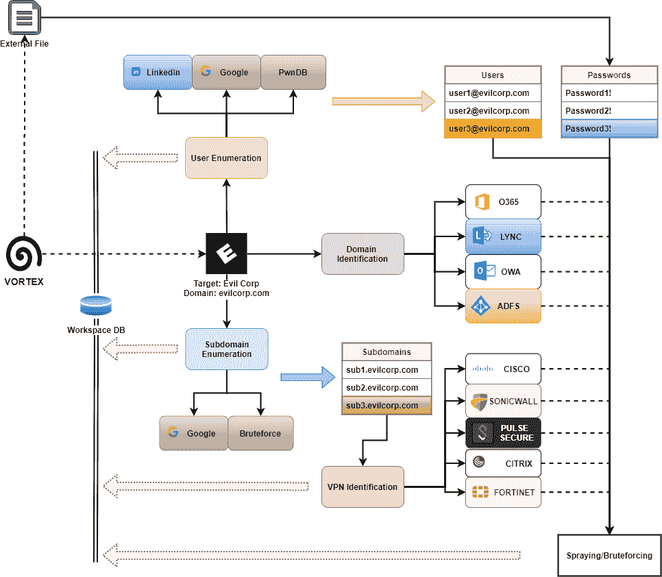

# Vortex : VPN 全面侦察、测试、枚举和开发工具包

> 原文：<https://kalilinuxtutorials.com/vortex/>

.png)

**Vortex** 是一个 VPN 全面侦察、测试、枚举和开发工具包

## 概述

一个非常简单的 Python 框架，受 SprayingToolkit 的启发，试图自动化检测、枚举和攻击常见 O365 和 VPN 端点(如 Cisco、Citrix、Fortinet、Pulse 等)所需的大部分过程。

### 我开发它的原因

使 VPN 喷涂阶段更快更容易。此外，由于其灵活性，该工具可以很容易地添加到现有的 OSINT 工作流中。

### 工具能为你做什么

Vortex 主要协助执行以下任务:

*   用户搜索和收集
    *   商务化人际关系网
    *   谷歌
    *   PwnDB
*   密码泄露
    *   PwnDB
*   主域标识
    *   OWA
    *   S4B/Lynk
    *   ADFS
*   子域搜索
    *   列举
    *   蛮力
*   VPN 端点检测
*   密码喷射/猜测攻击
    *   O365
    *   Lynk/S4B
    *   ADFS
    *   因特网邮件访问协议
    *   虚拟专用网
        *   加拿大白鲑
        *   思杰
        *   FortiNet
        *   脉冲安全
        *   声波墙
*   在社交网络上搜索个人资料
    *   照片墙
    *   脸谱网
    *   推特
    *   抖音国际版
    *   仅粉丝

## 安装

按如下方式安装 pip3 的先决条件:

**sudo -H pip3 安装要求. txt**

### 使用 Virtualenv 安装

否则，您可以使用虚拟环境安装先决条件:

###### 在 Windows 上

**virtualenv venv
venv \ Scripts \ activate
pip install-r requirements . txt**

## 在 Linux 上

**python 3-m virtualenv venv
source venv/bin/activate
pip install-r requirements . txt**

## 使用

使用这个工具非常简单，但是需要遵循一个工作流程。该工具使用 SQLite 数据库来存储有关当前攻击的信息。

### 工作空间

工作空间表示工具使用的数据库文件。名称应该只是一个简单的名称，用来标记当前的攻击、项目或目标。

每个工作空间都分配有一个 SQLite 数据库。当您指定工作空间名称时，例如:

**python manage.py -w 工作空间 1**

你实际上说的是“我想对`**workspace1.db**`文件进行操作”。

#### 工作空间初始化

为了正常工作，Vortex 需要用正确的模式初始化数据库。要做到这一点，唯一要做的就是执行命令:

**python manage . py-w workspace 1 db-c init**

如果用户试图跳过这一阶段，Vortex 将首先显示正确的启动命令。

**[-]工作空间未初始化。请使用
python manage . py-w workspace 1 db-c init**进行初始化

相反，当对现有的已初始化的数据库运行相同的命令时，Vortex 会在覆盖数据库文件之前要求确认:

**[-]数据库文件已存在并已初始化，是否覆盖？
【y | n】$>y**

### 动作和命令

Vortex 使用一个位置参数“Action”和其他键控值。

其中最重要的是命令参数(`**-c cmd**`)。结合动作值，该命令定义漩涡应该做什么。

可以从帮助中查看支持的操作列表:

**python manage . py-h
Vortex:VPN 整体侦察、枚举和利用
位置参数:
{db、domain、import、office、profile、search、tor、validate、vpn}
执行动作
可选参数:
-h，–帮助显示此帮助消息并退出
-w 工作区，–WORKSPACE WORKSPACE
工作区使用
-c 命令，–COMMAND COMMAND
命令进行动作
-D DOMAIN，–DOMAIN DOMAIN 域【T11 –LOCATION LOCATION
被攻击公司的位置(即英国、美国……)
-U URL，–URL URL VPN 端点 Origin(schema://domain:port)
-t Endpoint _ TYPE，–Endpoint-TYPE Endpoint _ TYPE
目标端点 Type
-U USER，–USER 用户用户名
-E EMAIL，–EMAIL EMAIL
用户电子邮件
-N NAME，–NAME NAME 用户名用户全名
-R ROLE，–ROLE 用户作业【角色 –QUOTES QUOTES
生成一个 Excel 安全的 CSV
-nh，–no-headers 删除 CSV 头文件
-k 关键字，–KEYWORDS 关键字
搜索关键字
-P PASSWORDS_FILE，–PASSWORDS-FILE PASSWORDS _ FILE
用于喷涂的密码文件
-L，–leaks 使用 leaks 进行喷涂
-I IMPORT_FILE，–IMPORT-FILE 导入文件
导入文件**

#### 动态参数输入

从帮助中可以看出，每个动作所支持的命令列表没有在任何地方指定。这是因为没有必要直接指定命令。事实上，如果没有指定命令，Vortex 会要求用户从指定动作的可用命令中选择一个。

**python manage . py-w workspace 1 db**

**[*]选择一个命令:
0:init
1:SQL
2:add-endpoint
3:add-user
4:drop-user
5:truncate-table
6:export
$>**

这同样适用于特定例程所需的参数。如果一个参数在运行时很难输入，Vortex 会友好地提醒用户该参数是必需的。否则，Vortex 将引导用户选择或输入必要的参数。

例如，如果用户想要导出一个特定的表甚至一列，唯一需要做的就是启动 export 命令，如下图所示:

### 一般工作流程

Vortex 的设计遵循特定的操作流程，总结如下:

### 操作

#### 收集用户

可以使用三种不同来源收集特定目标的有效用户:

## 商务化人际关系网

该来源因违反 LinkedIn 用户政策已被删除。您仍然可以使用 GoMapEnum 在 LinkedIn 上操作，然后使用`**import**`命令导入电子邮件地址。

请再次注意，使用此功能违反了 LinkedIn 用户协议，这在 LinkedIn 用户协议的第 8.2 条中可以看出:

您同意您不会:[……]2。开发、支持或使用软件、设备、脚本、机器人或任何其他方式或过程(包括爬虫、浏览器插件和附加程序或任何其他技术)来抓取服务或以其他方式从服务中复制配置文件和其他数据；

## 交联的

为了部分取代上述功能，该工具嵌入了一个经过修改的交联版本。该工具将尝试检测使用谷歌和必应的公司员工。这当然和直接在 LinkedIn 上搜索不一样，但它非常有用。

为了正确操作，该工具将询问用户用户名应使用哪种格式(即 john.doe、j.doe 或 d.john ),以及目标域使用的标准域。

## 谷歌

这个源是使用一个剥离、修改版本的采集器来操作的。该工具将尝试使用 Google Dorks 从 Google(被动收集)和从公司网站(主动收集)提取姓名/电子邮件。

**python manage . py-w workspace 1 search-c google-D evilcorp.com
[*]在 Google 上开始被动/主动搜索* 搜索不在域内的电子邮件站点:evilcorp.com 站点:evilcorp.com
*搜索域内的电子邮件站点:evilcorp.com[+]收集来自:https://evilcorp.com[+]收集来自:https://www.facebook.com/EvilCorp/[+]的任何电子邮件找到 2 封唯一的电子邮件:elliot.alderson@evilcorp.com tyrell.wellick@evilcorp.com[>]找到 2 封邮件[* ]更新数据库…** 

*   PwnDB

该源代码使用 sn0int 中实现的移植版本进行操作。

**注意**:该功能需要连接到 TOR 网络。在 Windows 上，可以使用 Vortex 提供的嵌入式版本。而在 Linux 上，则需要安装 tor 包(即 Kali 上的`**sudo apt-get install** **tor**`)。

##### Start TOR

**python manage . py-w workspace 1 tor-c start
[*]启动 TOR 浏览器，点击连接**

## 在 PwnDB 上枚举

**python manage . py-w workspace 1 search-c pwn db-D evilcorp.com
[*]开始在 PwnDB [ > ]上搜索发现 493 个泄露账号！[* ]更新数据库…
[+]完成！**

## Stop TOR

**python manage . py-w workspace 1 tor-c stop
[*]停止 TOR 浏览器**

#### 收集端点

Vortex 主要使用两大类端点:VPN 和微软(Office)端点。目标可以作为办公室或 VPN 端点添加，Vortex 将使用一系列验证器分别尝试验证该端点是办公室还是 VPN 端点。

##### 添加办公室端点

我们举个例子说清楚。用户需要攻击目标`**evilcorp.com**`，并且想要检查该域是 OWA、Lync、ADFS 还是 O365 目标。

python manage . py-w workspace 1 office-c add-D evilcorp.com
**[#]OWA 域似乎是内部托管的
[+]evilcorp.com 是有效的 OWA 目标！
[-]evilcorp.com 似乎不是有效的 LYNK 目标
[-]evilcorp.com 似乎不是有效的 ADFS 目标
[-]evilcorp.com 似乎不是有效的 IMAP 目标
[+]evilcorp.com 是有效的 O365 目标！**

##### 搜索 VPN 端点的子域

对于 VPN 端点，用户可以执行子域搜索，以查找运行 VPN Web 登录的主机，如下所示:

**[ *]启动子域被动枚举[ > ]找到 10 个子域[$]耗时:18.360117197036743 [* ]枚举潜在 VPN 端点(443，10443 上的 HTTPS)
[>]找到 1 台运行 SSL web 服务器的主机
[$]耗时:18.916626691818237
[ *]正在尝试***

##### 手动添加 VPN 端点

当然，要手动添加 VPN 端点，指定顶级域可能还不够。正确的方法是指定一个特定的子域以及运行 VPN Web 服务器的特定端口。

**python manage . py-w workspace 1 VPN-c add-D vpn.evilcorp.com:443
[+]vpn.evilcorp.com:443 是脉冲目标！**

#### 对 OWA、ADFS、LYNC 或 O365 执行密码喷射或暴力攻击

要执行密码喷射甚至暴力攻击，唯一需要的资源是文本文件形式的密码列表，每行一个密码。

**[ *]选择要攻击的端点类型，或选择 all 攻击任何支持的端点 0:OWA 1:lync 2:IMAP 3:adfs 4:o365 5:all $>4[*]运行 o365 enumerator
[-]Elliot . alderson @ evil corp . com:mrrobot 2021！无效。
[+]tyrell . wellick @ evil corp . com:Joanna 2021！是有效的！
[ > ]找到 1 个有效登录
[*]更新数据库…
[+]完成**

[**Download**](https://github.com/klezVirus/vortex)