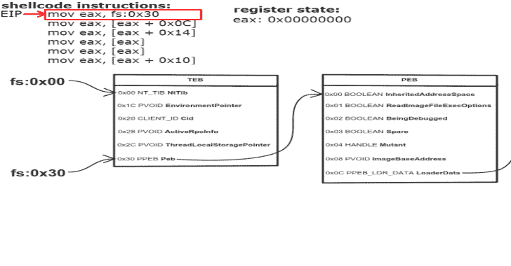

# 外壳代码模板:用于 Windows X64/X86 的易于修改的外壳代码模板

> 原文：<https://kalilinuxtutorials.com/shellcode-template/>

Shellcode 模板主要基于 Austin Hudson 的 TitanLdr，它将项目编译成 PE 可执行文件，并提取。文本部分

### 举例

外壳代码的入口点如下所示。当然，这可以根据您的需要进行更改。首先，我们需要使用自定义的 GetModuleHandle 和 GetProcAddress 来初始化所需的库和函数。

**SEC( text，B)VOID Entry(VOID)
{
INSTANCE INSTANCE = { }；
实例。modules . kernel 32 = TGetModuleHandle(HASH _ kernel 32)；
实例。modules . Ntdll = TGetModuleHandle(HASH _ Ntdll)；
if(实例。模块。内核 32！= NULL )
{
//加载需要的函数
实例。win32 . loadlibrary a = TGetProcAddr(实例。Modules.Kernel32，0xb 7072 fdb)；
//加载需要的库
实例。Modules.User32 =实例。win32 . loadlibrary a(GET _ SYMBOL(" user 32 "))；
如果(实例。模块。用户 32！= NULL )
{
实例。Win32.MessageBoxA = TGetProcAddr(实例。Modules.User32，0xb 303 ebb 4)；
}
}**

顺便说一下，正如你所看到的，我们可以在外壳代码中使用普通的字符串。这是因为我们包括了。rdata 部分在链接时插入到外壳代码中。GET_SYMBOL 通过它相对于 GetRIP()的偏移量获取指向函数或字符串的指针

### 开始

克隆这个项目，您就可以开始了

**git 克隆 https://www.github.com/Cracked5pider/ShellcodeTemplate**

接下来，您需要将 makefile 中的项目名称从`**ShellcodeTemplate**`更改为您想要的名称，然后您可以使用 make 编译该项目

**make //编译 x64 和 x86
make x64 //仅编译 x64
make x86 //仅编译 x86**

[**Download**](https://github.com/Cracked5pider/ShellcodeTemplate)