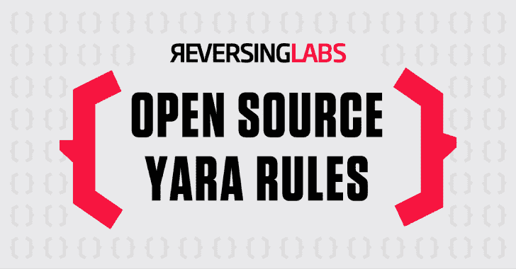
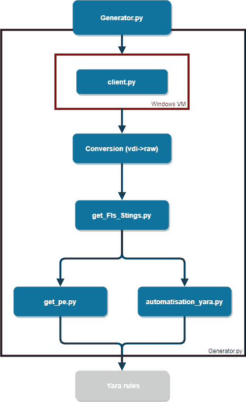

# 事实规则生成器:一个开源项目，旨在生成 YARA 规则

> 原文：<https://kalilinuxtutorials.com/factual-rules-generator/>

.png)

事实规则生成器是一个开源项目，旨在从正在运行的操作系统中生成关于已安装软件的 YARA 规则。

该软件的目标是能够针对收集或获取的数字取证证据使用一组规则，并及时找到安装的软件。

该软件可用于为 Windows 系统中的已知软件建立基准，并创建一组规则来查找其他系统上的类似安装。

## 依赖关系

*   pefile
*   psutil
*   恩吉松
*   python-tlsh
*   PyInstaller(将 client.py 更改为 client.py)
*   ssdeep
    *   在 Ubuntu 上:
        *   `**sudo apt-get install build-essential libffi-dev python3 python3-dev python3-pip libfuzzy-dev**`
        *   `**pip install ssdeep**`

## 工具要求

有些工具是主机操作系统所必需的，有些是 Unix 标准工具，有些是附加工具:

*   xxd
*   卷曲

对于 Windows 虚拟机，需要安装以下软件:

*   戴尔特尔
*   攻击面分析器

## 安装

*   安装所有 Python 依赖项定义的需求. txt
*   创建一个共享文件夹以与虚拟机通信
*   安装 Windows 虚拟机
    *   在 Windows 虚拟机上安装 chocolatey
    *   完成`**bin/OnWindows/Varclient.py**`
    *   用 PyInstaller 修改可执行文件中的`**bin/OnWindows/client.py**`,放入启动文件夹
*   更新`**etc/allVariables.py**`以匹配您想要的配置

在`**test/**`中给出了一些软件安装的例子，下面需要具体的格式:

*   首先，在 **`:`** 前使用 chocolatey 选择要安装的软件包的名称，如果是 msi 或 exe 文件，则选择文件名。
*   其次，在`**:**`之后是要提取并运行的 exe 文件的名称(不带扩展名)。
*   `**,**`之后的第二部分遵循相同的系统，先有单词`**installer**`后有`**:**`安装程序的类型:
    *   乔科人
    *   msiexec
    *   可执行程序的扩展名
*   最后，第三部分，`**uninstaller**`后面是`**:**`和卸载程序，如 choco，msiexec 或 exe

## 运行并生成规则

*   `**bin/Generator.py**`是唯一要运行的脚本，别忘了更新`**etc/allVariables.py**`(关键步骤)。

## 公共 YARA 规则库

*   事实规则——从一些非常常见的软件中生成的规则样本。

## 事实规则生成器概述

[**Download**](https://github.com/CIRCL/factual-rules-generator)