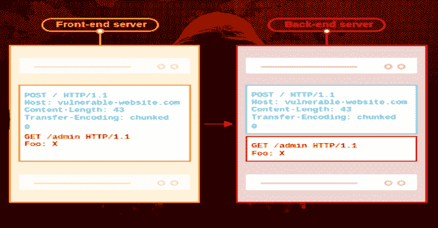

# Request _ smugger:Http 请求走私漏洞扫描器

> 原文：<https://kalilinuxtutorials.com/request_smuggler/>

%20(1).png)

**Request _ smugger**是一款 Http 请求走私漏洞扫描器。基于詹姆斯·凯特尔的惊人研究。该工具可以帮助找到易受请求走私漏洞攻击的服务器。

## 使用

**用法:
request _ smugger【选项】–URL
标志:
-h，–help 打印帮助信息
-V，–version 打印版本信息
选项:
–amount-payloads low/medium/all【默认:low】
-t，–attack-types
【clte method，ClTePath，ClTeTime，TeClMethod，TeClPath，TeClTime】【默认:“clte time”“tecl time”】
–file –verbose
0–仅打印检测到的案例和错误，
1–打印服务器响应的第一行
2–打印请求[默认值:0]
–验证验证漏洞的次数[默认值:2]**

## 装置

*   **Linux**
    *   来自版本
    *   来自源代码(应安装 rust)

**git 克隆 https://github.com/Sh1Yo/request_smuggler
CD 请求 _ 走私者
货物建造–发布**

使用货物安装

**货物安装请求 _ 走私者-版本 0 . 1 . 0-α2**

## 苹果个人计算机

*   来自源代码(应安装 rust)

**git 克隆 https://github.com/Sh1Yo/request_smuggler
CD 请求 _ 走私者
货物建造–发布**

使用货物安装

**货物安装请求 _ 走私者-版本 0 . 1 . 0-α2**

*   **窗户**
    *   来自版本

[**Download**](https://github.com/Sh1Yo/request_smuggler)