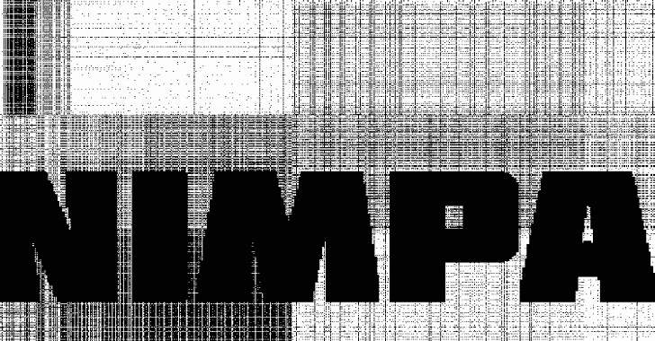

# Nimcrypt2:。NET、PE 和用 Nim 编写的原始外壳代码打包器/加载器

> 原文：<https://kalilinuxtutorials.com/nimcrypt2/>

[](https://blogger.googleusercontent.com/img/b/R29vZ2xl/AVvXsEj8WooNkgWDjr5IkWMnk27e1KJ80OA-PKtxI_aefhyXSgZFRLpHKVweeLPYiM_TWm7IKOwyRlEN7GLLceNMKw9xmMW3bxQ4R-zbApSqiJEjuHxtjrBjJaJZukLWTXi0POayoe7E_BL8EVn9w8Gs5PBMIR9-dsnChvNIBK3dD2lH_vW1IsSt1orUrTjG/s728/image_750x500_62561864e6a70.png)

Nimcrypt2 是另一种设计用于绕过 AV/EDR 的 PE 打包器/加载器。这是对我最初的 Nimcrypt 项目的改进，主要改进是使用直接系统调用和加载常规 PE 文件以及原始外壳代码的能力。

在继续之前，我必须感谢那些做了这个项目所依赖的绝大部分工作和研究的人。首先，我必须感谢@byt3bl33d3r 令人不快的 Nim repo，以及@ShitSecure 他公开发布的所有代码片段。这就是该工具的原始版本，当前版本也是如此。特别是，这个工具中使用的新 PE 加载功能只是 ShitSecure 最近发布的 Nim-RunPE 代码的一个实现。截至 2012 年 3 月 14 日，这段代码还将 GetSyscallStub 代码用于动态系统调用。我强烈建议赞助他使用他自己的 Nim PE Packer，这无疑是一个更好更有特色的版本。

此外，我要感谢@ajpc500 的 NimlineWhispers2 项目，这个工具使用它来直接进行系统调用。我再怎么强调这个项目也不过是前面提到的那些人的公共工程的合并，所以所有的荣誉都应该归于他们。

**nicrypt v 2.0
用法:
nicrypt-f file _ to _ load-t cs harp/raw/PE[-o][-n][-u][-s][-e][-g][-l][-v]
nicrypt(-h |–help)
选项:
-h–help 显示此屏幕。
–版本显示版本。
-f–文件文件名要加载的文件
-t–类型文件类型文件类型(csharp、raw 或 PE)
-p–处理外壳代码注入的进程的进程名
-o–编译后的 exe 的输出文件名文件名
-u–Unhook Unhook ntdll.dll
-v–在执行过程中启用详细消息
-e–Encrypt-strings 使用 strenc 模块加密字符串
-g–get-syscallstub 使用 GetSyscallStub 而不是 nimline**

#### 特征

*   NtQueueApcThread 外壳代码执行，带有 PPID 欺骗和第三方 DLL 阻塞
*   供系统调用使用的 nimlinewhispers 2 & GetSyscallStub
*   系统调用名称随机化
*   装载能力。NET 和常规 PE 文件
*   使用动态密钥生成的 AES 加密
*   LLVM-混淆器兼容性
*   字符串加密
*   沙盒逃避

#### 测试并确认工作于

*   Windows 11 (10.0.22000)
*   Windows 10 21H2 (10.0.19044)
*   Windows 10 21H1 (10.0.19043)
*   Windows 10 20H2 (10.0.19042)
*   Windows 10 19H2 (10.0.18363)
*   Windows Server 2019 (10.0.17763)

#### 安装/依赖

Nimcrypt2 设计用于安装了 Nim 的 Linux 系统。在安装 Nim 之前，您必须确保通过您的软件包管理器安装了以下软件包:

**sudo apt 安装****gcc minw-w64 xz-utils git**

要安装 Nim，我更喜欢使用 choosenim，如下所示:

**curl https://nim-lang.org/choosenim/init.sh-sSf | sh
echo " export PATH = $ HOME/。nimble/bin:$PATH" > > ~/。bashrc
出口路径=$HOME/。nimble/bin:$PATH**

Nimcrypt2 也依赖于一些可以通过 Nimble 安装的包。可以这样做:

**nimble 安装 winim nim crypto doc opt ptr _ math strenc**

现在安装了所有的依赖项，Nimcrypt2 可以像这样编译:

**nim c-d = release–cc:gcc–embedsrc = on–hints = on–app = console–CPU = amd64–out = nimcrypt nimcrypt . nim**

**可选:**要使用 Obfuscator-LLVM 标志，您必须将它与 wclang 一起安装在您的系统上。我发现这有点痛苦，但是只要有一点毅力，你就能做到。这里有一个在我的 Kali Linux 系统上有效的快速步骤:

*   克隆所需版本的混淆器-LLVM 并构建它
*   编译完成后，备份 clang 的现有版本，并将 clang 的新混淆器-LLVM 版本移动到/usr/bin/
*   安装 wclang 并将其二进制文件添加到您的路径中
*   备份现有的 clang 库文件，复制新的新建混淆器-LLVM 库包括到/usr/lib/clang/OLD_VERSION/

此外，您必须将下面几行添加到您的 **`nim.cfg`** 文件中，以将 nim 指向您的 wclang 二进制文件:

**amd64 . windows . clang . exe = " x86 _ 64-w64-mingw 32-clang "
amd64 . windows . clang . left rex = " x86 _ 64-w64-mingw 32-clang "
amd64 . windows . clang . CPP . exe = " x86 _ 64-w64-mingw 32-clang " ++ "
amd64 . windows . clang . CPP . left link**

```
amd64.windows.clang.cpp.linkerexe = "x86_64-w64-mingw32-clang++"
```

可能有更好的方法来做到这一点，但这是我的工作。如果你有问题，只要继续尝试，并确保你可以运行 **`x86_64-w64-mingw32-clang -v`** 和它显示“混淆器-LLVM”在输出中。还要确保 MinGW 使用的是混淆器-LLVM 库文件:否则 Nim 会给你一个错误。

[**Download**](https://github.com/icyguider/Nimcrypt2)