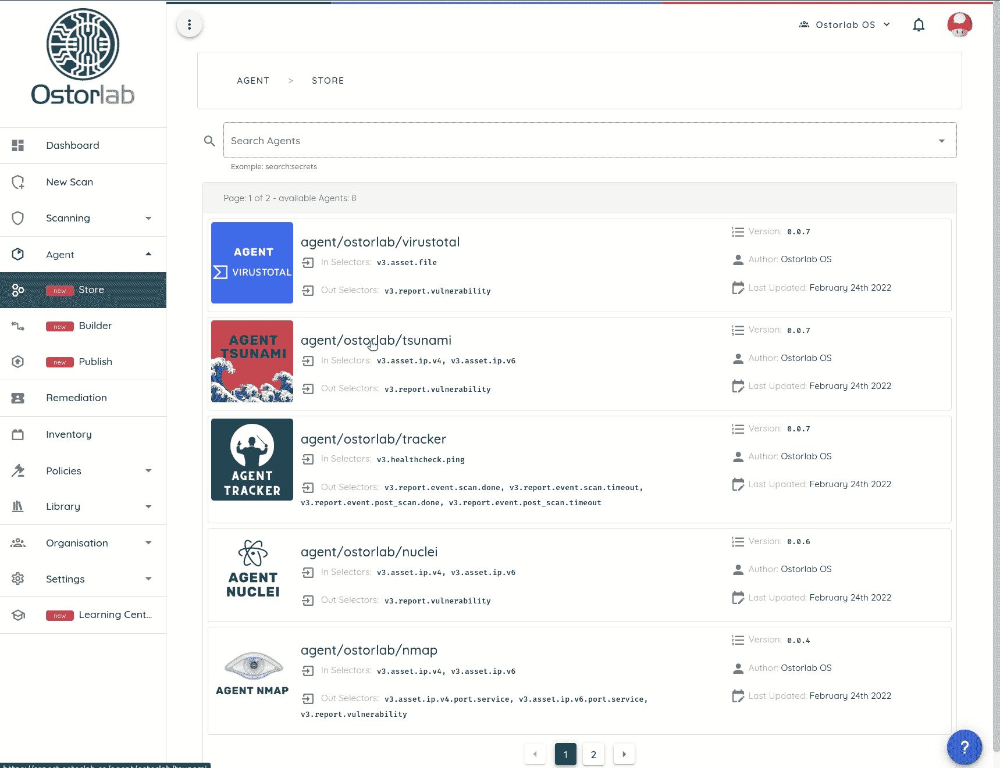

# Ostorlab:一个安全扫描平台，支持运行复杂的安全扫描任务

> 原文：<https://kalilinuxtutorials.com/ostorlab/>

.png)

Ostorlab 是一项安全测试，通常需要将工具链接在一起，从一个工具中获取输出，对其进行处理、过滤，然后将其推送给另一个工具。有几种工具试图减轻这一过程的痛苦。Ostorlab 通过简化最难的部分和自动化枯燥乏味的部分来解决同样的挑战。

为此，Ostorlab 专注于以下几个方面:

*   **易于使用**通过简单的一个命令行执行所有任务
*   **通过项目文档、教程、SDK 和模板获得开发者体验**
*   **可扩展性和性能**通过对其所有组件使用高效的电子监管格式和成熟的行业标准

为此，Ostorlab 配备了:

*   一个简单而强大的 SDK，让简单的情况变得轻松，同时支持复杂的情况，如分布式锁定、QPS 限制、多实例并行化…
*   一个久经考验的框架，多年来一直为 Ostorlab 平台提供支持，用于执行复杂的动态分析设置和在多台机器上运行的要求苛刻的静态分析工作负载。
*   高性能和可扩展的设计，得益于使用动态路由的消息队列、使用 protobuf 的二进制和压缩消息序列化、使用 docker 映像的通用文件格式以及得益于 docker swarm 的弹性部署。
*   一个代理存储库，可以轻松使用和发现工具来添加您的工具集。
*   一个自动化的构建器来解决构建和发布的麻烦。
*   用于准备和记录工具集合设置的 GUI。
*   关注文档、多个教程以及即将发布的视频和会议演示。
*   一个现成的一键模板回购开始使用。

# 要求

对于某些任务，如在本地运行扫描，Docker 是必需的。要安装 docker，请参阅以下说明。

# 安装

Ostorlab 作为 Python 包在 Pypi 上发布。要安装，如果您已经安装了`pip`，只需运行以下命令。

**pip install -U ostorlab**

# 入门指南

要执行第一次扫描，只需运行以下命令:

**ostorlab 扫描运行–安装–代理代理/ostorlab/nmap–代理代理/ostorlab/open vas–代理代理/ostorlab/tsunami–代理代理代理/ostorlab/nucleus IP 8.8.8.8**

此命令将下载并安装以下扫描代理:

*   `agent/ostorlab/nmap`
*   `**agent/ostorlab/tsunami**`
*   `**agent/ostorlab/nuclei**`
*   `**agent/ostorlab/openvas**`

并将扫描目标 IP 地址`**8.8.8.8**`

要检查扫描状态:

**ostorlab 扫描列表**

扫描完成后，要访问扫描结果:

**ostorlab vulnz list–scan-id
ostorlab vulnz describe–vuln-id**

# 故事

Ostorlab 列出了公共存储上的所有代理，您可以在公共存储上搜索并发布自己的代理。

[**Download**](https://github.com/Ostorlab/ostorlab)