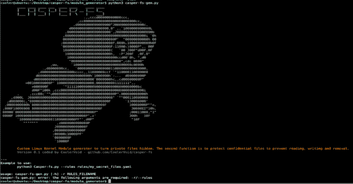

# Casper-Fs:一个定制的隐藏 Linux 内核模块生成器

> 原文：<https://kalilinuxtutorials.com/casper-fs/>

.png)

Casper-fs 是一个定制的 Linux 内核模块生成器，用于保护或隐藏定制的文件列表。每个 LKM 都有资源来保护或隐藏遵循 YAML 规则文件中的自定义列表的文件。是的，即使是根用户也没有权限查看文件或进行编辑和删除等操作。只有当用户向定制设备发送适当的密钥以释放文件系统中的动作时，文件才可以被捕捉、编辑和删除。

## 概述

第一点，用户向 Casper-FS 发送输入的带有规则的 YAML 文件以生成一个定制的 LKM(Linux 内核模块)，每个生成的模块在文件系统中工作以保护和隐藏秘密文件(即使是 root 也没有权限查看该文件，只有具有适当发送密钥的定制设备才能看到)。这个程序有两个主要功能:隐藏私人文件。第二个功能是保护机密文件，防止读取、写入和删除。

动机:在恶劣情况下，攻击者可以读取您机器中的每个文件(如果他获得了 root 权限)。但是，如果您有一个 Casper-fs 自定义模块，攻击者将不会发现隐藏的内核模块，该模块具有保护您的私人数据文件(如日志和密码库)的功能。

我在这个项目中的最初目的是保护我的服务器，也就是保护我朋友的机器。当我和朋友交谈时，我会说那些不知道如何编写低级代码的人。使用 Casper-fs，您可以生成自定义的内核模块来保护您的秘密文件。低级程序员可以为模块等编写新的模板。

## 第一步，跑前了解。

验证内核版本是 3.x、4.x 还是 5.x:

**$ uname -r**

克隆存储库

**$ git 克隆 https://github.com/CoolerVoid/casper-fs**

进入文件夹并安装 python3 模块:

**$ CD Casper-fs/module _ generator
$ sudo python 3-m pip install-r requirements . txt**

在目录 module _ generator/rules/fs-rules . YAML(python 脚本)中编辑您的文件规则，使用该文件生成新的 casper-fs 自定义模块。

**$ cat module _ generator/rules/fs-rules . YAML
binary _ name:Casperfs
module _ name:Casperfs
unhide _ module _ key:AbraKadabra
hide _ module _ key:Shazam
fake _ device _ name:USB 15
unhide-hide-file-key:胡地
unprotect-protect-file-key:Sesame
fs-rules:
hidden:
1:secret . txt**

该阵列是隐藏的，并且受到阵列保护。您可以在上下文中插入另一个文件的许多元素，例如:

**保护:
1:backup _ httpd . log
2:secret _ img . iso
3:secret _ file . img
4:secret _ file 2 . img
5:secret _ file 3 . img**

如果你想研究静态代码生成，看看目录“模板”的内容。

## 第二步，生成你的模块。

如果您想要生成一个遵循 YAML 规则文件的内核模块，请遵循以下命令:

**$ python 3 Casper-fs-gen . py–rules rules/fs-rules . YAML**

## 第三步，安装你的模块。

如果您使用 Fedora Linux，请为开发人员安装内核包:

**dnf 更新
dnf 安装 kernel-headers . x86 _ 64 kernel-modules . x86 _ 64 kernel . x86 _ 64 kernel-devel kmod**

在 Ubuntu Linux 上:

**apt 安装 Linux-headers-generic gcc make**

要测试模块:

**cd 输出；使干净；制造
insmod casperfs.ko**

## 第四步运行您的定制模块。

*   使 casper-fs 模块对 lsmod 可见的密码是密钥“Shazam”。
*   让 casper-fs 隐形的密码是“AbraKadabra”。
*   把秘密文件隐藏起来的密码是“胡地”，取消隐藏也是一样。
*   保护文件或解除保护的密码是“芝麻”。

您需要发送假设备的密码，例如“usb15 ”,以测试文件系统中隐藏和未隐藏的资源:

**$ touch secret . txt
$ ls
—无结果—
$ echo“胡地”>/dev/USB 15
$ ls
secret . txt
$ echo“胡地”> /dev/usb15
$ ls
—无结果—**

注意，您需要在“lsmod”命令中显示 casperfs。移除模块前需要此操作

**rmmod casperfs
rmmod:错误:../libk mod/libk mod-module . c:799 kmod _ module _ remove _ module()无法删除“casperfs”:没有这样的文件或目录
rmmod:错误:无法删除模块 casperfs:没有这样的文件或目录
lsmod | grep Casper
echo " Shazam ">/dev/USB 15
lsmod | grep Casper
casperfs
rmmod casperfs**

[**Download**](https://github.com/CoolerVoid/casper-fs)