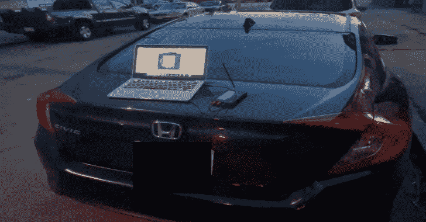

# CVE-2022-27254:本田遥控无钥匙系统漏洞的概念验证

> 原文：<https://kalilinuxtutorials.com/cve-2022-27254/>

.png)

**CVE-2022-27254** 是本田遥控无钥匙系统(CVE-2022-27254)漏洞的概念验证。

## 摘要

这是 CVE-2022-27254 的概念证明，其中各种本田汽车上的遥控无钥匙系统为每次开门、关门、行李箱打开和遥控启动(如果适用)发送相同的未加密射频信号。这使得攻击者能够窃听请求并进行重放攻击。

## 受影响的车辆

2016-2020 款本田思域(LX、EX、EX-L、Touring、Si、R 型)

## 重要提示

**密钥卡 FCC ID: KR5V2X
密钥卡频率:433.215MHz
密钥卡调制:FSK**

## 使用的工具

**fccid . I
hackrf one
gqrx
gnuradio**

## 预防

*   制造商:
    *   制造商必须实现滚动码，也称为跳跃码。这是一种安全技术，通常用于为遥控无钥匙进入(RKE)或被动无钥匙进入(PKE)系统的每次认证提供新的密码。
*   消费者:
    *   使用法拉第袋作为密钥卡。
    *   使用 PKE，而不是 RKE，这将使攻击者更难克隆/读取信号，因为他们需要接近才能做到这一点。

上述预防措施并非万无一失

如果您认为自己是此次攻击的受害者，目前唯一的缓解措施是在经销商处重置您的钥匙链。

[Download](https://github.com/nonamecoder/CVE-2022-27254)