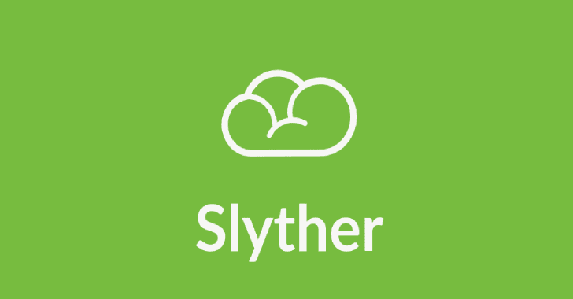

# Slyther : AWS 安全工具

> 原文：<https://kalilinuxtutorials.com/slyther/>

**s 另一个**是 AWS 安全工具，用于检查 S3 存储桶的读/写/删除访问。

## 要求

**aws-cli**

## 装置

**pip 3 install-r requirements . txt**

## 用法示例

**python 3 sly ther . py-b flaws . cloud**

[**Download**](https://github.com/iamavu/Slyther)