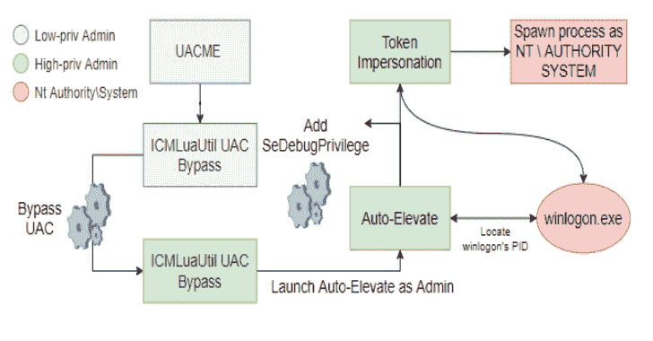
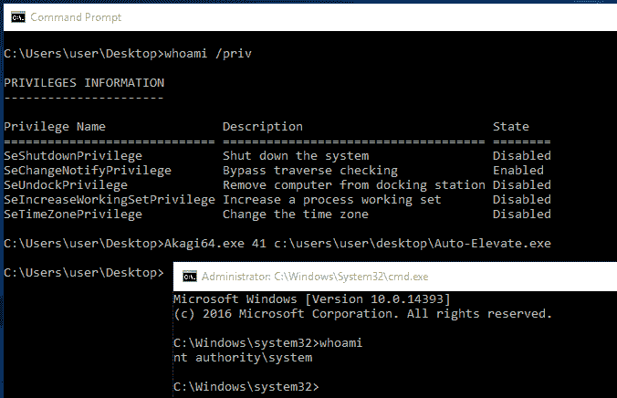
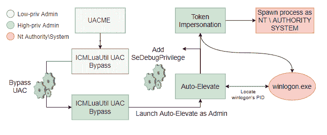

# 自动升级:从低完整性管理员帐户升级到 NT AUTHORITY\SYSTEM

> 原文：<https://kalilinuxtutorials.com/auto-elevate/>

.png)

**自动提升**工具展示了 UAC 旁路和 Windows 内置功能的威力。这个实用程序自动定位`**winlogon.exe**`，窃取并模仿它的进程令牌，并用窃取的令牌生成一个新的系统级进程。结合 hfiref0x 的 UACME 实用程序中的 UAC 绕过方法#41 (ICMLuaUtil UAC 绕过),该实用程序可以将低特权管理帐户自动提升到 NT AUTHORITY\SYSTEM。

下图演示了在 Windows 10 21H1 上使用 UACME 结合 Auto-Elevate 从低特权管理员帐户转到 NT AUTHORITY\SYSTEM。

下图演示了在不绕过 UAC 的情况下从高权限管理员帐户升级到系统

## 技术解释

自动提升将执行以下步骤，从低权限管理员提升到系统管理员

### 自动提升

*   通过使用 CreateToolhelp32Snapshot、Process32First 和 Process32Next 枚举运行进程的系统来定位 winlogon.exe 进程
*   通过调用 AdjustTokenPrivileges 为当前进程启用 SeDebugPrivilege，因为打开 winlogon.exe 的句柄需要它
*   通过调用 OpenProcess 打开一个 winlogon.exe 进程的句柄，这个调用使用了 PROCESS_ALL_ACCESS(但是，这有点过头了)
*   通过调用 OpenProcessToken 并结合以前获得的进程句柄来检索 winlogon 进程令牌的句柄
*   通过调用 ImpersonateLoggedOnUser 来模拟 winlogon 的用户(系统)
*   通过使用 SecurityImpersonation 调用 DuplicateTokenEx 来复制模拟的令牌句柄，这创建了我们可以使用的重复令牌
*   使用复制和模拟的令牌，通过调用 CreateProcessWithTokenW 生成新的 CMD 实例

[**Download**](https://github.com/FULLSHADE/Auto-Elevate)