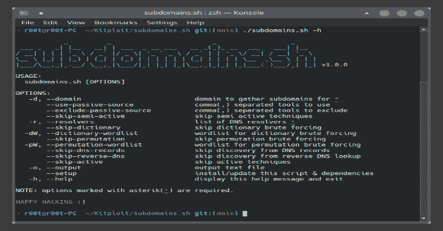
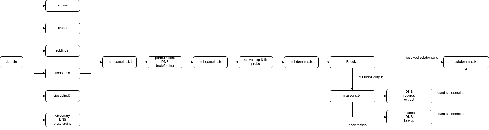

# 子域名。Sh:一个包装工具，用于给定域上的子域枚举

> 原文：<https://kalilinuxtutorials.com/subdomains-sh/>

.png)

**子域。Sh** 是一个包装工具，用于子域枚举，在给定的域上自动化工作流，用 bash 编写。

## 工作流程

## 装置

运行安装脚本:

**curl-s https://raw . githubusercontent . com/enenumxela/subdomains . sh/main/install . sh | ba**sh-

或者在短暂的 Docker 容器中运行:

克隆存储库并运行

**cd subdomains.sh
构建容器镜像
。/docker-subdomains.sh build
构建完成后，可以使用上面列出的相同选项运行脚本。
每次运行都会在一个新的容器中运行，运行后容器被销毁
。/docker-sudomains . sh-d example.com-r 1.1.1.1
如果需要的话销毁容器映像
。/docker-sub domains . sh destroy**

## 使用

要显示该脚本的帮助消息，请使用`**-h**`标志:

**subdomains.sh -h**

**_ _*| | |*_*_**(*)_ | |
/| | | ' _ \/*/`|/ _ | '_`*\/*` | | '*\/|/| ' _ \ _ \ |*| | |*)|(*| |(*)| | | |(*|*)/ __，*| _ _*/| |*| |*| | |*| _*，*|*|*| |*|*()/*| | | _ | v 1 . 0 . 0
用法:
subdomains.sh【选项】
选项:
-d，–domain domain 为*
-r 发现子域， –解析器包含文件*
的 DNS 解析器列表–使用-passive-source 逗号(，)分隔的被动工具使用
–exclude-passive-source 逗号(，)分隔的被动工具排除
–skip-从半主动技术中跳过发现
–skip-从字典中跳过发现 DNS 蛮力
-dW，–dictionary-word list 字典 DNS 蛮力的单词列表
–skip-从置换中跳过发现 DNS 蛮力
-pW， –permutation-wordlist 强制置换 dns 的单词表
–skip-DNS-records 跳过从 DNS 记录中发现
–skip-reverse-DNS 跳过从反向 DNS 查找中发现
–skip-active 跳过从主动技术中发现
-o，–output 输出文本文件
–setup 安装/更新此脚本&依赖关系
-h，–帮助显示此帮助消息并退出
注意:标有星号(*)的选项是必需的。
快乐黑客🙂**

[**Download**](https://github.com/enenumxela/subdomains.sh)