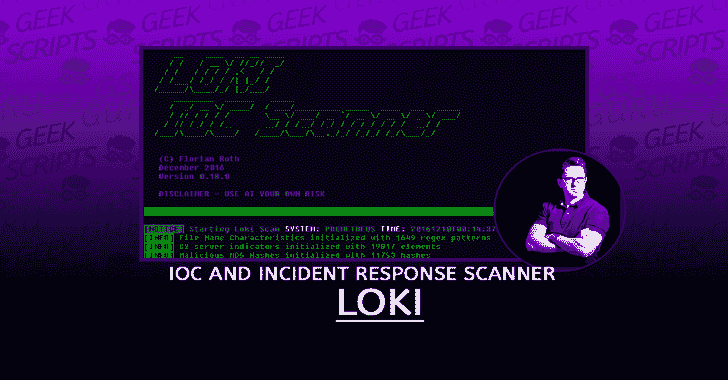
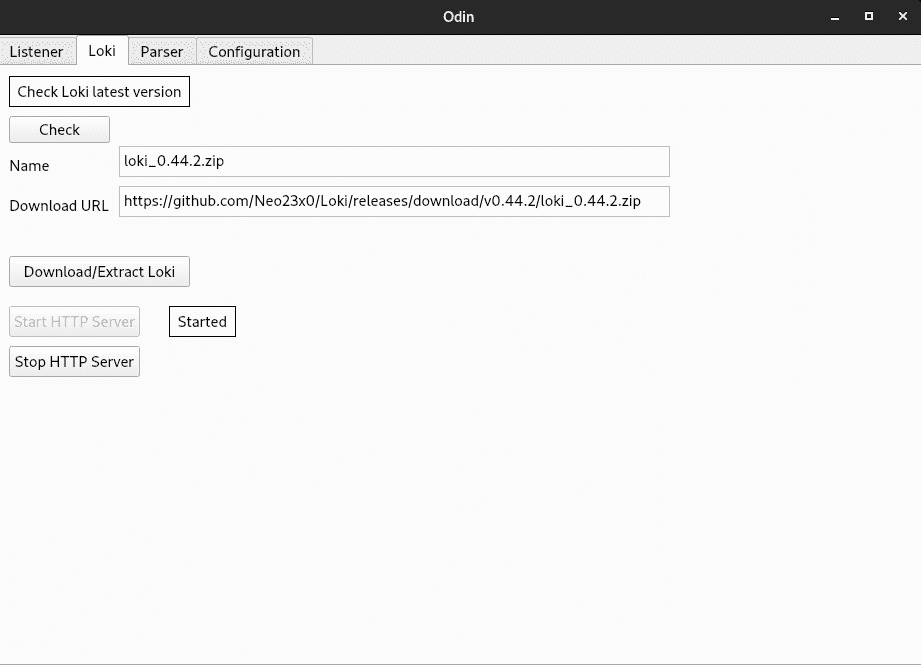
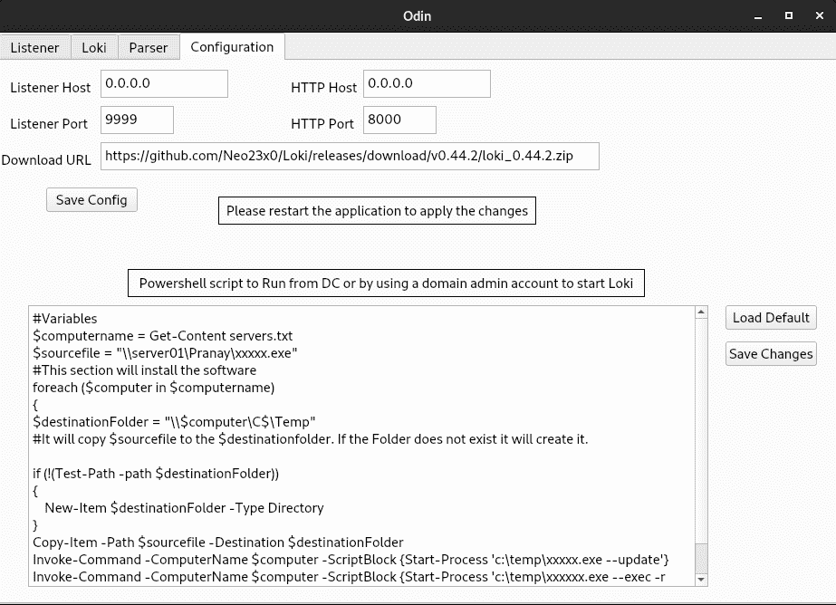
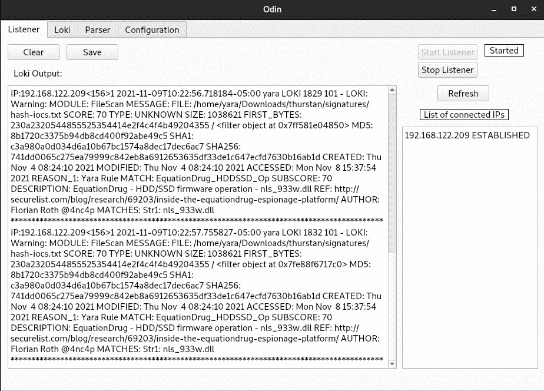
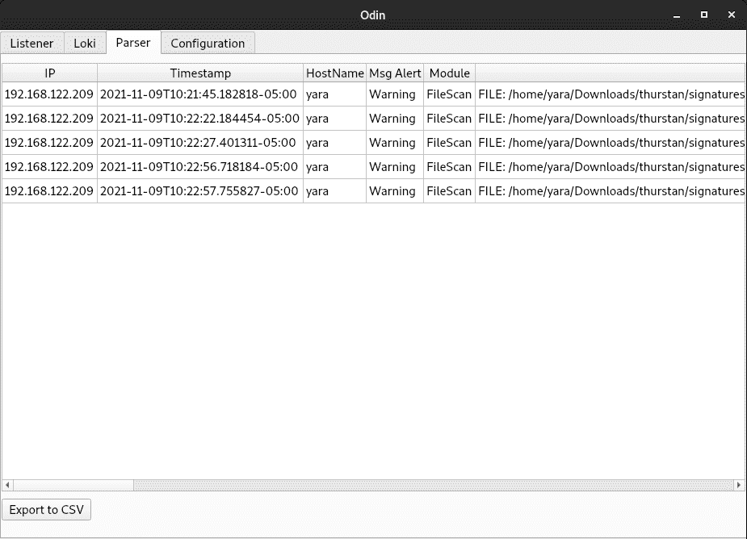

# Odin:基于 Loki 的中央 IoC 扫描仪

> 原文：<https://kalilinuxtutorials.com/odin/>

.png)

Odin 是一个基于 Loki 的中央 IoC 扫描仪。

## 一般信息

这个应用程序 Loki 最新版本，并使用 powershell 脚本将其下载到所有机器上并运行它，然后这个应用程序从所有机器接收响应并解析 CSV 格式的提要。

## 要求

*   Python +3.5
*   PyQT5
*   psutil
*   py 解析
*   zip 文件

## 获取

Odin 在 Loki 上下载并解压最新版本，启动 HTTP 服务器将可执行文件(Loki)传送到所有机器。

## 部署洛基

这一步必须手动完成使用 DC 机器上的 powershell 脚本或使用域管理帐户，脚本提供 loki 到所有机器，并开始更新。脚本在配置选项卡中，您可以根据需要修改 scipt。

## 收集

启动监听器，然后从 powershell 脚本启动 Loki 来搜索 IOC，结果将从 Loki 发送到 Odin

## 解析

收集的日志将被解析，并可以导出为 CSV 文件，以便用 ELK 之类的东西进行处理。

[**Download**](https://github.com/Hamza-Megahed/odin)