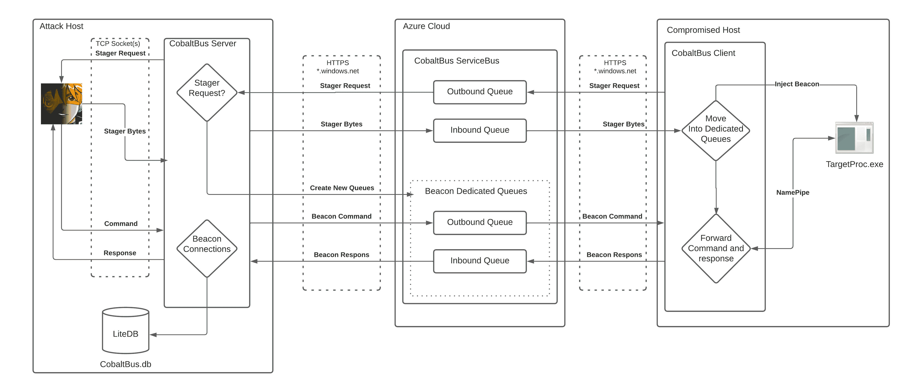

# CobaltBus : Cobalt Strike 外部 C2 与 Azure Servicebus 集成，C2 通过 Azure Servicebus 进行通信

> 原文：<https://kalilinuxtutorials.com/cobaltbus/>

.png)

**CobaltBus** 是 Cobalt Strike 外部 C2 与 Azure Servicebus 的集成，C2 交通通过 Azure Servicebus

# 设置

*   创建 Azure 服务总线
*   创建只能发送和侦听的共享访问策略(连接字符串)
*   编辑 Beacon C#项目中的静态 connectionString 变量，以匹配在步骤 2 中创建的共享访问策略的“主连接字符串”值。
*   CobaltBus 项目需要更新相同的变量，但是必须使用“RootManageSharedAccessKey”共享访问策略的“主连接字符串”。(需要“管理”权限)
*   在端口 4444，127.0.0.1 上设置 Cobalt 并启动 en 外部 C2 监听器(可以通过编辑 C#项目中的 External 2 port External 2 IP 变量来更改)

# 它是如何工作的？

然后，与 CobaltStrikes ExternalC2 集成的 CobaltBus DotNetCore 二进制文件将创建一个本地 SqliteDB，以便跟踪多个信标。入站到 CobaltBus 的消息将被捕获并写入数据库。数据库名“CobaltBus.db”和“CobaltBus-log.db”将在 CobaltBus.db 运行的目录中创建。一旦信标二进制文件运行，它将把一个“初始化”消息推送到 baseQueueName 队列，其中包含一个随机生成的 BeaconId 和 Pipename。然后，CobaltBus 处理程序将捕获这个消息，根据发送的 BeaconId 创建并移入两个新队列，从 CobaltStrike 请求 stager shellcode 代码，并将其作为“注入”消息推回到新队列。从这里，Beacon 项目将捕获的外壳代码注入内存，并通过生成的管道名与 CobaltStrike beacon 建立连接。当一个命令从 CobaltBus 发出时，它被压入相应的信标队列并进入信标管道名。

[**Download**](https://github.com/Flangvik/CobaltBus)