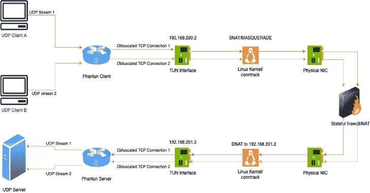
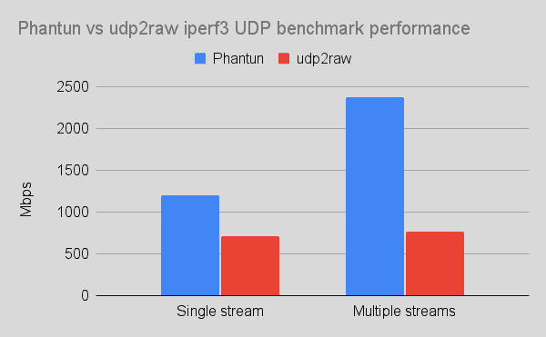
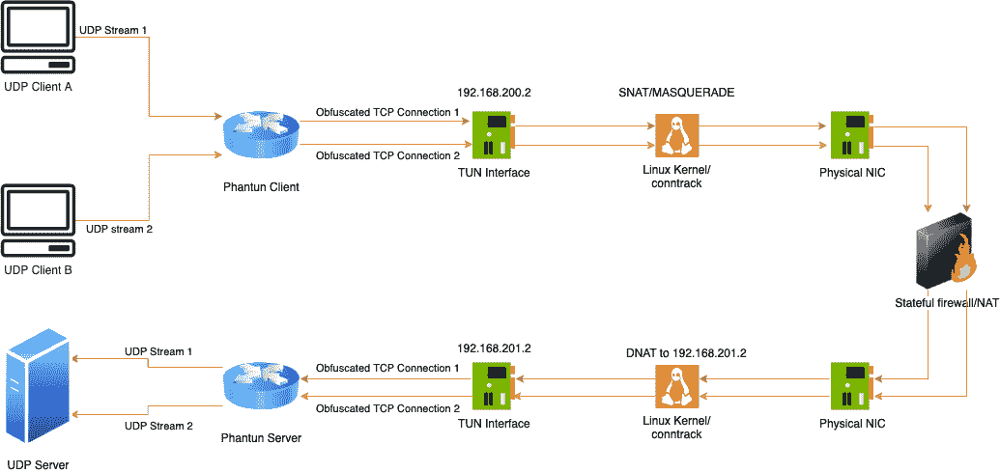

# Phantun:将 UDP 流转换成可以通过第 3 层的(伪)TCP 流

> 原文：<https://kalilinuxtutorials.com/phantun/>

.png)

Phantun 是一个将 UDP 数据包混淆成 TCP 连接的项目。它旨在以最小的处理和封装开销实现最高的性能。

它通常用于 UDP 被阻止/限制但 TCP 被允许通过的环境中。

Phantun 只是将 UDP 数据包流转换成混淆的 TCP 流数据包。Phantun 使用的 TCP 堆栈被设计为通过大多数 L3/L4 有状态/无状态防火墙/NAT 设备。它将**不能**通过 L7 代理。然而，这种方法的优点是不会出现常见的 UDP over TCP 性能杀手，如重新传输和流量控制。即使从防火墙/NAT 设备的角度来看，连接看起来像 TCP 连接，底层的 UDP 属性(如无序传递)也会完全保留。

Phantun 的意思是 Phantom TUN，因为它是 UDP 流量的混淆器，其工作刚好足以使其作为 TCP 数据包通过状态防火墙/NAT。

Phantun 是用 100%安全铁锈写成的。它经过了广泛的优化，可以在多核系统上很好地扩展，并且在快速连接时不会出现所有可用 CPU 资源饱和的问题。有关基准测试结果，请参见性能部分。

# 使用

对于下面的例子，假设 **Phantun 服务器**在端口`**4567**`(服务器的`**--local**`选项)监听传入的 Phantun 客户端连接，并且它将 UDP 数据包转发到`**127.0.0.1:1234**`的 UDP 服务器(服务器的`**--remote**`选项)。

还假设 **Phantun 客户端**在`**127.0.0.1:1234**`(客户端的`**--local**`选项)监听进入的 UDP 包，并连接到`**10.0.0.1:4567**`的 Phantun 服务器(客户端的`**--remote**`选项)。

Phantun 为客户机和服务器创建 tun 接口。对于**客户端**，Phantun 默认为自己分配 IP 地址`**192.168.200.2**`和`**fcc8::2**`。对于**服务器**，默认分配`**192.168.201.2**`和`**fcc9::2**`。因此，您的内核必须启用 IPv4/IPv6 转发，并为您的物理 NIC 地址和 Phantun 的 tun 接口地址之间的 NAT 设置适当的 iptables/nftables 规则。

您可以自定义由 Phantun 创建的 Tun 接口的名称和分配的地址。请运行带有`**-h**`选项的可执行文件，看看如何更改它们。

帮助理解此网络拓扑的另一种方法(请参见上图中对此拓扑的说明):

Phantun 客户端就像一台路由器后面有私有 IP 地址( **`192.168.200.2` / `fcc8::2`** )的机器。为了让它到达互联网，您需要在它的流量离开网卡之前 SNAT 专用 IP 地址。

Phantun 服务器就像一个路由器后面有私有 IP 地址( **`192.168.201.2` / `fcc9::2`** )的服务器。为了从互联网上访问它，你需要`**DNAT**`它在路由器上的监听端口，并将目的 IP 地址改为服务器监听输入连接的地方。

在这些情况下，运行 Phantun 的机器/iptables 充当“路由器”,允许 Phantun 使用它的私有 IP 地址与外部通信。

从 Phantun v0.4.1 开始，TCP 和 UDP 端都完全支持 IPv6。要指定 IPv6 地址，请使用以下格式:`**[::1]:1234**`和命令行选项。也支持解析 AAAA 记录。请用 **`-h`** 运行程序，查看如何控制 IPv6 行为的详细选项。

## 启用内核 IP 转发

编辑`**/etc/sysctl.conf**`，添加`**net.ipv4.ip_forward=1**`，运行 **`sudo sysctl -p /etc/sysctl.conf`。** IPv6 特定配置

`**net.ipv6.conf.all.forwarding=1**`也需要设置。

返回目录

## 添加所需的防火墙规则

### 客户

客户只需要在物理接口上启用 SNAT，就可以将 Phantun 的地址转换成可以在物理网络上使用的地址。这可以简单地用假面舞会来完成。

注意:将`**eth0**`改为任何实际的物理接口名称

返回目录

#### 使用 nftables

**表 inet NAT {
chain post routing {
type NAT hook post routing priority src NAT；策略接受；
iifname tun0 oif eth0 化妆舞会
}
}**

注意:上面的规则使用`**inet**`作为表族类型，因此它与 IPv4 和 IPv6 都兼容。

返回目录

#### 使用 iptables

**IP tables-t NAT-A post routing-o eth 0-j 伪装
IP 6 tables-t NAT-A post routing-o eth 0-j 伪装**

### 计算机网络服务器

服务器需要将 TCP 监听端口指定为 Phantun 的 tun 接口地址。

注意:将`**eth0**`改为任何实际的物理接口名称，将`**4567**`改为 Phantun 服务器使用的实际 TCP 端口号

返回目录

#### 使用 nftables

**表 inet NAT {
chain prerouting {
type NAT hook prerouting priority dst NAT；策略接受；
iif eth0 tcp dport 4567 dnat ip 到 192 . 168 . 201 . 2
IIF eth 0 TCP dport 4567 dnat ip6 到 fcc9::2
}
}**

## 使用 iptables

**iptables-t NAT-A PREROUTING-p TCP-I eth 0–dport 4567-j DNAT–to-destination 192 . 168 . 201 . 2
ip6 tables-t NAT-A PREROUTING-p TCP-I eth 0–dport 4567-j DNAT–to-destination FCC 9::2**

## 以非根用户身份运行 Phantun 二进制文件(可选)

以根用户身份运行面向网络的应用程序是不明智的。Phantun 可以作为具有`**cap_net_admin**`功能的非 root 用户完全运行。

**sudo setcap cap _ net _ admin =+PE phant un _ server
sudo setcap cap _ net _ admin =+PE phant un _ client**

## 启动 Phantun 守护进程

**注意:**使用`**-h**`选项运行 Phantun 可执行文件，查看完整的详细选项。

返回目录

### 服务器

注意:`**4567**`是 Phantun 应该监听的 TCP 端口，并且必须符合上面指定的 DNAT 规则。`**127.0.0.1:1234**`是用于新连接的 UDP 服务器。

**RUST _ LOG = info/usr/local/bin/phant un _ server–local 4567–remote 127 . 0 . 0 . 1:1234**

或者使用带`**--remote**`的主机名:

**RUST _ LOG = info/usr/local/bin/phant un _ server–local 4567–远程 example.com:1234**

注意:默认情况下，服务器会为 Tun 接口分配 IPv4 和 IPv6 专用地址。如果您不希望使用 IPv6，您可以简单地跳过创建上面的 IPv6 DNAT 规则，并且 Tun 接口上 IPv6 地址的存在应该不会对服务器产生副作用。

返回目录

### 客户

注意:`**127.0.0.1:1234**`是 UDP 地址和端口 Phantun 应该监听。`**10.0.0.1:4567**`是要连接的 Phantun 服务器。

**RUST _ LOG = info/usr/local/bin/phant un _ client–local 127 . 0 . 0 . 1:1234–remote 10 . 0 . 0 . 1:4567**

或者使用带`**--remote**`的主机名:

**RUST _ LOG = info/usr/local/bin/phant un _ client–local 127 . 0 . 0 . 1:1234–远程 example.com:4567**

# MTU 开销

Phantun 的目标是保持隧道开销最小。与普通 UDP 数据包相比，开销如下(以下面的 IPv4 为例):

**标准 UDP 数据包:** `**20 byte IP head**er + 8 byte UDP header = 28 bytes`

**混淆包:** `**20 byte IP header + 20 byte TCP header = 40 bytes**`

请注意，Phantun 不会添加除 IP 和 TCP 报头之外的任何其他报头来通过状态包检查！

Phantun 的附加开销:`**12 bytes**`。换句话说，当使用 Phantun 时，UDP 包的可用有效载荷减少了 12 个字节。这是进行这种混淆时可能的最小开销。

## WireGuard 的 MTU 计算

对于那些使用 Phantun 来传输 WireGuard UDP 数据包的人来说，这里有一些关于如何为 WireGuard 接口找到正确的 MTU 的指南。

**WireGuard MTU =接口 MTU–IP v4 报头(20 字节)–TCP 报头(20 字节)–wire guard 开销(32 字节)**

或者

**WireGuard MTU =接口 MTU–IPv6 报头(40 字节)–TCP 报头(20 字节)–wire guard 开销(32 b** 字节)

例如，对于具有 1500 字节 MTU 的以太网接口，WireGuard 接口 MTU 应设置为:

IPv4: `**1500 - 20 - 20 - 32 = 1428 bytes**` IPv6: `**1500 - 40 - 20 - 32 = 1408 bytes**`

产生的 Phantun TCP 数据包将为 1500 字节，不超过接口 MTU 1500。请注意，强烈建议对 WireGuard 隧道的两端使用相同的接口 MTU，否则可能会发生意外的数据包丢失，并且这些问题通常很难解决。

# 版本兼容性

虽然 TCP 栈相当稳定，但一般的期望是您应该在两端运行 Phantun 的服务器/客户机的相同次要版本，以确保最大的兼容性。

# 表演

性能测试在 2 个 AWS `**t4g.xlarge**`实例上进行，带有 4 个 vCPUs 和 5 Gb/s 网卡，通过局域网。`**nftables**`用于重定向`**iperf3**`的 UDP 流，以通过两个测试实例之间的 Phantun/udp2raw 隧道，MTU 已被调整以避免碎片。

使用了`**v0.3.2**`和 **`udp2raw_arm_asm_aes` `20200818.0`** 。这些是截至 2022 年 4 月这两个项目的最新版本。

测试命令:`**iperf3 -c <IP> -p <PORT> -R -u -l 1400 -b 1000m -t 30 -P 5**`

| 方式 | 发送速度 | 接收速度 | 整体 CPU 使用率 |
| --- | --- | --- | --- |
| 直接(1 个流) | 3.00 千兆位/秒 | 2.37 千兆位/秒 | 25%(100%时 1 个内核) |
| 幻影(1 流) | 1.30 千兆位/秒 | 1.20 千兆位/秒 | 60% (1 个内核为 100%，3 个内核为 50%) |
| UDP 2 raw(**`cipher-mode=none``auth-mode=none``disable-`**`**anti-replay**`)(1 流) | 1.30 千兆位/秒 | 715 兆比特/秒 | 40% (1 个内核为 100%，1 个内核为 50%，2 个内核空闲) |
| 直接连接(5 个流) | 5.00 千兆位/秒 | 3.64 千兆位/秒 | 25%(100%时 1 个内核) |
| 幻想(5 条溪流) | 5.00 千兆位/秒 | 2.38 千兆位/秒 | 95%(利用所有内核) |
| UDP 2 raw(**`cipher-mode=none``auth-mode=none``disable-anti-replay`**)(5 个流) | 5.00 千兆位/秒 | 770 兆比特/秒 | 50%(100%时两个内核) |

# 与 udp2raw 的比较

udp2raw 是@王宇的另一个受欢迎的项目——它与 Phantun 的功能非常相似。事实上，我从 udp2raw 获得了 Phantun 的灵感。开发 Phantun 的最大原因是因为运行 udp2raw 时性能不足(尤其是在 Raspberry Pi 等多核系统上)。然而，我们的目标是永远不要像 udp2raw 那样功能齐全，只支持最常见的用例。最值得注意的是，不支持 UDP over ICMP 和 UDP over UDP 模式，也不支持防重放和加密。这样做的好处是整体性能更好，MTU 开销更少，因为 TCP 有效负载中缺少额外的报头。

以下是对这两者进行比较的简要概述，以帮助您做出选择:

|  | 幽灵 | udp2raw |
| --- | --- | --- |
| UDP over FakeTCP 混淆 | 981 号房 | 981 号房 |
| UDP over ICMP 混淆 | -好的 | 981 号房 |
| UDP over UDP 混淆 | -好的 | 981 号房 |
| 多线程 | 981 号房 | -好的 |
| 吞吐量 | 较好的 | 好的 |
| 第三层模式 | 调谐器接口 | 原始套接字+ BPF |
| 隧道 MTU 开销 | 12 字节 | 44 字节 |
| 每个 udp 连接都有单独的 tcp 连接 | 客户端/服务器 | 仅服务器 |
| 防重放、加密 | -好的 | 981 号房 |
| IPv6 | 981 号房 | 981 号房 |

[**Download**](https://github.com/dndx/phantun)