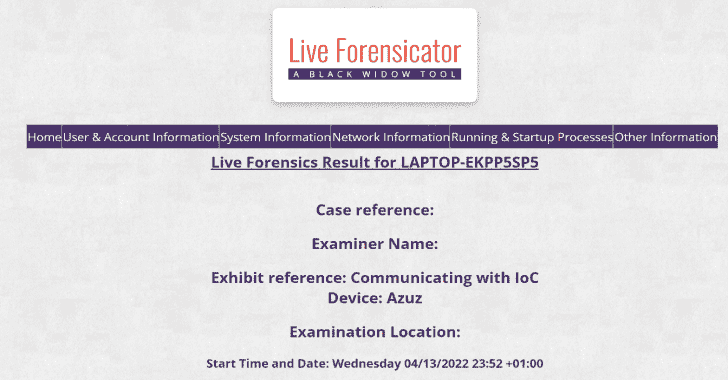

# Live-Forensicator : Powershell 脚本有助于事件响应和现场取证

> 原文：<https://kalilinuxtutorials.com/live-forensicator/>

.png)

**Live Forensicator** 是黑寡妇工具箱的一部分，其目的是协助法医调查人员和事故响应人员进行快速现场法医调查。

它通过收集不同的系统信息来实现这一点，以便进一步审查异常行为或意外的数据输入，它还寻找不寻常的文件或活动，并将其指出给调查者。

最重要的是要注意，这个脚本没有内置的智能，留给调查者分析输出并决定结论或决定进行更深入的调查。

## 可选依赖项

这个脚本是用 powershell 编写的，用于 windows PCs 和服务器。

对于附加功能，它依赖于外部二进制文件。

它有一个支持文件 WINPMEM，用于获取内存转储 https://github.com/Velocidex/WinPmem

它还依赖于 Nirsoft 的 BrowserHistoryView 来导出浏览器历史 http://www.nirsoft.net/utils/browsing_history_view.html

这个脚本有望开箱即用。

**winpmem _ mini _ x64 _ RC2 . exe | BrowsingHistoryView64.exe | BrowsingHistoryView86.exe | etl2pcapng64.exe | etl2pcapng86.exe**

## 使用

**把文件复制到电脑里
git 克隆 https://github.com/Johnng007/Live-Forensicator.git
执行
。\Forensicator.ps1**

## 例子

**基础
。\Forensicator.ps1
检查你的版本
。\ forensicator . PS1-版本
检查更新
。\Forensicator.ps1 -Update
解密一个加密的工件
。\ forensicator . PS1-DECRYPT DECRYPT
提取事件日志以及基本用法
。\Forensicator.ps1 -EVTX EVTX
抓取网络日志 IIS & Apache
。\ forensicator . PS1-WEBLOGS WEBLOGS
运行网络跟踪&捕获 120 秒的 PCA png
。\Forensicator.ps1 -PCAP PCAP
提取 RAM 转储以及基本用法
。\Forensicator.ps1 -RAM RAM
用 JNDILookup.class
检查 log4j。\ forensicator . PS1-log4j log4j
收集后加密神器
。\ forensicator . PS1-ENCRYPTED ENCRYPTED
是的，你当然可以做所有的
。\ forensicator . PS1-EVTX EVTX-RAM RAM-log4j log4j-PCAP PCAP-WEBLOGS WEBLOGS
无人值守模式下的基本用法
。\ forensicator . PS1-操作员“Ebuka John”-案例 01123-标题“感染勒索病毒的笔记本电脑”-位置尼日利亚-设备 AZUZ
您可以对其他每个参数使用无人值守模式
。\ forensicator . PS1-运营商“Ebuka John”-案例 01123-标题“感染勒索病毒的笔记本电脑”-位置尼日利亚-设备 AZUZ-EVTX EVTX-RAM-log4j log4j
检查与勒索病毒加密文件具有相似扩展名的文件(可能需要一些时间才能完成)
。\ Forensicator . PS1-勒索软件勒索软件
您可以在执行 online
后立即压缩 Forensicator 输出。\ Forensicator.ps1 开始-睡眠-s15；compress-Archive-Path " $ env:computer name "-destination Path " C:\ inetpub \ wwwroot \ $ env:computer name . zip "-Force**

## 笔记

以管理员身份运行脚本以获取值。结果以漂亮的 html 格式输出，并带有索引文件。
您可以在脚本的工作目录中找到所有提取的工件。

Forensicator 能够搜索系统中的所有文件夹，查找扩展名与众所周知的勒索软件相似的文件，虽然这种搜索需要很长时间，但它很有帮助。如果您收到的警报与勒索软件攻击有关，请使用-RANSOMEWARE 参数调用它。

Forensictor 现在能够使用 netsh trace 捕获网络流量，这在您调查与已知恶意 IP 通信的资产时非常有用，这样您可以将 pcapng 文件解析到 wireshark 并检查 C&C 服务器。通过默认，我设置捕捉时间为 120 秒

有时，保持文物的完整性可能是最重要的，律师可能会争辩说，文物可能在运往你的实验室的途中已经受损。Forensicator 现在可以使用 AES 算法使用唯一随机生成的密钥加密工件，您可以通过使用-ENCRYPTED 参数来指定这一点。你可以随时随地解密它，甚至用另一个副本的 Forensicator，只要保持你的密钥安全。此任务由 FileCryptography.psm1 文件执行

## 法医抓住了什么

**用户和账户信息
1。获取当前用户。
2。系统详细信息。
3。用户账号
4。登录会话
5。用户资料
6。管理员账户
7。本地组
系统信息
1。安装的程序。
2。从注册表安装的程序。
3。环境变量
4。系统信息
5。操作系统信息
6。修补程序
8。WINDOWS DEFENDER 状态和详细信息
网络信息
1。网络适配器信息。
2。当前 IP 配置 IPV6 IPV4。
3。当前连接配置文件。
4。关联的 WIFI 网络和密码。
5。ARP 缓存
6。当前 TCP 连接和相关进程
7。DNS 缓存
8。当前防火墙规则
9。活动的 SMB 会话(如果是服务器)
10。活跃的中小企业股票
11。到非本地目的地的 IP 路由
12。具有到非本地目的地的 IP 路由的网络适配器
13。具有无限有效生存期的 IP 路由
进程|计划任务|注册表
1。流程。
2。启动程序
3。预定任务
4。预定任务和状态
5。服务 6。注册表中的持久性
其他检查
1。逻辑驱动器
2。连接和断开的网络摄像头
3。USB 设备
4。UPNP 设备
5。所有先前连接的驱动装置
6。过去 180 天内创建的所有文件
7。POWERSHELL 天的历史记录
8。下载文件夹
9 中的可执行文件。APPDATA
10 中的可执行文件。温度
11 中的可执行程序。性能日志中的可执行文件
12。DOCUMENTS 文件夹
中的可执行文件或 HTML 索引文件
1 中的其他报告。组策略报告
2。WINPMEM RAM 捕获
3。LOG4J
4。IIS 日志
5。TOMCAT 日志
6。所有用户的浏览历史
7。检查与已知勒索软件加密文件具有相似扩展名的文件
注:根据驱动器数量和文件数量，此检查可能需要一些时间才能完成。
8。使用 NETSH TRACE &转换为 PCAPNG 运行网络**跟踪，以便进一步分析

[**Download**](https://github.com/Johnng007/Live-Forensicator)