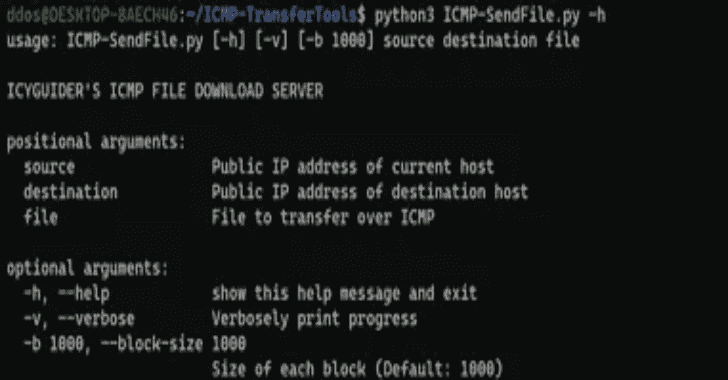

# ICMP-TransferTools:在受限的网络环境中，通过 ICMP 在 Windows 主机之间传输文件

> 原文：<https://kalilinuxtutorials.com/icmp-transfertools/>

**ICMP-TransferTools** 是一组脚本，用于在受限的网络环境中向/从 Windows 主机移动文件。这是使用总共 4 个不同的文件完成的，每个传输方向由一个 python 服务器和 powershell 客户端组成(下载&上传)。

唯一需要的依赖项是 python 脚本之一的`**Impacket**`。它可以通过 pip 安装，如下所示:

**pip3 安装入栈**

## 通过 ICMP 下载

附带的`**ICMP-SendFile.py**`和`**Invoke-IcmpDownload.ps1**`脚本可用于通过 ICMP 将文件下载到 Windows 主机。

必须首先运行 python 服务器来暂存文件以供下载。请参见下面的脚本用法:

**用法:ICMP-sendfile . py[-h][-v][-b 1000]源目标文件
ICYGUIDER 的 ICMP 文件下载服务器
位置参数:
当前主机的源公共 IP 地址
目标主机的目标公共 IP 地址
文件要通过 ICMP 传输的文件
可选参数:
-h，–help 显示此帮助消息并退出
-v，–verbose Verbosely print progress
-b 1000，**

导入后，可以使用 powershell 客户端下载暂存文件，如下所示:

**Invoke-icmp download public IP address of server file to download**

## 通过 ICMP 上传

附带的`**ICMP-ReceiveFile.py**`和`**Invoke-IcmpUpload.ps1**`脚本可用于通过 ICMP 从 Windows 主机上传/导出文件。

python 服务器必须首先运行，以确保它准备好接受来自客户端的请求。请参见下面的脚本用法:

**用法:ICMP-ReceiveFile.py [-h] src 文件
ICYGUIDER 的 ICMP 文件上传服务器
位置参数:
客户端 src 公共 IP 地址
文件要写入数据的文件
可选参数:
-h，–help 显示此帮助信息并退出**

导入后，可以使用 powershell 客户端上传所需的文件，如下所示:

**Invoke-ICM upload public IP address of server FileToUpload**

[**Download**](https://github.com/icyguider/ICMP-TransferTools#download-via-icmp)