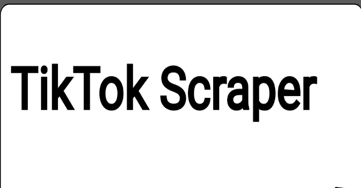

# Tiktok 刮刀:抖音刮刀。下载视频帖子，收集用户/趋势/标签/音乐源元数据

> 原文：<https://kalilinuxtutorials.com/tiktok-scraper/>

.png)

**Tiktok 刮刀**用于从抖音刮取和下载有用的信息。这不是官方的 API 支持等等。这只是一个刮刀，使用抖音网络应用编程接口刮媒体和相关元信息。

## 特征

*   从用户、标签、趋势或音乐 Id 页面下载**无限制的**帖子元数据
*   将帖子元数据保存到 JSON/CSV 文件中
*   下载带有和不带有水印的媒体**并保存到 ZIP 文件**
*   从 CLI 下载不带水印的单个视频
*   签署 URL 以向抖音 API 发出自定义请求
*   从用户、标签和单个视频页面中提取元数据
*   **保存以前的进度，仅下载在**之前未下载的新视频。此功能仅在命令行界面下工作，并且仅当**下载**标志打开时。
*   **在 CLI 中查看和管理以前下载的帖子历史记录**
*   批量抓取和下载文件中指定的用户、标签、音乐和单个视频

## 装置

tiktok 刮刀需要 Node.js v10+才能运行。

**从 NPM 安装**

tiktok 铲运机

**从纱线上安装**

**纱线全局添加 tiktok 刮刀**

## 使用

在终端

**$ tiktok-刮刀-帮助
用法:tiktok-刮刀【选项】
命令:
tiktok-刮刀用户[id]从用户名中刮取视频。只输入用户名
tiktok 刮标签[id]从标签刮视频。输入 hashtag 不带#
tiktok-scraper 趋势从当前趋势刮帖子
tiktok-scraper 音乐[id]从一个音乐 id 号刮帖子
tiktok-scraper 视频[id]下载单个视频不带水印
tiktok-scraper 历史查看以前的下载历史
tiktok-scraper from-file[file][async]刮用户、hashtags、音乐、视频在一个文件中提到
。每行 1 个值
选项:
–版本显示版本号【布尔】
–会话设置会话 cookie 值。从任何方法中抓取数据时，会话有时会有所帮助
[默认:" "]
–会话-文件将路径设置为包含活动会话列表的文件。每行一个
会话！[默认值:" "]
–超时设置请求之间的超时。超时以毫秒为单位:
1000 mls = 1 s【默认值:0】
–Number，-n 要抓取的帖子数。如果你将设置为 0，那么所有的
帖子都将被删除【默认值:0】
——因为不会删除在此日期(时间戳)之前发布的帖子。
如果设置为 0，则过滤器被禁用[默认值:0]
–代理，-p 设置单个代理[默认值:" "]
–代理-文件使用文件中的代理。Scraper 将根据每个请求使用文件中的随机代理
。1 线 1 代理。
【默认:】
–下载，-d 下载视频帖子到文件夹，输入名称
【id】【boolean】【默认:false】
–async Download，-并发下载数量【默认:5】
–高清下载高清视频。视频大小将是 x5-x10 倍
大，这将影响刮刀执行速度。此
选项仅与-w 标志
【boolean】【default:false】
–ZIP、-z ZIP 所有下载的视频帖子【boolean】【default:false】
–File path 保存所有输出文件的文件路径结合使用。
【默认:"/Users/Karl . wint/Documents/projects/JavaScript/tiktok-scraper "】
–filetype，
保存帖子信息的输出文件的类型。' all '–将所有帖子的相关信息保存到`
'json '和' csv '
[选项:“CSV”、“json”、“all”、“][默认:" "]
–文件名，-f 为输出文件设置自定义文件名[默认:" "]
–noWaterMark，-w 下载不带水印的视频。注意:随着
最近的更新，你只需要使用这个选项，如果你是
抓取标签提要。默认情况下，用户/趋势/音乐源将拥有
此 URL[boolean][default:false]
–store，-s Scraper 将在 OS TMP 或自定义
文件夹中保存进度，并且在将来的使用中将仅下载新的
视频以避免重复[boolean][default:false]
–history path 设置将存储历史文件的自定义路径
[default:"/var/folders/D5/fy h1 _ f 2926 Q7 c 65g 7 skc 0 qh 80000 gn 例如:用户:bob
【默认:】
–webHookUrl 设置 web hook URL 接收 scraper 结果作为 HTTP
请求。例如到您自己的 API[默认:" "]
–方法接收数据到您的 webhook url 作为 POST 或 GET 请求
[选择:" GET "，" POST "][默认:" POST "]
–帮助显示帮助[boolean]
示例:
tiktok-scraper 用户用户名-d-n 100–会话 sid _ TT = DAE 32131231
tiktok-scraper trend-d-n 100–会话 sid_tt=dae32131231**

## 码头工人

通过使用 docker，您将无法使用–file path 和–history path，但是您可以通过使用-v 来设置卷(**主机路径，所有文件将保存在该路径下**

##### 建造

**码头工人建造。-t tiktok 刮刀**

##### 奔跑

**示例 1:** 包括历史文件在内的所有文件都将保存在运行 docker 的目录($pwd)中

**对接器 run-v $(pwd):/usr/app/files titok-scraper user TIC**t**ok-d-n5–**s

**例 2:** 包括历史文件在内的所有文件都会保存在/User/blah/downloads 中

**docker run-v/User/blah/downloads:/usr/app/files tiktok-scraper 用户 tiktok -d -n 5 -s**

## 组件

### 方法

**。user(id，options)//从特定用户那里刮帖子(Promise)
。hashtag(id，options)//从 hashtag 部分刮贴(Promise)
。trend("，options) //从一个趋势板块刮帖子(Promise)
。音乐(id，options) //通过音乐 id (Promise)
刮帖。userEvent(id，options)//抓取特定用户的帖子(Event)
。hashtagEvent(id，options)//从 hashtag 节中抓取帖子(Event)
。trendEvent("，options) //从趋势部分抓取帖子(Event)
。musicEvent(id，options) //按音乐 id 刮贴(Event)
。getUserProfileInfo('USERNAME '，options) //获取用户配置文件信息
。getHashtagInfo('HASHTAG '，options) //获取 HASHTAG 信息
。signUrl('URL '，options) //获取请求的签名
。getVideoMeta('WEB_VIDEO_URL '，options) //获取视频元信息，包括没有水印的视频 URL
。Get music info(' https://www . tiktok . com/music/original-sound-6801885499343571718 '，options) //获取音乐元数据**

## 选择

**const options = {
//要抓取的帖子数:{int default: 20}
number: 50，
//抓取自该日期以来发布的帖子:{ int default: 0}
自:0，
//设置会话:{ string】default:["]}
//抓取用户/trending/music/hashtag feed
需要经过身份验证的会话 cookie 值//您可以在此放置任意数量的会话，每个请求将从列表中随机选择会话
sessionList:)
//设置代理{ string[]| string default:" }
//http proxy:127 . 0 . 0 . 1:8080
//socks proxy:socks 5://127 . 0 . 0 . 1:8080
//可以将代理作为数组传递，scraper 会从数组中随机选择一个代理来执行请求
proxy:"，
//设置为{true}来按用户 id 进行搜索:{ boolean default:false }
by _ user 仅当{ download:true }:{ int default:5 }
async download:5，
//应该异步抓取多少帖子:{int default: 3}
//当前选项将仅应用于当前类型:音乐和 hashtag
//对于其他类型，它始终为 1，因为对抖音 API 的每个请求响应都提供“maxCursor”值
//发送下一个请求
asyncScraping: 3，
//保存所有文件的文件路径:{ string default:' CURRENT _ DIR ' }
File path:`CURRENT_DIR`，
//输出文件的自定义文件名:{ string default:}
文件名:`CURRENT_DIR`，
//输出的信息可以保存到 CSV 或 json 文件:{ string default:' na ' }
//' CSV '保存到 csv
// 'json '保存到 JSON
//' all]保存到 JSON 和 csv
// 'na '跳过此步骤
文件类型:`na`，
//设置自定义头:用户代理、 cookie 和 etc
//注意:当您解析视频源或单个视频元数据时，您将收到{headers}对象
//用于提取信息，并且为了通过收到的{videoUrl}值访问和下载视频，您需要使用相同的头
头:{
“user-agent”:“BLAH”，
referer:' https://www . tiktok . com/'，
cookie: `tt_webid_v2=68dssds`，
}，
//下载不带水印的视频:{boolean default: false}
//设置为 true 下载不带水印
//此选项会影响执行速度
noWaterMark: false，
//创建高清视频的链接:{boolean default: false}
//此选项只有在{noWaterMark}设置为{true}
hdVideo: false，
// verifyFp 用于验证请求并避免验证码
//当您使用代理时，请求很可能会被验证码
//阻止
//您可以设置自己的 verifyFp 值，或者使用默认值(硬编码)
verifyFp:"，
//将主机切换到 Tiktok 测试 enpoint。 当你的请求被验证码阻止时，你可以尝试使用 Tiktok 测试端点。
useTestEndpoints:false
}；**

不要忘记查看**示例**文件夹

### 许诺

**const TikTokScraper = require(' tiktok-刮板')；
//通过用户名
(async()=>{
try {
const posts = await tiktokscraper . User(' USERNAME '，{
number: 100，
session list:[' sid _ TT = 58 ba 9 e 34431774703d 3c 34 e 60d 584475；']
})；
console.log(帖子)；
} catch(错误){
console.log(错误)；
}
})()；
//按用户 id 的用户提要
//某些抖音用户 id 大于 MAX_SAFE_INTEGER，您需要将用户 id 作为字符串传递
(async()=>{
try {
const posts = await tiktokscraper . User(`USER_ID`，{
number: 100，
by_user_id: true，
session list:[' sid _ TT = 58 ba 9 e 344317777]
})；
console.log(帖子)；
} catch(错误){
console.log(错误)；
}
})()；
//趋势提要
(async()=>{
try {
const posts = await tiktokscraper . trend("，{
number: 100，
session list:[' sid _ TT = 58 ba 9 e 34431774703d 3c 34 e 60d 584475；']
})；
console.log(帖子)；
} catch(错误){
console.log(错误)；
}
})()；
//Hashtag feed
(async()=>{
try {
const posts = await tiktokscraper . Hashtag(' Hashtag '，{
number: 100，
session list:[' sid _ TT = 58ba 9 e 34431774703 3c 34 e 60d 584475；']
})；
console.log(帖子)；
} catch(错误){
console.log(错误)；
}
})()；
//获取单个用户个人资料信息:关注者数量等
//input–USERNAME
//options–不需要
(async()=>{
try {
const user = await tiktokscraper . getuser profile info(' USERNAME '，options)；
console.log(用户)；
} catch(错误){
console.log(错误)；
}
})()；
//获取单个 hashtag 信息:视图数等
//input–HASHTAG NAME
//options–不需要
(async()=>{
try {
const HASHTAG = await tiktokscraper . Get hashtaginfo(' HASHTAG '，options)；
console . log(hashtag)；
} catch(错误){
console.log(错误)；
}
})()；
//获取单个视频元数据
//input–WEB _ VIDEO _ URL
//例如:https://www.tiktok.com/@tiktok/video/6807491984882765062
//options–不需要
(async()=>{
try {
const VIDEO meta = await tiktokscraper . getvideo meta(' https://www . tiktok . com/@ tiktok/VIDEO/68074919848882765062 '，options)；
console . log(video meta)；
} catch(错误){
console.log(错误)；
}
})()；**

## 事件

**const TikTokScraper = require(' tiktok-刮板')；
const users = tiktokscraper . user event(" tiktok "，{ number:30 })；
users.on('data '，JSON =>{
//JSON 格式的数据
})；
users.on('done '，()=>{
//已完成
})；
users.on('error '，error =>{
//错误消息
})；
users . scrape()；
const hashtag = tiktokscraper . hashtagevent(" summer "，{ number: 250，proxy:' socks 5://1 . 1 . 1:90 ' })；
hashtag.on('data '，JSON =>{
//JSON 格式的数据
})；
hashtag.on('done '，()=>{
//已完成
})；
hashtag.on('error '，error =>{
//错误消息
})；
hashtag . scrape()；**

### 获取设置会话

**不需要**

**非常常见的问题是，当 tiktok 将你的 IP/代理列入黑名单时，在这种情况下，你可以尝试设置会话，成功的几率会更高**

获取会话:

*   在任何浏览器中打开 https://www.tiktok.com/
*   登录您的帐户
*   右键单击->检查器->网络
*   刷新页面->选择向 tiktok 发出的任何请求->转到请求标题部分-> cookie
*   在 cookies **中找到 sid_tt** 的值。通常是这样的:**sid _ TT = 521 kkadkasdaskdj 4j 213j 12j 312；**
*   **sid _ TT = 521 kkadkasdaskdj 4j 213j 12j 312；**–这将是您的认证会话 cookie 值，应用于抓取用户/标签/音乐/趋势订阅源

设置会话:

*   CLI :
    *   使用选项**–会话**设置单个会话。例如**–会话 sid _ TT = 521 kkadkasdaskdj 4j 213j 12j 312；**
    *   通过使用选项**–session-file**设置会话列表文件的路径。例如**–session-file/var/bob/session list . txt**
        *   示例内容/var/bob/sessionList.txt:

**sid _ TT = 521 kkadkasdaskdj 4j 213j 12j 312；
sid _ TT = 521 kkadkasdaskdj 4j 213j 12j 312；
sid _ TT = 521 kkadkasdaskdj 4j 213j 12j 312；
sid _ TT = 521 kkadkasdaskdj 4j 213j 12j 312；**

*   在**模块**中，您可以通过设置选项值 sessionList 来设置会话。例如**session list:[" sid _ TT = 521 kkadkasdaskdj 4j 213j 12j 312；"，“希德 _ TT = 12312312312312；”]**

### 下载视频

**此部分与模块使用相关(非 CLI)**

**{videoUrl}** 值被绑定到可以包含**任意值**的 cookie 值**{ TT _ 网络 id_v2}**

#### 方法 1:默认标题

当您从用户、标签、音乐、趋势提要或单个视频中提取视频时，除了视频元数据之外，您还会收到包含用于提取数据的参数的 **headers** 对象。这里是重要的一部分，**为了通过{videoUrl}值访问/下载视频，您需要使用相同的{headers}值**。

**头:{
“用户代理”:“Mozilla/5.0(Macintosh；英特尔 Mac OS X 10 _ 15 _ 5)apple WebKit/537.36(KHTML，像壁虎一样)Chrome/86 . 0 . 4240 . 80 Safari/537.36 "，
" referer ":" https://www . tiktok . com/"，
" cookie ":" TT _ webid _ v2 = 689854141086886123 "
}，**

### Json 输出示例

##### 视频提要

方法的示例输出:**用户、hashtag、趋势、音乐、用户事件、hashtagEvent、音乐事件、趋势事件**

**{
头:{
'用户代理':' Mozilla/5.0(Macintosh；英特尔 Mac OS X 10 _ 15 _ 5)apple WebKit/537.36(KHTML，像壁虎一样)Chrome/86 . 0 . 4240 . 80 Safari/537.36 '，
referer:' https://www . tiktok . com/'，
cookie:' TT _ webid _ v2 = 689854141086886123 '
}，
collector:[{
ID:' VIDEO _ ID ' .
musicOriginal: true，
playUrl: 'SOUND/MUSIC_URL '，
}，
covers:{
default:' COVER _ URL '，
origin: 'COVER_URL '，
dynamic: 'COVER_URL'
}，
imageUrl:'IMAGE_URL '，
videoUrl:'VIDEO_URL '，
VIDEO URL nowatermark:' VIDEO _ URL _ WITHOUT _ THE _ WATERMARK '，
VIDEO meta:{ 0 }
//如果启用了{filetype}和{download}选项，则:
zip:'/{ CURRENT _ PATH }/user _ 1552963581094 . zip '，
JSON:'/{ CURRENT _ PATH }/user _ 1552963581094 . JSON '，
CSV:'/{ CURRENT _ PATH }/user _ 1552963581094 . CSV '
}** 

[**Download**](https://github.com/soxoj/tiktok-scraper)