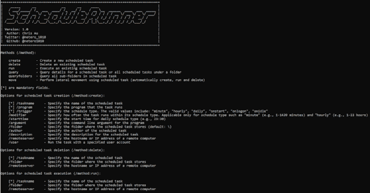

# ScheduleRunner:一个 C#工具，可以更加灵活地定制调度任务

> 原文：<https://kalilinuxtutorials.com/schedulerunner/>

.png)

**scheduler runner**is a Scheduled task 是过去十年中最流行的攻击技术之一，现在仍被黑客/红队普遍用于持续性和横向移动。

已经开发了许多 C#工具来模拟使用预定任务的攻击。我已经使用了其中的一些，但是每一个在定制任务时都有自己的限制。因此，这个项目旨在提供一个 C#工具(cobalt strike execute-assembly friendly)来包含我需要的功能，并提供足够的灵活性来定制预定的任务。

## 方法(/方法)

| 方法 | 功能 |
| --- | --- |
| 创造 | 创建新的计划任务 |
| 删除 | 删除现有的计划任务 |
| 奔跑 | 执行现有的计划任务 |
| 询问 | 查询文件夹下某个计划任务或所有计划任务的详细信息 |
| 查询文件夹 | 查询计划任务中的所有子文件夹 |
| 移动 | 使用计划任务执行横向移动(自动创建、运行和删除) |

## 计划任务创建选项(/method:create)

| 方法 | 功能 |
| --- | --- |
| [*] /taskname | 指定计划任务的名称 |
| [*]/程序 | 指定任务运行的程序 |
| [*]/触发器 | 指定计划类型。有效值包括:“分钟”、“每小时”、“每天”、“onstart”、“onlogon”、“onidle” |
| /修饰符 | 指定任务在其计划类型内运行的频率。仅适用于“分钟”(例如，1-1439 分钟)和“每小时”(例如，1-23 小时)等计划类型 |
| /starttime | 指定每日计划类型的开始时间(例如，23:30) |
| /参数 | 指定程序的命令行参数 |
| /文件夹 | 指定存储计划任务的文件夹(默认:\) |
| /作者 | 指定计划任务的作者 |
| /描述 | 指定计划任务的描述 |
| /remoteserver | 指定远程计算机的主机名或 IP 地址 |
| /用户 | 使用指定的用户帐户运行任务 |
| /技术 | 指定规避技术:
–“隐藏”:铪恶意软件使用的一种技术，它将从任务查询

中隐藏预定任务。]https://www . Microsoft . com/security/blog/2022/04/12/tar rask-malware-uses-scheduled-tasks-for-defense-escalation/
[！]由于远程注册表的权限，该技术不支持远程执行。它需要“NT AUTHORITY\SYSTEM ”,任务将继续运行，直到系统重新启动，即使在任务删除后 |

[*]是必填字段。

## 计划任务删除选项(/method:delete)

| 方法 | 功能 |
| --- | --- |
| [*] /taskname | 指定计划任务的名称 |
| /文件夹 | 指定存储计划任务的文件夹(默认:\) |
| /remoteserver | 指定远程计算机的主机名或 IP 地址 |
| /技术 | 指定使用规避技术创建计划任务的时间:
–“隐藏”:删除使用了“隐藏计划任务”技术

的计划任务。]删除需要“NT AUTHORITY\SYSTEM ”,任务将继续运行，直到任务删除后系统重新启动 |

[*]是必填字段。

## 计划任务执行选项(/method:run)

| 方法 | 功能 |
| --- | --- |
| [*] /taskname | 指定计划任务的名称 |
| /文件夹 | 指定存储计划任务的文件夹(默认:\) |
| /remoteserver | 指定远程计算机的主机名或 IP 地址 |

[*]是必填字段。

## 计划任务查询选项(/method:query)

| 方法 | 功能 |
| --- | --- |
| /taskname | 指定计划任务的名称 |
| /文件夹 | 指定存储计划任务的文件夹(默认:\) |
| /remoteserver | 指定远程计算机的主机名或 IP 地址 |

[*]是必填字段。

## 计划任务横向移动选项(/method:move)

| 方法 | 功能 |
| --- | --- |
| [*] /taskname | 指定计划任务的名称 |
| [*]/程序 | 指定任务运行的程序 |
| [*] /remoteserver | 指定远程计算机的主机名或 IP 地址 |
| /触发器 | 指定计划类型。有效值包括:“分钟”、“每小时”、“每天”、“onstart”、“onlogon”、“onidle” |
| /修饰符 | 指定任务在其计划类型内运行的频率。仅适用于“分钟”(例如，1-1439 分钟)和“每小时”(例如，1-23 小时)等计划类型 |
| /starttime | 指定每日计划类型的开始时间(例如，23:30) |
| /参数 | 指定程序的命令行参数 |
| /文件夹 | 指定存储计划任务的文件夹(默认:\) |
| /作者 | 指定计划任务的作者 |
| /描述 | 指定计划任务的描述 |
| /用户 | 使用指定的用户帐户运行任务 |

[*]是必填字段。

## 举例

**创建一个名为“清理”的计划任务，该任务将在每天晚上 11:30 执行**

`**ScheduleRunner.exe /method:create /taskname:Cleanup /trigger:daily /starttime:23:30 /program:calc.exe /description:"Some description" /author:netero1010**`

**创建一个名为“清理”的计划任务，该任务将在远程服务器上每 4 小时执行一次**

`**ScheduleRunner.exe /method:create /taskname:Cleanup /trigger:hourly /modifier:4 /program:rundll32.exe /argument:c:\temp\payload.dll /remoteserver:TARGET-PC01**`

**删除名为“清理”的计划任务**

`**ScheduleRunner.exe /**method:delete /taskname:Cleanup`

**执行名为“清理”的计划任务**

`**ScheduleRunner.exe /method:run /taskname:Cleanup**`

**查询远程服务器上“\ Microsoft \ Windows \ CertificateServicesClient”文件夹下名为“清理”的计划任务的详细信息**

`**ScheduleRunner.exe /method:query /taskname:Cleanup /folder:\Microsoft\Windows\CertificateServicesClient /remoteserver:TARGET-PC01**`

**查询远程服务器上特定文件夹“\ Microsoft \ Windows \ CertificateServicesClient”下的所有调度任务**

`**ScheduleRunner.exe /method:query /folder:\Microsoft\Windows\CertificateServicesClient /remoteserver:TARGET-PC01**`

**查询调度任务中的所有子文件夹**

`**ScheduleRunner.exe /method:queryfolders**`

**使用特定用户帐户，通过预定任务向远程服务器执行横向移动**

`**ScheduleRunner.exe /method:move /taskname:Demo /remoteserver:TARGET-PC01 /program:rundll32.exe /argument:c:\temp\payload.dll /user:netero1010**`

**使用隐藏计划任务技术创建一个名为“清理”的计划任务:**

`**ScheduleRunner.exe /method:create /taskname:Cleanup /trigger:daily /starttime:23:30 /program:calc.exe /description:"Some description" /author:netero1010 /technique:hide**`

**删除使用了隐藏计划任务技术的名为“清理”的计划任务:**

`**ScheduleRunner.exe /method:delete /taskname:Cl**eanup /technique:hide`

## 隐藏预定任务技术

这种技术曾被威胁行动者铪使用，最近被微软发现。它的目的是使被调度的任务不被工具查询，也不被任务调度器看到。

要使用此技术，您需要拥有“NT 权限/系统”, ScheduleRunner 将为您完成以下工作:

1.  从“HKLM \软件\微软\ Windows NT \当前版本\计划\任务缓存\树\[任务名]”中删除“SD”值
2.  删除计划任务 XML 文件“C:\ Windows \ System32 \ Tasks \[任务名]”

要删除使用此技术创建的计划任务，需要在删除方法中添加“/technique:hide”以正确删除它。

### 这种技术的缺点

即使通过注册表删除了任务，该任务仍将继续运行，直到下次系统重新启动。因此，最好不要在您的操作服务器中使用这种技术。

[**Download**](https://github.com/netero1010/ScheduleRunner)