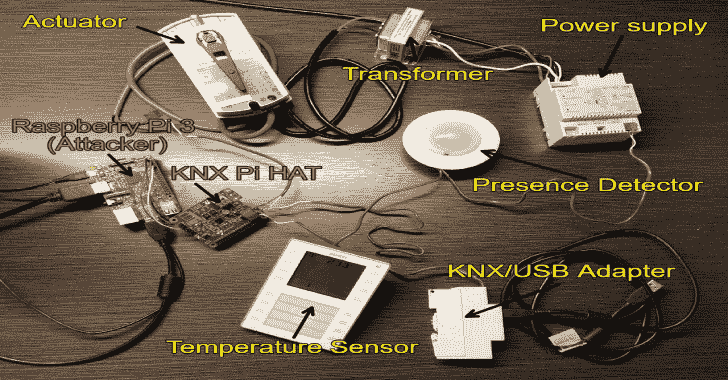
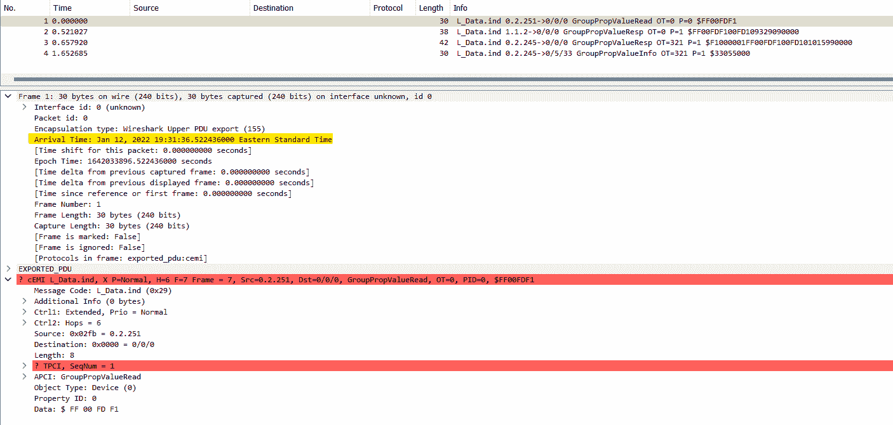
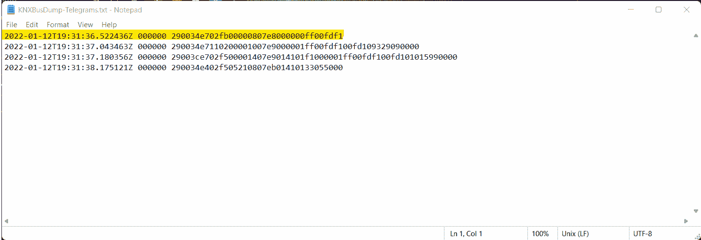

# KNX-Bus-Dump:通过 TPUART 和 Calimero 项目套件监听 KNX 总线的工具

> 原文：<https://kalilinuxtutorials.com/knx-bus-dump/>

KNX-Bus-Dump 是一种流行的楼宇自动化协议，用于将智能建筑的传感器、执行器和其他组件互连在一起。我们的 KNX 总线转储工具使用 Calimero java 库来记录通过 KNX 总线发送的电报，这个库是为了这个工具而开发的。特别是，我们的工具通过 TPUART 连接访问 KNX 总线，但是可以更改为使用不同的连接介质。电报被转储到 Wireshark 兼容的十六进制转储文件中。提供时间戳并以纳秒精度标准化为 UTC 时间，以执行数据分析并提供电报的时间线。十六进制转储文件可以导入 Wireshark，Wireshark 可以配置为使用 Wireshark 的 cEMI 解析器解析 KNX 电报。

我们的工具可用于 KNX 传感器、执行器和其他 KNX 设备的协议分析。例如，我们使用该工具来了解我们的 KNX 设备，并发现不规则的 KNX 电报。该工具对于 KNX 设备的安全性分析也是理想的，因为它公开了所涉及的协议和通过 KNX 总线发送的数据的所有细节。

Tcpdump 和 Wireshark 不能用于转储通过 KNX 总线发送的电报，因为我们处理的是本地 KNX 电报，而不是 TCP/IP 数据包。Wireshark 和 tcpdump 可以转储 KNXnet/IP 数据包，即 TCP/IP 数据包。KNXnet/IP 是一种协议，用于通过 TCP/IP 网络向 KNX 总线发送命令和数据。

# 先决条件

该工具旨在与 Calimero Java 库配合使用，并与 Raspberry Pi 3 或 4 以及用于 TPUART 连接的 Raspberry Pi HAT 兼容。

以下是一些设置环境的指南:

*   KNX Raspberry PiHAT 用法演练
*   Raspberry Pi 和 Calimero 套件设置

*注意:接下来的步骤将假设您根据这些指南设置您的环境。*

# 用法

## 创建十六进制转储

*   将*KNXBusDump.java*文件放到 Calimero 项目套件的*introduction/src/main/Java/*文件夹中。
*   进入*简介*文件夹。
*   要运行该程序，您只需运行:

**。/grad Lew run-pcalimero . serial . tpuart . maxinterbytedelay = 60000-DmainClass = KNXBusDump**

*   现在，您等待一些消息在总线上传输，转储的电报将在*KNXBusDump-telegraphs . txt*文件中。
*   使用 Ctrl-C 取消该工具，文件现在可以导入 Wireshark 进行分析了。

## 分析十六进制转储

在 Wireshark 中，您可以从十六进制转储中导入数据包，并指定一个分析器来分析数据包。

*   启动 Wireshark 后，等待初始加载完成。然后点击*文件- >从十六进制转储导入…*
*   为了正确地解析它，我们需要给它一个带有一些标签的正则表达式(regex)。

***(？\ d-\ d \ d-\ d \ dt(\ \ d \ d \:)\ d \ d。(\ d){ 6 }[z])\ s(？\d{6})\s+(？[0-9a-fa-f]*$**

*   选择十六进制转储文件作为源文件。
*   在新对话框下，切换到*正则表达式*选项卡，并将正则表达式粘贴到框中。
*   确保数据编码为*普通十六进制* 200*16
*   在*时间戳格式*文本框中，我们需要指定工具生成的模式。

**%Y-%m-%dT%H:%M:%S.%fZ**

*   在*封装*部分，将*封装类型*改为 *Wireshark Upper PDU Export* 。
*   勾选 *ExportPDU* 指定 *cemi* 解剖器。
*   现在，您可以导入文件并分析电报。

## 抽样输出

**Wireshark 时间戳**

**对应的十六进制转储文件**

**注意事项**

*   cemi 解析器从报文的消息代码(MC)部分开始。它不考虑介质类型。
*   TPCI 之所以用红色突出显示是因为一个设计选择。解析器将看到该数据包是一个未编号的数据包(UDP ),这意味着根据 KNX 标准，序列号*通常*设置为 0。但是，有时一些设备会将其设置为非零值。在本例中，它被设置为 1。然后解剖器将检查序列号是否为零。在这种情况下，它不是，因此序列号的错误消息预期为 0。

[**Download**](https://github.com/ChrisM09/KNX-Bus-Dump)