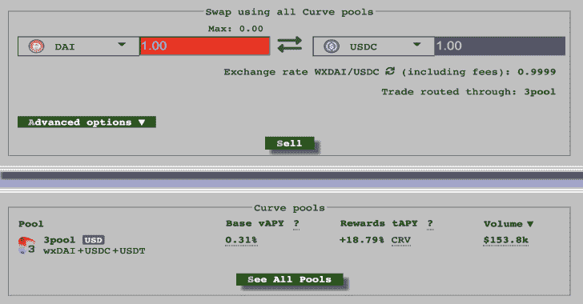

# Hcltm:用 HCL 记录您的威胁模型

> 原文：<https://kalilinuxtutorials.com/hcltm/>

Hcltm 是一款用 HCL 记录威胁模型的工具。有许多不同的方法可以记录威胁模型。从简单的文本文件，到更深入的 word 文档，再到集中解决方案中全面的威胁模型。威胁模型的两个最有价值的属性是能够清楚地记录威胁，以及能够推动有价值的变化。

`**hcltm**`旨在通过关注以下目标，提供一种 DevOps 优先的方法来记录系统威胁模型:

*   简单文本文件格式
*   简单的 cli 驱动的用户体验
*   集成到版本控制系统中(VCS)

这个存储库是`**hcltm**` cli 软件的所在地。`**hcltm**`规范基于 HCL2，HashiCorp 的配置语言，旨在“*令人愉快地阅读和编写，以及基于 JSON 的变体，便于机器生成和解析*”。将`**hcltm**` cli 软件和`**hcltm**`规范结合起来，实践者可以用 HCL 定义系统威胁模型，例如:

**threatmodel "伦敦塔" {
description = "一座历史城堡"
author = " @ xn trik "
attributes {
new _ initiative = " true "
internet _ facing = " true "
initiative _ size = " Small "
}
information _ asset " crown jewels " {
description = " including The imperial state crown "
information _ class = " Confidential "
}
use case {
description = "。
third _ party _ dependency " community watch " {
description = " The community watch helps The premises "
uptime _ dependency = " degraded "
}
threat {
description = " Someone not The Queen steak The crown "
impacts =[" confidential "]
control = " Lots guards "
}
data _ flow _ diagram {
//…详见下文
}** 

有关如何构建自动转换为 png 的数据流图的更多信息，请参见数据流图。

要查看如何引用 OWASP 主动控制和 AWS 安全清单的预定义控制库的示例，请参见 examples/tm3.hcl。我们在此处还有米特 ATT&CK 控制。

要查看规范的完整描述，请点击此处或运行:

**hcltm 生成样板文件**

## 为什么是 HCL？

HCL 是 HashiCorp 产品中使用的主要配置语言，尤其是 Terraform——他们的开源基础设施即代码软件。我在 HashiCorp 工作了一段时间，这种语言真的让我越来越喜欢，另外，如果开发人员和软件工程师正在使用这种语言，那么简化他们记录威胁模型的方式符合`**hcltm**`的目标。

你可以在 JSON 中使用`**hcltm**`，但是你失去了一些特性。有关更多信息，请参见示例/文件夹。

# hcltm cli

## 安装

从 releases 下载最新版本，并将`**hcltm**`二进制文件移到您的路径中。

## 用自制软件安装

下面将添加一个本地 tap，并用 Homebrew 安装`**hcltm**`

**brew 安装 xntrik/repo/hcltm**

## 与码头工人一起跑

**码头运行–RM-it xntrik/hcltm**

## 使用 GitHub 操作运行

`**hcltm**`可以直接集成到您的 GitHub repos 与 https://github.com/xntrik/hcltm-action.这是一个理想的方法来管理您的威胁模型，并有助于实现集成到您的版本控制系统的目标。

## 从源头构建

*   克隆此存储库。
*   换入目录，`**hcltm**`
*   `m**ake bootstrap**`
*   `**make dev**`

要进一步了解对`**hcltm**`的贡献，请查看 CHANGELOG.md。

## 用法

有关任何子命令的帮助，请使用`**-h**`标志。

**$ hcltm
用法:hcltm[–version][–help][]
可用命令有:
仪表板从现有 HCL 威胁模型文件生成降价文件
dfd 从现有 HCL 威胁模型文件生成数据流图 PNG 文件
生成 HCL 威胁模型
列出在 HCL 文件中找到的威胁模型
验证验证现有 HCL 威胁模型文件
查看查看现有 HCL 威胁模型文件**

## 配置文件

大多数`**hcltm**`命令都有一个`**-config**`标志，允许你指定一个`**config.hcl**`文件。该文件中的 HCL 可能被用来覆盖`**hcltm**`的一些默认属性。下面列出了这些:

*   **计划规模**–默认为“未定义”、“小”、“中”、“大”
*   **默认方案规模**–默认为“未定义”
*   **信息分类**–默认为“受限”、“机密”、“公开”
*   **默认信息分类**–默认为“机密”
*   **影响类型**–默认为“机密性”、“完整性”、“可用性”
*   **STRIDE 元素**–默认为“欺骗”、“篡改”、“信息泄露”、“拒绝服务”、“特权提升”
*   **正常运行时间依赖分类**–默认为“无”、“降级”、“硬”、“可操作”
*   **默认正常运行时间依赖分类**–默认为“无”

例如:

**initiative _ size =[" S "，" M "，" L "]
default _ initiative _ size = " M "
info _ classifications =[" 1 "，" 2 "]
default _ info _ classification = " 1 "
impact _ types =[" big "，" small "]
stamps =[" S "，" T "]
uptime _ dep _ classifications =[" N "，" D "]
default _ uptime _ dep _ classification = " N "**

如果您修改这些属性，您需要记住为其他操作提供配置文件，因为这可能会影响验证或仪表板的创建。

## 列表和查看

`**hcltm list**`和`**hcltm view**`命令可用于列出和查看来自`**hcltm**` spec HCL 文件的数据。

**$ hcltm list examples/*
File threat model 作者
1 examples/tm1.hcl 伦敦塔@xntrik
2 examples/tm1.hcl 诺克斯堡@ xn trik
3 examples/tm2 . HCl Modelly model @ xn trik**

## 使生效

`**hcltm validate**`命令用于验证`**hcltm**`规格 HCL 文件。

**$ hcltm 验证示例/*
在 3 个文件中验证了 3 个 threatmodels】**

## 产生

**`hcltm generate`** 命令用于输出一个通用的 **`boilerplate` `hcltm`** 规格 HCL 文件，或者交互式地向用户提问，然后输出一个`**hcltm**`规格 HCL 文件。

### 生成交互

请参见以下示例:

**hcltm 生成交互**

### 生成交互式编辑器

如果您喜欢直接在您的`**$EDITOR**`中工作，那么运行:

**hcltm 基因** r **ate 互动编辑**

这将在您的编辑器中打开一个准系统 HCL 威胁模型。如果您想在创建后验证模型，那么使用`**-validate**`标志。

## 仪表盘

`**hcltm dashboard**`命令获取`**hcltm**` spec HCL 文件，并生成一些 markdown 和 png 文件，将它们放入选定的文件夹中。

**$ hcltm dashboard-overwrite-outdir = dashboard-example/*
创建了“dashboard-example”目录
将 dashboard 降价文件写入“dashboard-example”并覆盖现有文件
成功写入“dashboard-example/tm1-toweroflondon . MD”
成功写入“dashboard-example/tm1-fortknox . MD”
成功写入“dashboard-example/tm2-modely model . png”
成功写入“dashboard-example/tm2-model”**

### 自定义降价模板

`**hcltm dashboard**`命令也可以使用可选标志来指定定制模板(根据 Golang 的文本/模板)。

要指定仪表板模板文件，请使用`**-dashboard-template**`标志。有关示例，请参见 dashboard-template.tpl。

要指定 threatmodel 模板文件，请使用`**-threatmodel-template**`标志。有关示例，请参见 threatmodel-template.tpl。

### 仪表板索引文件的自定义文件名

`**hcltm dashboard**`命令还可以使用一个可选标志来指定“索引”生成的仪表板文件的文件名。默认情况下，这个文件是`**dashboard.md**`。使用不带扩展名的`**-dashboard-filename**`标志来更改该文件名。

## 数据流程图

根据规范，一个`**threatmodel**`可以包含一个`**data_flow_diagram**`。这里有一个简单的 DFD 的例子。

`**hcltm dfd**`命令获取`**hcltm**` spec HCL 文件，并生成许多 png 文件，将它们放入选定的文件夹中。

如果 HCL 文件不包括带有`**data_flow_diagram**`块的`**threatmodel**`块，那么什么都不输出。

该命令本身非常类似于仪表板命令。

**$ hcltm DFD-overwrite-outdir testout examples/*
成功创建' testout/tm2-modelly model . png '**

如果你的`**threatmodel**`不包含`**diagram_link**`，但是包含了`**data_flow_diagram**`，那么这也会在运行`**hcltm dashboard**`时被渲染。

## 地形

`**hcltm terraform**`命令可以从`**terraform show -json**`文档中提取数据资源，在此输出计划文件或活动状态文件，并将其转换成草图`**information_asset**`块，以包含在`**hcltm**`文件中。

如果您在具有现有状态的文件夹中，您可以执行以下操作:

**terra form show-JSON | hcltm terra form-stdin**

这将输出类似如下的内容:

**information _ asset " AWS _ rds _ cluster default " {
description = " cluster _ identifier:aurora-cluster-demo，database _ name:mydb "
information _ class ification = " "
source = " terra form state "
}
information _ asset " AWS _ S3 _ bucket example " {
description = " bucket:terra form-202111107150000000001 "
information _ class ification = " "【T8**

您还可以通过运行以下命令来查看尚未应用 Terraform 的计划文件的类似输出:

**terra form show-JSON | hcltm terra form-stdin**

如果您想要更新现有的`**hcltm**`威胁模型文件(“threatmodel.hcl”)，您可以使用:

**terra form show-JSON | hcltm terra form-stdin-add-to-existing = threat model . HCl>new-threat model . HCl**

使用`**-add-to-existing**`标志，如果需要从源文件中指定一个特定的威胁模型(如果有多个),还可以指定`**-tm-name=<string>**`。你也可以应用一个默认的分类，带有`**-default-classification=Confidential**`标志。

这些命令也可以接受一个文件作为输入，在这种情况下，省略`**-stdin**`标志。

[**Download**](https://github.com/xntrik/hcltm)