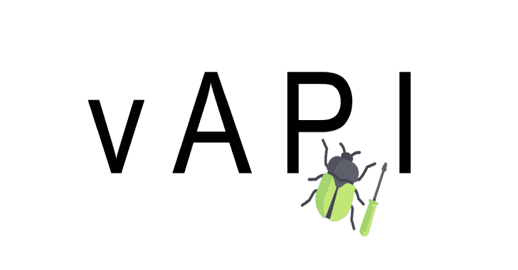

# vAPI:易受攻击的反向编程接口，它是自托管 API

> 原文：<https://kalilinuxtutorials.com/vapi/>

.png)

**vAPI** 是易受攻击的反向编程接口，它是一种自托管 API，在练习方式上模仿 OWASP API 十大场景。

# 要求

*   服务器端编程语言（Professional Hypertext Preprocessor 的缩写）
*   关系型数据库
*   邮递员
*   MITM 代理

# 安装(对接)

**坞站-合成 up -d**

# 安装(手动)

## 复制代码

**CD<your-hosting-directory>**

**git 克隆 https://github . com/root tusk/vapi . git**

## 设置数据库

将`**vapi.sql**`导入 MySQL 数据库

在`**vapi/.env**`中配置数据库凭证

## 启动 MySQL 服务

运行以下命令(Linux)

**服务 mysqld 开始**

## 正在启动 Laravel 服务器

转到`**vapi**`目录并运行

**php 匠服**

## 设置邮递员

*   在邮递员中导入`**vAPI.postman_collection.json**`
*   在邮递员中导入`**vAPI_ENV.postman_environment.json**`

运筹学

使用公共工作区

# 使用

浏览`**http://localhost/vapi/**`获取文档

发送请求后，参考 Postman 测试或环境来获取生成的令牌

# 部署

Helm 可用于部署到 Kubernetes 名称空间。图表在`**vapi-chart**`文件夹中。该图表需要一个名为`**vapi**`的秘密，其值如下:

**数据库 _ 密码:
数据库 _ 用户名:**

样本舵安装命令:`**helm upgrade --install vapi ./vapi-chart --values=./vapi-chart/values.yaml**`

***重要***

`**values.yaml**`中第 232 行的 MYSQL_ROOT_PASSWORD 必须与第 184 行的相匹配才能工作。

[**Download**](https://github.com/roottusk/vapi)