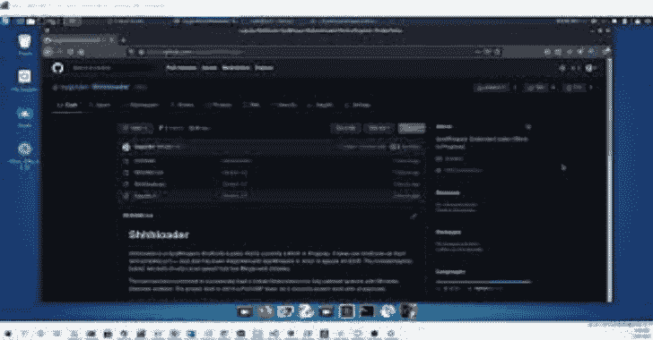

# Shhhloader : SysWhispers 外壳代码加载程序

> 原文：<https://kalilinuxtutorials.com/shhhloader/>

Shhhloader 是一个 SysWhispers 外壳代码加载器，目前正在开发中。它将原始外壳代码作为输入，并编译一个已经与 SysWhispers 集成的 C++存根，以绕过 AV/EDR。包含的 python builder 可以在任何安装了 Mingw-w64 的 Linux 系统上运行。

该工具已被确认可以在启用了 Windows Defender 的完全更新的系统上成功加载 Meterpreter 和 Cobalt Strike beacon。该项目本身仍处于 PoC/WIP 状态，因为它目前并不支持所有有效负载。

编辑:Shhhloader 现在包括 5 种不同的方式来执行你的外壳代码！更新的用法见下文。非常感谢@ Snovvcrash 和他们的 DInjector 项目带来的灵感！我强烈建议看一看它，以获得更多关于 shellcode 注入技术和这个工具现在所基于的代码的信息。

**┳┻|
┻┳|
┳┻|
┻┳|
┳┻| _
┻┳|。)–嘘，AV 可能会听到我们！
┳┻|⊂ﾉ
┻┳|
用法:shhhloader . py[-h][-p explorer.exe][-m queueuser APC][-NR][-v][-d][-o a.exe]文件
ICYGUIDER 的自定义 SYSWHISPERS 外壳代码加载器
位置参数:
包含原始外壳代码的文件
可选参数:
-h，–帮助显示此帮助消息并退出
-p explorer.exe，–处理 explorer.exe
处理到 CurrentThread)(默认:QueueUserAPC)
-nr，–no-randomize 禁用系统调用名称随机化
-v，–执行时详细启用调试消息
-d，–dll-沙盒使用基于 DLL 的沙盒检查，而不是标准的检查
-o a.exe，–outfile a.exe
编译文件的名称**

## 特征

*   5 种不同的外壳代码执行方法(ProcessHollow、QueueUserAPC、RemoteThreadContext、RemoteThreadSuspended、CurrentThread)
*   PPID 欺骗
*   阻止第三方 dll
*   系统调用名称随机化
*   具有动态密钥生成的 XOR 加密
*   通过加载的 DLL 枚举进行沙箱规避
*   通过检查处理器、内存和时间来躲避沙盒

经过测试和确认的工作:

*   Windows 10 21H1 (10.0.19043)
*   Windows 10 20H2 (10.0.19042)
*   Windows Server 2019 (10.0.17763)

[**Download**](https://github.com/icyguider/Shhhloader)