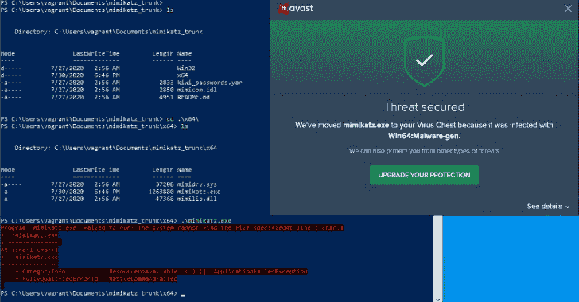

# edr blaster:一种工具，它将易受攻击的签名驱动程序武器化，以绕过 EDR 检测和 LSASS 保护

> 原文：<https://kalilinuxtutorials.com/edrsandblast/>

`**EDRSandBlast**`是用 **`C`** 编写的工具，将易受攻击的签名驱动程序武器化，以绕过 EDR 检测(内核回调和`**ETW TI**`提供者)和`**LSASS**`保护。多用户区域脱钩技术也被实现以逃避用户区域监控。

自发布之日起，用户域(`**--usermode**`)和内核域(`**--kernelmode**`)技术的组合被用于在 EDR 审查下转储`**LSASS**`内存，而不会被阻止，也不会在产品(云)控制台中生成与“操作系统凭证转储”相关的事件。测试在 3 种不同的 EDR 产品上进行，并且在每种情况下都成功。

## 描述

### 通过内核回调移除 EDR 绕过

EDR 产品在 Windows 上使用内核回调，由内核通知系统活动，比如进程和线程的创建以及镜像的加载( **`exe` / `DLL`** )。

内核回调是使用许多文档化的 API(**`nt!PsSetCreateProcessNotifyRoutine`、`nt!PsSetCreateThreadNotifyRoutine`** 等)从用户层面定义的。).用户域 API 将驱动程序提供的回调例程添加到内核空间中未记录的例程数组中:

*   `**PspCreateProcessNotifyRoutine**`用于流程创建
*   `**PspCreateThreadNotifyRoutine**`用于螺纹创建
*   `**PspLoadImageNotifyRoutine**`用于图像加载

`**EDRSandBlast**`枚举那些数组中定义的例程，并删除任何链接到预定义的 EDR 驱动程序列表的回调例程(来自分配的过滤器高度的超过 1000，000 个安全产品的驱动程序)。通过利用`**Micro-Star MSI Afterburner**`驱动程序(`**CVE-2019-16098**`)的任意内核内存读/写漏洞，可以实现枚举和删除。枚举和删除代码很大程度上是受 br-sn 的 CheekyBlinder 项目的启发。

对于超过 350 个版本的 Windows 内核`**ntoskrnl.exe**`，上述数组的偏移量被硬编码在`**NtoskrnlOffsets.csv**`文件中。选择使用硬编码的偏移量而不是模式搜索是合理的，因为负责内核回调添加/移除的未记录的 API 可能会发生变化，并且任何在错误地址写入内核内存的尝试都可能(并且经常会)导致 **`Bug Check` ( `Blue`** `**Screen of Death**`)。有关如何收集失调的更多信息，请参考失调部分。

### 通过停用 ETW 微软视窗威胁情报提供商绕过 EDR

`**ETW Microsoft-Windows-Threat-Intelligence**` provider 记录一些常用的 Windows API 被恶意使用的数据。这包括由`**nt!NtReadVirtualMemory**`调用的`**nt!MiReadWriteVirtualMemory**` API(用于转储`**LSASS**`内存)和由`**nt!EtwTiLogReadWriteVm**`函数监控。

EDR 产品可以通过分别作为`**SERVICE_LAUNCH_PROTECTED_ANTIMALWARE_LIGH**T`或**、**运行并与`**Early Launch Anti Malware (ELAM)**`驱动程序相关联的服务或进程，来使用`**ETW TI**`提供者生成的日志。

正如`**slaeryan**`在一篇`**CNO Development Labs**`博客文章中所发表的， **`ETW TI`** 提供者可以通过在内核内存中将其`**ProviderEnableInfo**`属性修补为`**0x0**`来完全禁用。关于这项技术的更多信息，请参考前面提到的博客文章。

类似于内核回调移除，必要的`**ntoskrnl.exe**`偏移量( **`nt!EtwThreatIntProvRegHandleOffset`、`_ETW_REG_ENTRY`的`GuidEntry`** 和 **`_ETW_GUID_ENTRY`的`ProviderEnableInfo`** )被硬编码在多个 Windows 内核版本的`**NtoskrnlOffsets.csv**`文件中。

### 通过用户区挂接旁路的 EDR 旁路

#### 用户区挂钩的工作原理

为了方便地监控进程执行的动作，EDR 产品经常部署一种叫做*用户域挂钩*的机制。首先，EDR 产品注册一个内核回调函数(通常是*镜像加载*或*进程创建*回调函数，见上)，允许它们在每个进程启动时得到通知。

当一个进程被 Windows 加载时，在它实际启动之前，EDR 能够将一些自定义 DLL 注入到包含其监控逻辑的进程地址空间中。在加载时，这个 DLL 在每个由 EDR 监控的函数的开始注入"*钩子*"。在运行时，当被监视的进程调用被监视的函数时，这些钩子将控制流重定向到 EDR DLL 中的一些监督代码，这允许它检查这些调用的参数和返回值。

大多数时候，被监控的函数都是系统调用(如 **`NtReadVirtualMemory`、`NtOpenProcess`** 等)。)，其实现位于`**ntdll.dll**`。拦截对`**Nt***`函数的调用允许产品尽可能接近用户域/内核域边界(同时保持在用户域内)，但是来自一些更高级别的 dll 的函数也可能被监控。

以下是使用 EDR 产品前后相同功能的示例:

**ntprotectivirtualmemory proc near
mov r10，rcx
mov eax，50h
ptr 字节测试 ds:7FFE0308h，1
jnz short loc _ 18009 D1 E5
sys all
retn
loc _ 18009 D1 E5:** 

**NtProtectVirtualMemory proc 附近
jmp sub _ 7 ffc 74490298；–>“钩子”，跳转到 EDR 分析函数
int 3；被覆盖的指令
int 3；被覆盖的指令
int 3；覆写指令
测试 byte_7FFE0308，1；<–分析后执行在此恢复
jnz short loc _ 7 ffcb 44 ad1e 5
syscall
retn
loc _ 7 ffcb 44 ad1e 5:
int 2Eh
retn
NtProtectVirtualMemory endp**

#### 钩子检测

用户区挂钩的“弱点”是位于用户区内存中，这意味着它们可以被正在审查的进程直接观察和修改。要自动检测进程地址空间中的挂钩，主要思想是比较磁盘上的原始 DLL 和驻留在内存中的库之间的差异，这些差异可能已被 EDR 改变。为了进行这种比较，edr blassam 遵循以下步骤:

*   由于位于`**PEB**`中的`**InLoadOrderModuleList**`，所有加载的 dll 的列表被枚举(以避免调用任何可能被监视和可疑的 API)
*   对于每个加载的 DLL，它在磁盘上的内容被读取并且它的头被解析。驻留在存储器中的相应库也被解析以识别部分、导出等。
*   通过考虑相应加载库的基址，DLL 的重定位被解析和应用。这允许内存库和源自磁盘的 DLL 的内容具有完全相同的内容(在应用重定位的部分)，从而使得比较可靠。
*   枚举导出的函数，并比较“内存中”和“磁盘上”版本的第一个字节。任何差异都表明在加载 DLL 后进行了更改，因此很可能是 EDR 挂钩。

注意:这个过程可以推广到查找不可写部分的任何地方的差异，而不仅仅是在导出函数的开始处，例如，如果 EDR 产品在函数中间开始应用钩子🙂因此不被工具使用，这已经在`**findDiffsInNonWritableSections**`中实现。

为了绕过这些钩子执行的监控，可以使用多种技术，每种技术都有优点和缺点。

#### 挂钩旁路使用…脱钩

绕过基于钩子的监控的最直观的方法是移除钩子。因为钩子存在于进程本身可以到达的内存中，所以要移除钩子，进程可以简单地:

*   改变挂钩所在页面的权限(RX -> RWX 或 RW)
*   由于磁盘上的 DLL 内容，写入已知的原始字节
*   将权限改回 RX

这种方法相当简单，可以用来一次删除所有检测到的钩子。由攻击性工具在开始时执行，这允许代码的其余部分完全不知道挂钩机制，并在不受监控的情况下正常执行。

然而，它有两个主要缺点。EDR 可能正在监控`NtProtectVirtualMemory`的使用，所以用它来改变安装了钩子的页面的权限(至少在概念上)是个坏主意。此外，如果一个线程由 EDR 执行，并定期检查挂钩的完整性，这也可能触发一些检测。

具体实现请查看`**unhook_method**`为 **`UNHOOK_WITH_NTPROTECTVIRTUALMEMORY`时`**unhook()**`函数的代码路径。**

**重要提示:为简单起见，该技术在 edr blaster 中实现，作为用于*展示*其他旁路技术的基础技术；它们中的每一个都演示了如何获得一个不受监控的`NtProtectVirtualMemory`版本，但是之后执行相同的操作(解开一个特定的钩子)。**

#### 使用定制的蹦床钩住旁路

要绕过一个特定的钩子，可以简单地“跳过”并按原样执行函数的其余部分。首先，必须从 DLL 文件中恢复被监控函数的原始字节，这些字节已经被安装钩子的 EDR 覆盖。在我们之前的代码示例中，这将是对应于以下指令的字节:

**mov r10、rcx
mov eax、50h**

识别这些字节是一项简单的任务，因为我们能够对库的内存和磁盘版本执行干净的 *diff* ，如前所述。然后，我们汇编一个跳转指令，该指令被构建来将控制流重定向到地址`**NtProtectVirtualMemory + sizeof(overwritten_instructions)**`处紧随钩子之后的代码

**jmp NtProtectVirtualMemory+8**

最后，我们连接这些操作码，将它们存储在(新的)可执行内存中，并保留一个指向它们的指针。这个对象被称为一个“*蹦床*，然后可以被用作一个函数指针，严格来说相当于原来的`**NtProtectVirtualMemory**`函数。

这种技术的主要好处是挂钩永远不会被删除，因此 EDR 对挂钩执行的任何完整性检查都应该通过。然而，它需要分配可写然后可执行的内存，这是一个典型的外壳代码分配，因此吸引了 EDR 的审查。

实现细节，查看`**unhook_method**`为`**UNHOOK_WITH_INHOUSE_NTPROTECTVIRTUALMEMORY_TRAMPOLINE**`时`**unhook()**`函数的代码路径。请记住，该技术仅在我们的实现中展示，并且最终用于**从内存中移除**钩子，每种技术如下。

#### 利用自带的 EDR 蹦床绕过钩子

EDR 产品，为了让它的钩子工作，必须在内存的某个地方保存它已经删除的操作码。最差(*或“更好”，从攻击者的角度来看*)，为了有效地使用原始指令，EDR 可能已经在某个地方为自己分配了一个*蹦床*来在拦截调用后执行原始函数。

这个 trampoline 可以被搜索并作为挂钩函数的替代，而不需要分配可执行内存，也不需要调用除了`**VirtualQuery**`之外的任何 API，它很可能是一个无害的函数而没有被监控到。

为了找到内存中的蹦床，我们使用`**VirtualQuery**`来浏览整个地址空间，寻找提交的和可执行的内存。对于每一个这样的内存区域，我们扫描它来寻找一个跳转指令，这个跳转指令的目标地址在被覆盖的指令之后(在我们前面的例子中是`**NtProtectVirtualMemory+8**`)。然后，蹦床可以用来调用被挂钩的函数，而不会触发挂钩。

这种技术惊人地有效，因为它在测试过的 EDR 上几乎恢复了所有的蹦床。实现细节，查看`**unhook_method**`为`**UNHOOK_WITH_EDR_NTPROTECTVIRTUALMEMORY_TRAMPOLINE**`时`**unhook()**`函数的代码路径。

#### 使用重复的 DLL 挂接旁路

另一个访问不受监控版本的`**NtProtectVirtualMemory**`函数的简单方法是将复制版本的`**ntdll.dll**`库加载到进程地址空间中。由于两个相同的 dll 可以在同一个进程中加载，假设它们有不同的名字，我们可以简单地将合法的`**ntdll.dll**`文件复制到另一个位置，使用 **`LoadLibrary`** 加载它(或重新实现加载进程)，并使用例如`**GetProcAddress**`来访问函数。

这种技术很容易理解和实现，并且有相当大的成功机会，因为一旦进程运行，大多数 EDR 产品不会在新加载的 dll 上重新安装钩子。然而，主要的缺点是以不同的名字复制微软签名的二进制文件经常被 EDR 产品认为是可疑的。

这种技术仍然在`**EDRSandblast**`中实现。具体实现请查看`**unhook_method**`为**T3 时`**unhook()**`函数的代码路径。**

#### 使用直接系统调用挂接旁路

为了使用与系统调用相关的功能，一个程序可以重新执行 syscalls(在汇编中),以便调用相应的操作系统特性，而无需实际接触`**ntdll.dll**`中的代码，这可能会被 EDR 监控。这完全绕过了在`**ntdll.dll**`中对 syscall 函数进行的任何用户域挂钩。

然而，这也有一些缺点。首先，这意味着能够知道程序需要的函数的系统调用号列表，该列表因 Windows 的每个版本而异。此外，技术上不是系统调用的函数(例如 **`LoadLibraryX` / `LdrLoadDLL`** )也可以被监控，并且不能简单地使用系统调用来重新实现。

这种技术是在 edr blaster 中实现的。如前所述，它仅用于安全执行`**NtProtectVirtualMemory**`，并移除所有检测到的钩子。然而，为了不依赖于硬编码的偏移量，实现了一个小的启发式算法，在`**NtProtectVirtualMemory**`函数的开始处搜索`**mov eax, imm32**`指令，如果找到，就从中恢复系统调用号(否则依赖于已知 Windows 版本的硬编码偏移量)。

实现细节，查看`**unhook_method**`为`**UNHOOK_WITH_DIRECT_SYSCALL**`时`**unhook(**)`函数的代码路径。

### RunAsPPL 旁路

在 Windows 8.1 和 Windows Server 2012 R2 中首次引入的`**Local Security Authority (LSA) Protection**`机制利用`**Protected Process Light (PPL)**`技术来限制对 **`LSASS`** 进程的访问。`**PPL**`保护规范和限制操作，例如受保护进程的内存注入或内存转储，甚至来自持有`**SeDebugPrivilege**`特权的进程。在进程保护模式下，只有以较高保护级别运行的进程才能对受保护的进程执行操作。

Windows 内核用来表示内核内存中进程的`**_EPROCESS**`结构包括一个`**_PS_PROTECTION**`字段，通过其 **`Type` ( `_PS_PROTECTED_TYPE` )** 和 **`Signer` ( `_PS_PROTECTED_SIGNER`** )属性定义进程的保护级别。

通过在内核内存中写入，edr blaster 进程能够将其自身的保护级别升级到`**PsProtectedSignerWinTcb-Light**`。这个级别足以转储`**LSASS**`进程内存，因为它“支配”于`**PsProtectedSignerLsa-Light**`，即运行`**RunAsPPL**`机制的`**LSASS**`进程的保护级别。

`**EDRSandBlast**`实现如下自我保护:

*   打开当前进程的句柄
*   泄漏所有系统句柄使用`**NtQuerySystemInformatio**n`查找当前进程上打开的句柄，以及当前进程的地址' **`EPROCESS`** 结构在内核内存中。
*   利用`**Micro-Star MSI Afterburner**`驱动程序的任意读/写漏洞，覆盖内核内存中当前进程的`**_PS_PROTECTION**`字段。相对于`**EPROCESS**`结构的`**_PS_PROTECTION**`字段的偏移量(由正在使用的`**ntoskrnl**`版本定义)被硬编码在`**NtoskrnlOffsets.csv**`文件中。

### 凭证保护旁路

微软的`**Credential Guard**`是一种基于虚拟化的隔离技术，在微软的`**Windows 10 (Enterprise edition)**`中引入，防止直接访问存储在`**LSASS**`进程中的凭证。

当`**Credentials Guard**`被激活时，在`**Virtual Secure Mode**`中会创建一个`**LSAIso**` ( *LSA 隔离*)进程，该特性利用 CPU 的虚拟化扩展来为内存中的数据提供额外的安全性。对`**LSAIso**`进程的访问受到限制，即使是对具有`**NT AUTHORITY\SYSTEM**`安全上下文的访问。当处理散列时，`**LSA**`进程执行对`**LSAIso**`进程的`**RPC**`调用，并等待`**LSAIso**`结果继续。因此，`**LSASS**`进程将不会包含任何秘密，并将就地存储`**LSA Isolated Data**`。

如 **`N4kedTurtle`的原始研究所述:通过修补内存中`**g_fParameter_useLogonCredential**`和`**g_IsCredGuardEnabled**`的值，可以在具有凭证保护的系统上启用`Wdigest`** 。激活`**Wdigest**`将导致明文凭证存储在`**LSASS**`内存中，用于任何新的交互式登录(无需重启系统)。关于这项技术的更多细节，请参考原始的研究博客。

`**EDRSandBlast**`简单地使最初的 PoC 对 opsec 更加友好，并提供对许多`**wdigest.dll**`版本的支持(通过对`**g_fParameter_useLogonCredential**`和**)**的硬编码补偿)。

### ntoskrnl 和 wdigest 偏移量

使用`**r2pipe**`提取所需的`**ntoskrnl.exe**`和`**wdigest.dll**`偏移量(如上所述)，如 **`ExtractOffsets.py` `Python`** 脚本中所实现的。为了支持更多的 Windows 版本，可以自动下载 Winbindex 引用的`**ntoskrnl.exe**`和`**wdigest.dll**`(并提取它们的偏移量)。这允许从几乎所有在 Windows update 包中发布的文件中提取偏移量(到目前为止是 350+ `**ntoskrnl.exe**`和 30+ `**wdigest.dll**`版本)。

## 用法

易受攻击的 **`RTCore64.sys`** 驱动程序可在以下网址检索:

**http://download-Eu2 . guru 3d . com/afterburner/% 5b guru 3d . com % 5D-msiafterburnersetup 462 beta 2 . zip**

## 快速使用

**用法:EDRSandblast.exe[-h |–help][-v |–verbose][–user mode[–unhook-method]][–kernel mode][–dont-unload-driver][–dont-restore-callbacks][–driver][–service][–nt-offsets][–wdigest-offsets][–add-dll]*[-o |–dump-output]**

## 选择

**-h |–帮助显示此帮助消息并退出。
-v |–verbose 启用更详细的输出。
动作模式:
审计显示用户登陆钩子和/或内核回调而不采取动作。
转储转储 lsass 进程，默认为' LSASS '在当前目录下或者在
使用-o |–output 指定的文件下。
cmd 打开 cmd.exe 提示符。
credguard 修补 LSASS 进程的内存，以启用 Wdigest 明文密码缓存，即使在主机上启用了
凭据保护。不需要内核操作。
–用户模式执行用户登陆操作(DLL 脱钩)。
–Kernel mode 执行内核着陆操作(内核回调移除和 ETW TI 禁用)。
–unhook-method
从以下选项中选择用户区域取消挂钩技术:
1(默认)使用 ntdll 中的(可能被监控的)NtProtectVirtualMemory 函数来删除所有
存在的用户区域挂钩。
2 通过
分配一个跳过钩子的可执行蹦床，并移除所有当前的
用户区钩子，构建了一个“脱钩”(即不受监控)版本的 NtProtectVirtualMemory。
3 搜索由 EDR 自己分配的现有蹦床，以获得 NtProtectVirtualMemory 的“脱钩的”
(即不受监控的)版本，并移除所有当前用户区域的
挂钩。
4 将一个附加版本的 ntdll 库加载到内存中，并使用这个库中的 NtProtectVirtualMemory(希望是
未被监控的)版本来移除所有
当前的用户域钩子。
5 分配一个 shellcode 使用直接 syscall 调用 NtProtectVirtualMemory，
并使用它移除所有检测到的钩子
其他选项:
–don-unload-driver 保留主机上安装的微星 MSI 加力漏洞驱动
默认自动卸载驱动。
–dont-restore-Callbacks 不恢复已删除的 EDR 驱动程序内核回调。
默认恢复回调。
–微星 MSI 加力燃烧室易受攻击驱动程序文件的驱动程序路径。
默认为当前目录下的‘rtcore 64 . sys’。
–要安装/启动的易受攻击服务的服务名。
–包含所需 ntoskrnl.exe 偏移量的 CSV 文件的 nt-offsets 路径。
默认为当前目录下的‘ntoskrnloffsets . CSV’。
–wdigest-offsets 包含所需 wdigest.dll 偏移量的 CSV 文件路径
(仅适用于“credguard”模式)。
默认为当前目录中的‘wdigestoffsets . CSV’。
–在开始
任何操作之前，add-dll 将任意库加载到进程的地址空间中。这有助于审计 DLL 的用户界面挂钩，这些 DLL 不是由这个程序默认加载的
。多次使用这个选项来一次加载多个
dll。
有趣的 dll 示例:shell32.dll、shell32.dll、shell32.dll、
samcli.dll、winhttp.dll、urlmon.dll、shell32.dll、shell32 . dll…
-o |–将由“转储”模式生成的转储文件的输出路径。
当前目录中默认为‘lsass’**tory。

### 建设

`**EDRSandBlast**`(仅限 x64)基于 Visual Studio 2019 (Windows SDK 版本: **`10.0.19041.0` a** nd 平台工具集:`**Visual Studio 2019 (v142)**`)构建。

### ExtractOffsets.py 用法

注意`**ExtractOffsets.py**`只在 Windows 上测试过。

# Python 依赖项的安装

pip.exe 安装-m .\requirements.txt

# 脚本用法

**extract offsets . py[-h]-I INPUT[-o OUTPUT][-d]mode
位置参数:
mode ntoskrnl 或 wdigest。下载并提取 ntoskrnl 或 wdigest
的偏移量的模式可选参数:
-h，–帮助显示此帮助消息并退出
-i 输入，–输入输入
包含要从中提取偏移量的 ntoskrnl.exe/wdigest.dll 的单个文件或目录。
如果在下载模式下，从 MS symbols 服务器下载的 PE 将放在该文件夹中。
-o OUTPUT，–OUTPUT 输出
要写入偏移量的 CSV 文件。如果指定的文件已经存在，将只下载/分析新的 ntoskrnl 版本
。
默认为当前文件夹中的 ntoskrnloffsets . CSV/wdigestoffsets . CSV。
-d，–使用来自 winbindex.m417z.com 的版本列表从 Microsoft 服务器下载 PE 的 download 标志。**

## 侦查

从防御者(EDR 厂商、微软、关注 EDR 遥测技术的 SOC 分析师……)的角度来看，可以使用多种指标来检测或阻止这种技术。

### 驱动程序白名单

由于该工具在内核模式内存中执行的每个操作都依赖于易受攻击的驱动程序来读取/写入任意内容，因此 EDR 产品(或 SOC 分析师)应该严格审查驱动程序加载事件，并在任何不寻常的驱动程序加载时发出警报，甚至阻止已知的易受攻击的驱动程序。后一种方法甚至是微软自己推荐的:任何支持 HVCI ( *Hypervisor 保护的代码完整性*)的 Windows 设备都嵌入了驱动程序阻止列表，这将逐渐成为 Windows 上的默认行为(它已经在 Windows 11 上实现了)。

### 内核内存完整性检查

由于攻击者仍然可以使用未知的易受攻击的驱动程序在内存中执行相同的操作，EDR 驱动程序可以定期检查其内核回调是否仍然注册，直接通过检查内核内存(就像该工具所做的那样)，或者简单地通过触发事件(进程创建、线程创建、映像加载等)。)并检查回调函数确实是由执行内核调用的。

顺便提一下，这种类型的数据结构可以通过最近的内核数据保护(KDP)机制来保护，该机制依赖于基于虚拟的安全性，以便在不调用正确的 API 的情况下使内核回调数组不可写。

同样的逻辑也适用于敏感的 ETW 变量，如`**ProviderEnableInfo**`，该工具滥用它来禁用 ETW 威胁情报事件生成。

### 用户模式检测

一个进程主动试图避开用户登陆挂钩的第一个标志是对与加载的模块相对应的每个 DLL 的文件访问；在正常执行中，用户域进程很少需要读取`**LoadLibrary**`调用之外的 DLL 文件，尤其是 **`ntdll.dll`。**

为了防止 API 挂钩被绕过，EDR 的产品可以定期检查每个被监控的进程中的挂钩在内存中没有被改变。

最后，检测挂钩旁路(滥用蹦床，使用直接系统调用，等等。)这并不意味着钩子的移除，EDR 产品可能会依赖与被滥用的系统调用(例如`**PsCreateProcessNotifyRoutine**`代表`**NtCreateProcess**`系统调用，`**ObRegisterCallbacks**`代表`**NtOpenProcess**`系统调用，以此类推。)，并执行用户模式调用堆栈分析，以确定系统调用是由正常路径(**`kernel32.dll`->-`ntdll.dll`**->系统调用)还是异常路径(例如`**program.exe**` - >直接系统调用)。

[**Download**](https://github.com/wavestone-cdt/EDRSandblast)