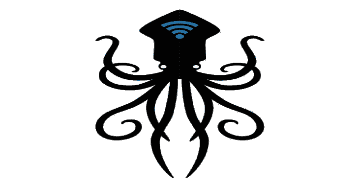

# 北海巨妖:一个多平台分布式暴力破解密码系统

> 原文：<https://kalilinuxtutorials.com/kraken-2/>

.png)

**北海巨妖**是一款在线分布式暴力破解密码工具。它允许你在多台机器上并行化字典和基于单词生成器的破解，既可以作为一个 web 浏览器中的 web 应用，也可以作为一个独立的基于电子的客户端。北海巨妖的目标是易于使用、容错和可扩展。

我写了《北海巨妖》,因为我想学习更多关于攻击性安全的知识，并编写一个简单的解决方案来克服在尝试分发强力负载时使用单个设备的限制。

### 安装

##### 服务器和浏览器客户端

北海巨妖是一个使用 **docker-compose** 的 docker 化应用，它将启动**db**(Postgres)**S3 兼容文件存储**(Minio)**服务器**和**浏览器客户端**。您可以在存储库的根目录下找到 docker-compose 文件。您可以使用以下命令部署它:

**坞站-合成**

北海巨妖的浏览器客户端应可在以下位置访问:

*   HTTP : localhost:8080(使用服务器 URL HTTP://localhost:5000/API[默认])
*   HTTPS :  https://localhost:8443 (use server url  https://localhost:8443/api)

**注意**:要从远程机器运行浏览器客户端，你**必须**对服务器 url 和浏览器 url 都使用 HTTPS。例如，如果您在 192.168.1.2 上托管服务器，那么浏览器客户端将在 https://192.168.1.2:8443 上可用，并且服务器 url 应该是 https://192.168.1.2:8443/api

要上传密码列表或字典，请将它们上传到位于 localhost:9001 的 Minio 控制台。否则，你可以使用 crunch 动态生成单词列表。参见 crunch 选项及其使用方法:crunch 手册页

北海巨妖的服务器在 localhost:5000 上运行，同时也在 localhost:5000/swagger 上托管 swagger 文档。

##### 便携式桌面客户端

桌面客户端是一个基于电子的便携式应用程序，可以在 Mac、Windows 和 Linux 上运行。由于运行所需的敏感权限，强烈建议您通过克隆 repo 并使用以下命令来自行编译它:

**cd kraken-client
npm 安装
npm 运行电子启动**

###### Windows 操作系统

**注意** : Window EXE 便携客户端需要运行在带有 hashcat 依赖项的文件夹中。Hashcat 文件可以从他们的主页或者这里下载。我在可移植的可执行文件和所需的 hashcat 文件中包含了一个压缩的 zip 文件。它们可以下载:

*   可移植 Exe
*   压缩拉链

###### Linux

发行版包括一个 Linux **AppImage** ，它只需要安装 hashcat。

*   AppImage

安装 hashcat:

**sudo apt-get install hashcat**

您必须通过属性授予 AppImage 权限才能执行。

[**Download**](https://github.com/arcaneiceman/kraken)