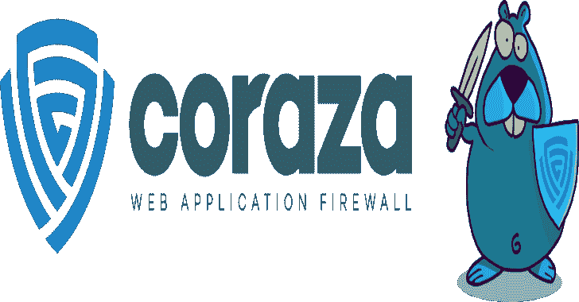

# OWASP Coraza WAF:一个 Golang Modsecurity 兼容的 Web 应用防火墙库

> 原文：<https://kalilinuxtutorials.com/owasp-coraza-waf/>

.png)

**OWASP Coraza** Web 应用防火墙，OWASP Coraza 是 golang 企业级 Web 应用防火墙框架，支持 Modsecurity 的 seclang 语言，与 OWASP 核心规则集 100%兼容。

## 先决条件

*   Linux 发行版(推荐使用 Debian 和 Centos，尚不支持 Windows)
*   Golang 编译器 1.16+版

## 从 v1 迁移

*   将 SecAuditLog 回滚到旧语法(串行/并发)
*   使用`**waf.SetErrorLogCb(cb)**`附加一个错误日志处理程序(可选)
*   函数事务。必须使用 Clean()来清除事务数据和文件，并将它们放回同步池。
*   如果您使用的是低级 API，请检查完整的 changelog，因为其中大部分已被删除。
*   OWASP CRS 不再需要任何外部依赖

## 运行测试

运行 go 测试:

**去测试。/…
去试车吧。/……**

使用预提交

**pip 安装预提交
预提交运行-所有文件**

您也可以通过运行以下命令来安装预提交 git 挂钩

**预提交安装**

## Coraza v2 与 v1 的区别

*   完整的内部 API 重构，公共 API 未更改
*   支持插件的完整审计引擎重构
*   用于变换、动作、主体处理器和操作符的新的增强插件接口
*   我们完全符合 modsecurity v2 的 Seclang
*   许多特性被移除并转化为插件:XML(大部分)、GeoIP 和 PCRE regex
*   更好的调试日志记录
*   新的错误记录(像 modsecurity)
*   更好的性能

## 你的第一个 Coraza WAF 项目

**package main
import(
" fmt "
" github . com/corazawaf/coraza/v2 "
" github . com/corazawaf/coraza/v2/seclang "
)
func main(){
//首先我们初始化我们的 waf 和我们的 sec lang 解析器
waf := coraza。NewWaf()
解析器，_ := seclang。NewParser(waf)
//现在我们解析我们的规则
if err := parser。from string(`SecRule REMOTE_ADDR "@rx .*" "id:1,phase:1,deny,status:403"`)；呃！= nil {
fmt。Println(err)
}
//然后我们创建一个事务，赋一些变量
tx := waf。new transaction()
defer func(){
tx。ProcessLogging()
tx 清洁()
}()
tx。ProcessConnection("127.0.0.1 "，8080，" 127.0.0.1 "，12345)
//最后我们处理请求头阶段，如果:= tx，可能会返回中断
。ProcessRequestHeaders()；它！= nil {
fmtPrintf("事务被中断，状态为%d\n "，它。状态)
}
}**

[**Download**](https://github.com/corazawaf/coraza)