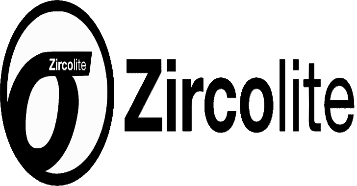

# Zircolite:一个独立的基于 SIGMA 的检测工具，用于 Linux 日志的 EVTX、Auditd 和 Sysmon

> 原文：<https://kalilinuxtutorials.com/zircolite/>

.png)

Zircolite 是用 Python 3 编写的独立工具。它允许在 MS Windows EVTX (EVTX 和 JSONL 格式)、Auditd 日志和 Sysmon for Linux 日志上使用 SIGMA 规则

*   **锆英石**可直接用于调查终点(使用释放物)或您的法医/检测实验室
*   Zircolite 速度很快，可以在几秒钟内解析大型数据集(基准测试)

Zircolite 可以直接在 Python 中使用，也可以使用版本中提供的二进制文件(仅限 Microsoft Windows 和 Linux)。 **文档在这里。**

## 要求/安装

您可以使用`**pip3 install -r requirements.txt**`安装依赖项

evtx_dump 的使用是**可选的，但默认情况下是必需的(因为它现在要快得多)**，如果你不想使用它，你必须使用`**--noexternal**`选项。如果您克隆了 Zircolite 存储库(官方存储库在此),则会提供该工具。

## 快速启动

#### EVTX 文件

使用 **`zircolite.py -h`可以获得帮助。**如果你的 EVTX 文件有扩展名”。evtx "

**python 3 zircolite . py–evtx–ruleset
python 3 zircolite . py–evtx sysmon . evtx–ruleset rules/rules _ windows _ sysmon . JSON**

这里使用的 SYSMON 规则集是默认规则集，它适用于来自安装了 SYSMON 的端点的日志。通用规则集也是可用的。

#### 审计日志

**python 3 zircolite . py–evtx–ruleset–auditd
python 3 zircolite . py–evtx auditd . log–ruleset rules/rules _ Linux . JSON–auditd**

## Linux 日志的 Sysmon

**python 3 zircolite . py–evtx–ruleset–sysmon 4 Linux
python 3 zircolite . py–evtx auditd . log–ruleset rules/rules _ Linux . JSON–sysmon 4 Linux**

## JSONL/NDJSON 文件

**python 3 zircolite . py–evtx–ruleset rules/rules _ windows _ sysmon . JSON–JSON only**

[**Download**](https://github.com/wagga40/Zircolite)