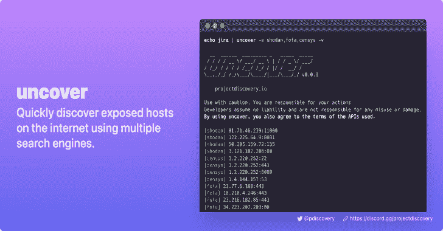

# 发现:使用多个搜索引擎快速发现互联网上暴露的主机

> 原文：<https://kalilinuxtutorials.com/uncover/>

**Uncover** 是一个 go wrapper，使用知名搜索引擎的 API 来快速发现互联网上暴露的主机。它是按照自动化的思想构建的，因此您可以查询它，并使用您当前的管道工具来利用结果。目前支持 **shodan** 、 **shodan-internetdb** 、 **censys** 、 **fofa** 搜索 API。

## 特征

*   查询多个搜索引擎简单方便的工具
*   多搜索引擎支持( **Shodan** 、 **Censys** 、 **Fofa** 、 **Shodan-InternetDB** )
*   自动密钥/凭证随机化
*   **标准输入** / **标准输出**支持输入输出

# 安装说明

揭开需要 **go1.17** 才能成功安装。运行以下命令获取报告–

**去安装-v github.com/projectdiscovery/uncover/cmd/uncover@latest**

## 使用

**揭开-h**

这将显示该工具的帮助。以下是它支持的所有标志:

**用法:
。/uncover【Flags】
Flags:
输入:
-q，-query string[]搜索查询或列表(文件或逗号分隔或 stdin)
-e，-engine string[]搜索引擎要查询的(shodan，shodan-idb，fofa，censys)(默认 shodan)
CONFIG:
-pc，-provider string 提供者配置文件(默认" $HOME/)。config/uncover/provider-config . YAML ")
-config 字符串标志配置文件(默认" $HOME/)。config/uncover/config . YAML ")
-time out int time out in seconds(默认为 30)
-delay int delay in seconds(0 表示禁用)(默认为 1)
OUTPUT:
-o，-output string 输出文件以写入找到的结果
-f，-field string 字段以显示在输出中(ip，port，host)(默认为“IP:port”)
-j，-json write 以 JSONL(ines)格式输出
-r，-raw 写入由接收的原始输出 -no-color 禁用输出中的颜色
调试:
-静默只显示输出中的结果
-版本显示项目的版本
-v 显示详细输出**

# 提供商配置

默认的提供者配置文件应该位于`**$HOME/.config/uncover/provider-config.yaml**`处，并具有以下内容作为示例。**为了运行此工具，需要在此配置文件中添加 API 密钥/凭证，或者将其设置为环境变量。**

**shod an:
shod an _ API _ KEY 1
shod an _ API _ KEY 2
CENSYS:
CENSYS _ API _ ID:CENSYS _ API _ SECRET
fofa:
FOFA _ EMAIL:FOFA _ KEY**

当在配置文件中为同一个提供程序指定了多个密钥/凭据时，随机密钥将用于每次执行。

或者，您也可以将 API 键设置为 bash 配置文件中的环境变量。

**出口 SHODAN_API_KEY=xxx
出口 CENSYS_API_ID=xxx
出口 CENSYS_API_SECRET=xxx
出口 FOFA_EMAIL=xxx
出口 FOFA_KEY=xxx**

需要的钥匙可以在 Shodan，Censys，Fofa 上注册获得。

## 跑步揭开

**揭开**支持多种方式进行查询，包括 **stdin** 或`**q**` flag

**echo 'ssl:“优步科技有限公司”’| uncover
////*_ \/_*/_ \/*/
//*///////////
///|////*/*///*/_ _*/_/|*/_/*/v 0 . 0 . 1 你对你的行为负责
【WRN】开发者不承担任何责任，也不对任何误用或损坏负责。
[WRN]使用 uncover，您也同意所使用的 API 的条款。
107.180.12.116:993
107.180.26.155:443
104.244.99.31:443
161.28.20.79:443
104.21.8.108:443
198.71.233.203:443
104.17.237.13:443
162.255.165.171:443
12 . 237 . 119 . 61:443
192 . 169 . 250 . 211:443
104 . 16 . 251 . 50:443****

运行**发现**带有**文件**输入，每行包含多个搜索查询。

**cat dorks.txt
ssl:“优步技术有限公司”
标题:“Grafana”**

### 多个搜索引擎 API (Shodan，Censys，Fofa)

**揭秘**支持多个搜索引擎，默认使用 **shodan** ，`**engine**`标志可以用来指定任何可用的搜索引擎。

### Shodan-InternetDB API

**发现**支持 shodan-internetdb API，为给定的 IP/CIDR 输入提取可用端口。

当提供 **IP/CIDR** 作为输入时，`**shodan-idb**`用作**默认**引擎，否则使用`**shodan**`搜索引擎。

### 字段过滤器

`**-f, -field**`标志可以用来表示返回哪些字段，目前支持**、`ip`、`port`、`**host**`可以用来返回想要的字段。**

### 字段格式

**uncover** 有一个`-f, -field`标志，可以用来定制输出格式。例如，在`**uncover -f https://ip:port/versio**n`的情况下，ip:port 将被替换为输出中的结果，同时保持所定义的格式，它还可以用于指定一个已知的方案/路径/文件，以便准备输出，以便它可以作为输入立即传递给管道中的其他工具。

**uncover** 的输出可以进一步传送到工作流中的其他项目，接受 **stdin** 作为输入，例如:

*   **`uncover -q example -f ip | naabu`–**在找到的主机上运行 naabu 进行端口扫描。
*   `**uncover -q title:GitLab | httpx**`–为 web 服务器运行 httpx，探测找到的结果。
*   `**uncover -q 51.83.59.99/24 | httpx**`–在从 shodan-internetdb 获得的主机/端口上运行 httpx。

## 注意事项:

*   在运行或使用此项目之前，需要配置**密钥/凭证**。
*   `query` flag 支持正在使用的底层 API 支持的所有过滤器。
*   `query`标志输入需要与正在使用的搜索引擎兼容。
*   默认情况下，结果限于`100`,可通过`limit`标志增加。
*   API 不需要 API 密钥，开箱即用。
*   当提供 **IP/CIDR** 作为输入时，`shodan-idb` API 被用作**默认**引擎。

[**Download**](https://github.com/projectdiscovery/uncover)