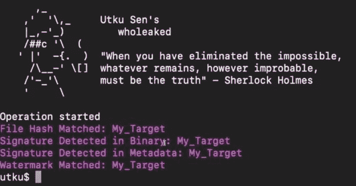

# Wholeaked:一个文件共享工具，可以让你在文件泄露的情况下找到负责人

> 原文：<https://kalilinuxtutorials.com/wholeaked/>

Wholeaked 是一个文件共享工具，可以让你在文件泄露的情况下找到责任人。这是用围棋写的。

## 如何？

wholeaked 获取将要共享的文件和收件人列表。它为每个收件人创建一个独特的签名，并将其秘密添加到文件中。之后，它可以通过使用 Sendgrid、AWS SES 或 SMTP 集成自动将文件发送给相应的收件人。除了通过电子邮件发送，您还可以手动共享它们。

wholeaked 适用于所有文件类型。然而，它有额外的功能，为常见的文件类型，如 PDF，DOCX，MOV 等。

### 分享过程

+———++———+/|绝密|
|绝密| |收件人| / |。pdf |
|。pdf | | List |+——+/| |
| | | | | | utkusen/|/b @ gov | |
| | | a @ gov |——>| wholeaked |/——-+|
| | | b @ gov | | | | \ | Hidden |
| | | c @ gov |+——+——+\ | signature 2 |
| | | \+——————–+【T7+】———————++————————pdf |
c @ gov \ | |
\ | |
\ | |
\ | Hidden |
-| signature 3 |
+———+

### 验证部分

要找到是谁泄露了文档，你只需要把泄露的文件提供给 who leaked，它就会通过对比数据库中的签名来揭示责任人。

**+———++————+
|绝密| |签名|
|。pdf |+——+| Database |
| | | utkusen/| | |文档泄露者
| |->| wholeaked | | |———+
| | | | | b @ gov
| Hidden |+——+| |
| signature 2 | | |
+————++————————+**

## 文件类型和检测模式

wholeaked 可以将唯一的签名添加到文件的不同部分。可用的检测模式如下所示:

**文件哈希:**文件的 SHA256 哈希。支持所有文件类型。

**二进制:**签名直接加到二进制上。*几乎*所有文件类型都被支持。

**元数据:**将签名添加到文件的元数据部分。支持的文件类型:PDF，DOCX，XLSX，PPTX，MOV，JPG，PNG，GIF，EPS，AI，PSD

**水印:**在文本中插入一个看不见的签名。仅支持 PDF 文件。

# 安装

## 来自二进制

您可以从 releases 页面下载预构建的二进制文件并运行。例如:

`**unzip wholeaked_0.1.0_macOS_amd64.zip**`

`**./wholeaked --help**`

## 来源

*   在您的系统上安装 Go
*   运行:`**go install github.com/utkusen/wholeaked@latest**`

## 安装依赖项

wholeaked 需要`**exiftool**`将签名添加到文件的元数据部分。如果不想用这个功能，就不需要安装了。

1.  基于 Debian 的 Linux:运行`**apt install exiftool**`
2.  macOS:运行`**brew install exiftool**`
3.  Windows:从 https://exiftool.org/这里下载 exiftool，把`**exiftool.exe**`放在与 wholeaked 相同的目录下。

wholeaked 需要`**pdftotext**`来验证 PDF 文件中的水印。如果不想用这个功能，就不需要安装了。

1.  从这里下载适用于 Linux、macOS 或 Windows 的“Xpdf 命令行工具”: https://www.xpdfreader.com/download.html
2.  提取档案并导航到`**bin64**`文件夹。
3.  将`**pdftotext**`(或`**pdftotext.exe**`)可执行文件复制到与 wholeaked 相同的文件夹中
4.  对于基于 Debian 的 Linux:运行`**apt install libfontconfig**`命令。

# 用法

## 基本用法

wholeaked 需要一个项目名`**-n**`，签名将添加的基础文件的路径`**-f**`和一个目标接收者列表`**-t**`

命令示例:`**./wholeaked -n test_project -f secret.pdf -t targets.txt**`

**`targets.txt`** 文件应包含以下格式的姓名和电子邮件地址:

**管它的，管它的@ utusen . com
比尔盖茨，比尔@microsoft.com**

执行完成后，将生成以下唯一文件:

**test _ project/files/Utku _ Sen/secret . pdf
test _ project/files/Bill _ Gates/secret . pdf**

默认情况下，wholeaked 会将签名添加到“文件类型和检测模式”一节中定义的所有可用位置。如果你不想使用一个方法，你可以用一个`**false**`标志来定义它。例如:

`**./wholeaked -n test_project -f secret.pdf -t targets.txt -binary=false -metadata=false -watermark=false**`

## 发送电子邮件

为了发送电子邮件，您需要填写`**CONFIG**`文件中的一些部分。

*   如果您想通过 Sendgrid 发送电子邮件，请在`**SENDGRID_API_KEY**`部分键入您的 API 键。
*   如果你想通过 AWS SES 集成发送电子邮件，你需要在你的机器上安装`**awscli**`并添加所需的 AWS 密钥。wholeaked 会自己读取密钥。但是您需要填充配置文件中的`**AWS_REGION**`部分。
*   如果您想通过 SMTP 服务器发送电子邮件，请填写 **`SMTP_SERVER`、`SMTP_PORT`、`SMTP_USERNAME`、`SMTP_PASSWORD`** 部分。

其他需要填写的字段:

*   `**EMAIL_TEMPLATE_PATH**`电子邮件正文的路径。您可以指定使用 HTML 或文本格式。
*   `**EMAIL_CONTENT_TYPE**`可以是 **`html`** 或者`**text**`
*   `**EMAIL_SUBJECT**`邮件的主题
*   `**FROM_NAME**`发件人电子邮件的名称
*   `**FROM_EMAIL**`来自电子邮件的电子邮件

要指定发送方法，您可以使用 **`-sendgrid`，`-ses`** 或`**-smtp**`标志。例如:

`**./wholeaked -n test_project -f secret.pdf -t targets.txt -sendgrid**`

## 验证泄露的文件

您可以使用`**-validate**`标志来揭示泄漏文件的所有者。wholeaked 将比较在文件和位于项目文件夹中的数据库中检测到的签名。示例:

`**./wholeaked -n test_project -f secret.pdf -validate**`

**重要提示:**如果你想使用文件验证功能，你不应该删除`**project_folder/db.csv**`文件。如果那个文件被删除了，wholeaked 就不能比较签名了。

[**Download**](https://github.com/utkusen/wholeaked)