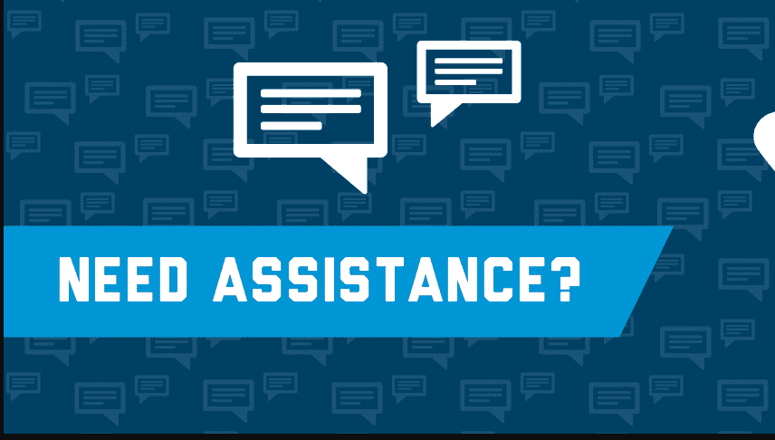

# 如果你需要学术上的帮助，这里是你可以得到的地方

> 原文：<https://kalilinuxtutorials.com/if-you-need-academic-help-heres-where-you-can-get-it/>

我真不敢相信我已经三年级了，反正明年的这个时候我也没有资格。如果你已经 18 岁了，这是每个人都应该吸取的教训，不管你是一个多么成熟的学生。我们走吧，这是每个人的想法，所以这个视频基本上就像你在标题中所说的那样，如果你需要如何要求它，我的意思是，在这个词的每一个意义上，你都需要它栩栩如生。

无论如何，你需要帮助别人或继续艺术，因为总会有人能帮助你。我见过很多，尤其是第二份工作，很多人都在挣扎。我看到人们不想寻求帮助，因为他们甚至认为我已经成熟了，我是一个 30 多岁的成年人了。我不应该寻求帮助或像我一样稳定的东西，我不应该需要帮助，或者我 19 岁了，我不认为我不成熟，如果我问你如何知道这样的事情，我见过很多，或者他们只是喜欢。我不知道他们有什么样的帮助，然后他们不相信他们可以帮助我们，这有点像她，我是两者之间的混合体。我同意工会的说法，当他们说你们是成熟的学生时，你应该喜欢你知道你是否必须帮助自己，但也喜欢你应该能够为自己寻求帮助，这就是我的看法，就像如果你需要帮助就去找它一样，每个大学都在那里提供帮助。我可以处理我喜欢的，帮助他们让我们承受压力，他们最好有办法抵消。我是怎么看的所以这将会是一个这可能是大学提供的去寻找它的机会所以首先我要谈谈你的精神健康因为你的精神身体情绪健康或物质所以身体上确保你去看你的医生你的全科医生在你的新大学区找一个全科医生因为相信我长途跋涉回到你住的地方只是为了得到一个全科医生的预约那就不要做 在精神上确保你正在做的事情就像通常你的膝盖会有社团，其中一些社团可能会有正念或我的手瑜伽可能会有一些伤害或你喜欢做的事情来平静你看着它，但大学本身也会为你提供基本上，你通常会有很好的咨询服务，因为我的大学实际上是与圣乔治大学合作的，所以金斯敦大学是圣乔治大学的合作伙伴。 我在某种程度上拥有两个世界的优势，因为金斯敦经常提供几个咨询会议，我不知道时间有多长，但我记得圣乔治提供六周的咨询服务，所以你可能会喜欢这两个东西，他们通常会建议如果你需要更长的时间，大学会提供什么你应该去你的全科医生那里寻求帮助，所以你这样做了，这就是他们提供的 这就像你的精神帮助和身体帮助，现在让我们转到学术方面，在学校或类似的水平或大学，你可能会做得很好，然后让你投资，你可能会受到一些打击，你可能需要学术帮助，不是每个人，但有时你可能需要，特别是如果这是你可能需要帮助弄清楚的第一个学位。 我如何这样写，我如何这样引用，现在有这么多层次的学术支持，通常是你的图书馆或学习娱乐中心，它是什么？

I don’t know well it sounds little web lessons well your library basically usually they will have staff the librarians there are usually really gifted and they usually have like a library for each kind of module type or for the overall school department you’re in they all have someone who specializes in that who can help you update it so go to that if you feel like you don’t want like loads of help you just want some help if you go that they always having to have someone who does academic support or basically someone who could just read over your essay to make sure it makes sense to make sure like there’s no grammatical errors tough like that to make sure you’re writing at a level 5 or level over for level 5 or level 6 level whatever level you’re at so basically fascist second at that yet to make sure that your reference in some point the house on who does referencing now will have support that for you also your academic tutors can help people they were probably refer you just over to the I preserve says anyway unless they don’t know to your library services go to your receptionist and ask them when their drop-in sessions are or if you have the Becca session how can you book one because they are so helpful and that’s what they’re there for and that’s what they get paid for so don’t feel like oh I’m gonna be a bird and I don’t want to like don’t feel that way or don’t feel like I feel so silly cuz I’m so grown I don’t feel that way like listen it’s a sign of maturity when you’re able to ask for help so go ask for help what’s the point of view paying like nine thousand two hundred and fifty pounds a year to not use what you’re paying for see that makes sense we should get our money’s worth so go an arts for help like I said when you’re getting into debt for nothing should we don’t ask for any help by the way just let you know so go and ask to help its that they offer it it’s there and then, if you feel like you may be struggling a bit more than usual a bit more than the average Joe then you need to go sorry in one’s good you don’t know eyes at them mmm then you should go to your Student Life Center or Student Center however your uni calls it and go there, and ask them for some help they’re worth they can assist you anything they are cool that they can help you with housing stuff they can help you with finance stuff they can help you with again learning stuff academic stuff they can help with anything like they are so good they’re okay they have a cool job unless you’re like Charlotte then that’s a bad job but anyway if you go that or if you go on the website evil I’m they can help you and tell you we need to go to see if you need to get assessed and they can take you for the whole process of applying for DSA and all that stuff now I’m gonna get personal with you guys I don’t think I’ve ever really just kind of said it where you have I don’t know anyway I have always kind of known I struggled in school I would revive with my device and still only get straight average or scraped just under average I’ve always struggled my new brain does not process information like most people’s my brain likes to over complicate things and I’m like no dummy dummy dumb it down dumb it down so I say to you I might talk to me as if I’m stupid so that my brain can process it so that my brain doesn’t over think it’s not it’s work thing and I’ve come up with so many coping mechanisms throughout the years it’s crazy I remember my earliest memory was when we’ve got our SATs results into like you and your six so I was like 11 and 10 11 years old not 11 like end of year six I was 11 I got my SATs results and I remember sitting there and my teacher was like okay Louisa don’t cry but you actually did really well and I was like oh obviously I was a priori about them I saw that Melissa be honest but still like I was just like so like did well because I always struggle in school from that age I’m your uncle in school and I didn’t know if that was just because at home my friends are doing with special learning I was it was my mom’s dyslexic I didn’t know but then again she was really great like she was like she didn’t know that so she would arc someone else or she’ll get like a dictionary out she was on it okay but I just kind of always do a struggle and then throwing through secondary school I still sure what they wouldn’t do anything about it because they don’t want to spend the money to get me tested which sucked but luckily it was a cool black lady there who helped me out whenever I needed help I was so sad when she left so sad and then when I got to sixth form I like so they like you don’t need to like those wide kind of like spread like let’s see who may need help I got caught up in that so they were like hey you look like you need help but it didn’t give me a lot of help they’re like not dyslexic enough to get help so they just gave me like some overlaid color overlays to put over my book so if you ever seen me out and about and you seen my book and it is like blue thing out mother that’s my color overlay sir I can read properly yeah so I got you than that but again nothing more than really and then when I don’t to college to do my access course again they’re like you’re not just left sick enough for us to help you you’re not 12 if you ever get 12 or 18 month waiting list Mike I was nine months what and I got to university finally I don’t know how I did it and as soon as I got to university I went straight to that Student Life Center and I’ve got my sock out. I was like I figure dyslexic help me up these actually I on the application form I put on like just that’s it and then they hunt up to me that way as well I was a bit but not really like I suppose like I don’t have any proof but I think I am and so they like she loved me and I went there we spoke and they told me all the steps I needed to take I went and like applied online on like the government website for like DSA then I went and took the tested DSA paid for the test fighting the lord Prozac test was like seven-eight hundred pounds roughly, and I was in her house. I went to the woman’s house and it was expensive but anyway so I’ve got the test done and then it was finally written on paper.

我有阅读障碍，她也认为我是一个发育不良的人，但我不这么认为，但她也认为我有其他的问题，但我想我现在只需要知道一件事，即使是一件事，所以从那以后我一直在调整。我正式考试时间变长了。我还得到了你的额外帮助，我可以接触到诵读困难症辅导老师，就像所有这些真的很棒的东西。如果你看了我的帖子。我对你们说了实话。我跟你说过，我确实有一篇论文不及格，那是因为。我没有在我的时间表中腾出时间去寻求帮助，我压力太大了，我甚至不知道我在做什么，我没有东西给他们看，所以我没有去寻求帮助，这很愚蠢，因为。

我感觉到了，然后我就像被重拍了一样。我走了，我不会再上这门课了，但正如你所说的，我发了帖子，但无论如何，事情是这样的，因为我没有时间去想我是如何失败的，如果我只是优先考虑这个事实。我无论如何都需要学术支持，我应该去获得学术支持，我不会发现我会通过，我会被诅咒，她和我会有压力，我的二年级会被降级，但我喜欢不，我不需要它，我觉得，然后我有很多人我知道很多人在一篇论文上失败或做得很差，确实是因为我不想要我们的帮助，或者他们喜欢。我不知道我需要帮助，或者他们就像我不知道那些可用的帮助。我制作这个视频是为了告诉你们，没有什么比让你在学术生涯中获得成功更重要的了，如果你为你的学术生涯负债累累，基本上请去寻求帮助，我求你去寻求帮助，因为论文不及格糟透了，简直糟透了，我不想再经历一次，我真的不想让你们再经历一次。我告诉你，有帮助在那里去好吧，我下次继续做你们，如果你喜欢这个视频给它一个大拇指。