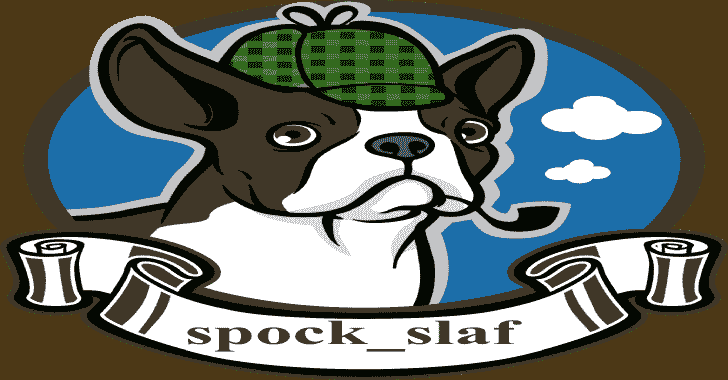

# 斯波克·SLAF:共享图书馆应用防火墙“SLAF”

> 原文：<https://kalilinuxtutorials.com/spock-slaf/>

.png)

**斯波克·SLAF**是一个**共享库应用防火墙**“SLAF”。它的目的是保护任何使用 OpenSSL 库的服务。SLAF 插入挂钩来拦截所有通信，以检测安全异常，并阻止和记录缓冲区溢出、路径遍历、XSS 和 SQL 注入等攻击。因此，为了检测异常，Spock 使用带有等级分数的确定性有限自动机来计算风险，并为每个上下文创建警报。

我在这个项目中的最初目的是保护任何使用 OpenSSL 资源与 TLS 通信的二进制文件。

## 特征

*   阻止、记录和检测安全异常的操作，如 SQL 注入、XSS、SSL_read()函数的路径遍历(获取输入缓冲区)。
*   在任何使用 OpenSSL 库的程序中运行的能力。
*   如果在 TLS 上下文中检测到异常，Spock 会将攻击者的 IP 地址、日期时间和攻击“有效载荷”记录保存在日志文件中。

## 语源

这个工具的动机是在过去七年的一个缓解项目中发布的。在我的自由职业者任务之后，一个老客户披露了一个关于废弃的专有二进制文件的问题，该文件有许多漏洞，如堆缓冲区溢出、远程缓冲区溢出和路径遍历。二进制上下文的大问题是应用程序放弃了没有补丁的软件，但是企业需要运行生产负载。所以我的解决方案是插入 **seccomp()** 来限制进程中的 syscalls(你知道，像 system()/execv()这样的阻塞调用)。我将 libc 的 malloc()替换为**“顽固分子”，一个抗错误的内存分配器**。另一方面，另一项举措是在 OpenSSL 的 SSL_read()函数中加入一些挂钩，以限制一些有害的有效载荷，这是另一种选择。

另一个选择是使用 **libreSSL** 并启动一个监视器来监听它是否有兼容性错误。LibreSSL 的烂点是性能；你可以看到，如果你使用 gprof 这样的工具，在 OpenSSL 和 LibreSSL 之间获得一个基准。所以 OpenSSL 很酷，但不像 LibreSSL 或 lib 钠那样安全。再看性能上下文，如果把算术函数拿到 OpenSSL 的 big int，有些资源像 **Big int operations BN_new()** 没有**lIB GMP**那么好的性能。所以放松点。性能并不总是安全的最佳途径。安全验证和额外的缓冲和适当的边界检查有一个预期的成本，没有这个，你可以看到很多问题，例如在过去期待 **spectre/meltdown** 。

根据其他事实，服务器的外部规则使用 **BSD 的防火墙(又名包过滤)**，使用自定义规则**只允许通过 IP 和操作系统指纹**。因此，自由职业者的任务在我脑海中挥之不去，现在你可以看到我的新解决方案，它遵循一种全局方法来保护服务器上下文中的 TLS 通信。

## 第一步编译部署

克隆存储库:

**$ git 克隆 https://github.com/CoolerVoid/spock_slaf**

在文件夹中输入:

**$ cd CoolerVoid/spock_slaf**

编译内容:

**$弄干净；制作**

现在可以在“bin”目录下看到共享库“spock_slaf.so.1”。

## 第二步注射保护

第二步是在使用 OpenSSL 的二进制文件中注入共享库。

所以现在我们可以使用 LD_PRELOAD 技巧:

**$ LD _ PRELOAD =/home/cooler/spock_slaf/bin/Spock _ slaf . so . 1 bin/rest _ server
注意:将/home/cooler/Spock _ slaf/bin/改为你的完整路径名**

[**Download**](https://github.com/CoolerVoid/spock_slaf)