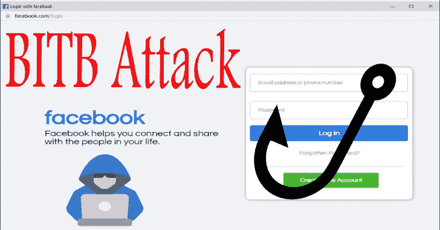

# BITB:浏览器中的浏览器(BITB)模板

> 原文：<https://kalilinuxtutorials.com/bitb/>

**BITB** 是一个浏览器模板，用于浏览器中的浏览器(BITB)攻击。

# 使用

每个文件夹都有一个`**index.html**`文件，其中有 4 个必须修改的变量:

*   **XX-TITLE-XX**–页面显示的标题(例如，立即登录您的帐户)
*   **XX-DOMAIN-NAME-XX**-你伪装成的域名。(例如 gmail.com)
*   **XX-DOMAIN-PATH-XX**-域路径(例如/auth/google/login)
*   **XX-PHISHING-LINK-XX**–将嵌入 iFrame 的钓鱼链接(如 https://example.com)

此外，如果你使用的是 Windows 模板，你应该更新`**logo.svg**`，它是你伪装成的网站的图标。默认徽标是 Microsoft。

# 视窗-黑暗模式-延迟

Windows-DarkMode-Delay 文件夹利用 jQuery 的 fadeIn()函数在弹出窗口出现时给它添加一点延迟。这只是让窗口以延迟的方式出现的一种方法，还有其他各种方法可以做到这一点。

# 检测颜色偏好

为了充分利用这一点，您应该从用户代理和颜色首选项中确定操作系统，并显示适当的模板。

要了解应该使用深色模板还是浅色模板，请查看:https://stack overflow . com/questions/50840168/how-to-detect-if-the-OS-is-in-dark-mode-in-browsers

# 探测 BITB

## 拖动窗口

检测 BITB 的一种方法是试图将窗口拖动到浏览器的边缘。如果窗口不能逃离浏览器，那么它不是一个真正的窗口。

## 浏览器扩展

@odacavo 发布了一个很棒的浏览器扩展，可以检测并警告用户关于嵌入的 iframes。在这里可以买到:https://github.com/odacavo/enhanced-iframe-protection.

[**Download**](https://github.com/mrd0x/BITB)