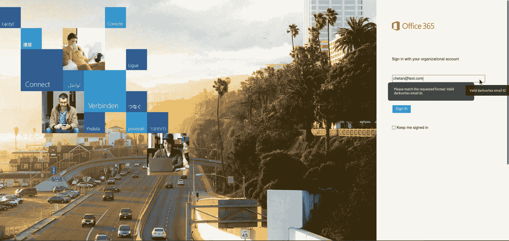
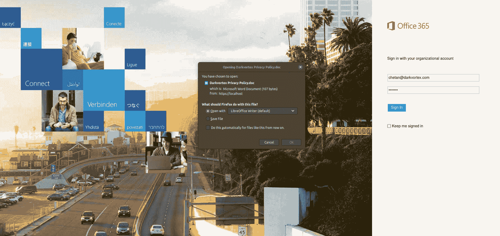

# o365-重身幽灵:一个获取用户凭证的快捷方便的脚本

> 原文：<https://kalilinuxtutorials.com/o365-doppelganger/>

.png)

**O365——重身幽灵**不能替代顽固的网络钓鱼活动。还有几个其他工具可以执行 OAuth 和 OTA 捕获，这不是 O365-重身幽灵的目的。

o365-重身幽灵是一个快捷方便的脚本，用于在红队中收集用户凭证。这个库是我的一个旧红队参与脚本的快速破解，我曾多次使用它来捕获凭证并使用它们来制作横向移动的 windows 访问令牌。该代码库主要执行以下任务:

*   GO 代码:
    *   托管 O365 门户(可以替换为 index.html 中的任何内容)。建议使用有效的证书和密钥文件(LetsEncrypt？)而不是目录中提供的那个
    *   将门户网站上的所有用户活动记录在服务器上的单独日志文件中
    *   将捕获的凭据记录在服务器上单独的日志文件中
    *   也可用于在捕获凭据后向用户返回有效文件。这可以通过替换当前目录中名为`**MacroFile.doc**`的文件并用 HTA/ISO/MSI 或网络钓鱼者想要的任何其他文件来实现。GO 代码中还有一小段代码需要修改，以指定需要返回的用户文件名:`**content, err := ioutil.ReadFile("MacroFile.doc")**`
    *   修改后，目标用户在输入有效的电子邮件 id 和密码时，将被要求保存上述文件。可以使用 GO 文件中的以下代码更改该文件名:`**response.Header().Set("Content-Disposition", "attachment; filename=Darkvortex Privacy Policy.doc")**`
*   index.html 电码:
    *   在一个小正则表达式旁边呈现一个 O365 门户，该正则表达式检查给定用户的域名，使其看起来更合法一些。正则表达式代码如下:`**pattern="^([a-zA-Z0-9_\-\.]+)@darkvortex\.([a-zA-Z]{2,5})$" title=" Valid darkvortex email ID"**`
    *   上面的正则表达式检查给定的用户名是否包含完整有效的电子邮件地址，否则它将提示用户输入正确的用户名，如下所示:

*   同样的检查也在 GO 代码中执行，这样用户就不会使用像打嗝这样的东西来绕过检查:`**if strings.Contains(value[i], "@darkvortex") {**`
*   建议将 index.html 文件中的名称 darkvortex 改为您自己的目标公司名称。
*   输入正确的电子邮件 ID 和密码后，将要求用户保存提供的文件，如下所示:

[**Download**](https://github.com/paranoidninja/O365-Doppelganger)