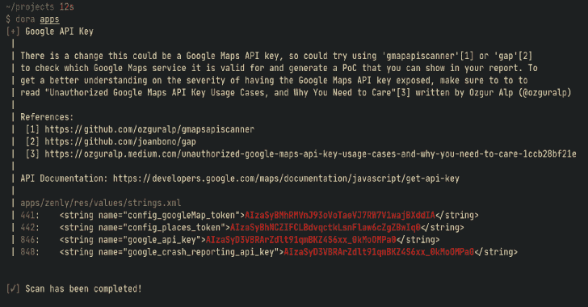

# Dora:基于正则表达式找到暴露的 API 键并获取利用方法

> 原文：<https://kalilinuxtutorials.com/dora/>

.png)

Dora ，一个基于正则表达式查找暴露的 API 密钥的工具，并获取一些找到的密钥的利用方法

## 特征

*   我们在后台使用`**ripgrep**`的速度非常快
*   Exploit/PoC 步骤中的许多 API 密钥，允许编写一份出色的 bug 赏金猎人报告
*   与许多其他 API 键查找器不同，`**dora**`还显示了文件的路径和带有上下文的行，以便于分析
*   可以很容易地在脚本中实现。参见用例示例

## 安装

确保安装 ripgrep

**克隆回购
git 克隆 https://github.com/sdushantha/dora.git
将工作目录改为夏洛克
CD Dora
install Dora
python 3 setup . py install–user**

## 使用

**$ Dora–help
用法:dora [options]
位置参数:
PATH 要扫描的目录或文件的路径
可选参数:
-h，–help 显示此帮助消息并退出
–RG-PATH RG _ PATH 指定 ripgrep 的路径
–RG-ARGUMENTS RG _ ARGUMENTS
您要提供给 ripgrep 的参数
–json JSON 从有效的 JSON 文件中加载 regex 数据(默认值:db/data . JSON)
–**

## 示例使用案例

*   使用`**apktool**`反编译一个 APK，并运行 **`dora`** 来查找暴露的 API 键
*   通过克隆 GitHub repos 并允许`**dora**`扫描来扫描它
*   抓取站点时，运行`**dora**`扫描 API 密钥

[**Download**](https://github.com/sdushantha/dora)