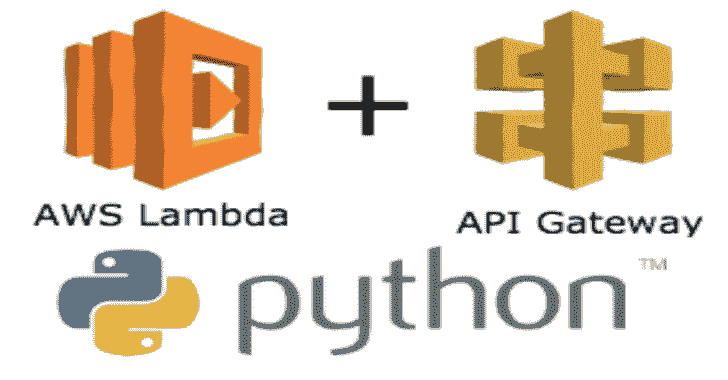

# Requests-Ip-Rotator:利用 AWS API 网关的大型 Ip 池的 Python 库

> 原文：<https://kalilinuxtutorials.com/requests-ip-rotator/>

**Requests-IP-Rotator** 是一个 Python 库，利用 AWS API Gateway 的大型 Ip 池作为代理，为 web 抓取和暴力破解生成伪无限 Ip。

这个库将允许用户绕过基于 IP 的网站和服务的速率限制。

除非给出，否则 X-Forwarded-For 标头会自动随机化和应用。这是因为，否则，AWS 将在此报头中发送客户端的真实 IP 地址。

AWS 的 ApiGateway 从任何可用的 IP 地址发送请求——由于 AWS 的基础设施非常庞大，几乎可以保证每次都会有所不同。通过使用 ApiGateway 作为代理，我们可以利用这一点每次从不同的 IP 发送请求。请注意，这些请求很容易被识别和阻止，因为它们发送时带有唯一的 AWS 头(即“X-Amzn-Trace-Id”)。

## 安装

这个包在 pypi 上，所以您可以通过以下任何一种方式进行安装:

*   `**pip3 install requests-ip-rotator**`
*   `**python3 -m pip install requests-ip-rotator**`

## 简单用法

**从 requests_ip_rotator 导入 ApiGateway
创建网关对象并在 AWS 中初始化
gateway = API gateway(" https://site . com ")
gateway . start()
将网关分配给会话
session = requests。session()
session . mount(" https://site . com "，gateway)
发送请求(IP 将被随机化)
响应= session . get(" https://site . com/index . html ")
打印(response.status_code)
删除网关
gateway.shutdown()**

替代用法(自动启动和关闭)

**从 requests_ip_rotator 导入请求
用 ApiGateway("https://site.com ")作为 g:
session = requests 导入 ApiGateway
。session()
session . mount(" https://site . com "，g)
response = session . get(" https://site . com/index . html ")
print(response . status _ code)**

请记住，如果在使用方法#1 时没有通过`**shutdown()**`方法关闭网关，将来可能会向您收费。

## 成本

API Gateway 对于每个地区的前一百万个请求是免费的，这意味着对于大多数用例来说，这应该是完全免费的。在撰写本文时，超过免费等级后，AWS 对每百万个请求收取约 3 美元的费用。
如果您的请求涉及数据流，AWS 将收取每 GB 0.09 美元的数据传输费。

## 文档

### AWS 认证

建议通过环境变量设置身份验证。使用 awscli，您可以运行`**aws configure**`来完成这项工作，或者，您可以简单地自己设置`**AWS_ACCESS_KEY_ID**`和`**AWS_SECRET_ACCESS_KEY**`变量。

### 正在创建 ApiGateway 对象

可以使用以下可选参数创建 ApiGateway 类:

| 名字 | 描述 | 需要 | 默认 |
| --- | --- | --- | --- |
| 位置 | 站点(无路径)请求将被发送到。 | 真实的 |  |
| 地区 | 要在其中设置网关的 AWS 区域数组。 | 错误的 | ip_rotator。默认 _ 区域 |
| 访问密钥 id | AWS 访问键 ID(将覆盖环境变量)。 | 错误的 | *依赖于环境变量。* |
| 访问密钥秘密 | AWS 访问密钥机密(将覆盖 env 变量)。 | 错误的 | *依赖于环境变量。* |

**从 ip_rotator 导入 ApiGateway，EXTRA_REGIONS，ALL_REGIONS
网关到出站 HTTP IP 和仅两个区域的端口
Gateway _ 1 = API Gateway(" HTTP://1 . 1 . 1 . 1:8080 "，regions=["eu-west-1 "，" eu-west-2"])
网关到 HTTPS Google for the EXTRA REGIONS pack，用指定的访问密钥对
Gateway _ 2 = API Gateway(" https://www . Google . com "，regions=EXTRA_REGIONS，access _ key _ id**

### 正在启动 API 网关

然后必须使用`**start**`方法启动 ApiGateway 对象。
**默认情况下，如果站点已经存在一个 ApiGateway，它将使用现有的端点，而不是创建一个新的端点。**
这不需要任何参数，但接受以下:

| 名字 | 描述 | 需要 |
| --- | --- | --- |
| 力 | 创建一组新的端点，即使一些端点已经存在。 | 错误的 |
| 端点 | 预先存在的端点阵列(即来自上一个会话)。 | 错误的 |

**为站点启动新的 ApiGateway 实例，或者定位现有端点(如果它们已经存在)。
gateway_1.start()
启动新的 ApiGateway 实例，即使其中一些已经存在。
gateway _ 2 . start(force = True)**

### 发送请求

通过将 ApiGateway 对象附加到请求会话对象来发送请求。
`**mount**`中给出的站点必须与`**ApiGateway**`构造函数中传递的站点相匹配。

**导入请求
向 gateway_1 中创建的站点发布请求。会从一个随机的 IP 地址发出。
session_1 =请求。session()
session _ 1 . mount(" http://1 . 1 . 1 . 1:8080 "，gateway _ 1)
session _ 1 . post(" http://1 . 1 . 1 . 1:8080/update . PHP "，headers={"Hello": "World"})
发送 127.0.0.1 作为出站请求中的 X-Forwarded-For 头(否则 X-Forwarded-For 是随机的)。
session _ 1 . post(" http://1 . 1 . 1 . 1:8080/update . PHP "，headers={"X-Forwarded-For "，" 127.0.0.1"})
从随机 IP 执行 Google 搜索查询
session_2 = requests。session()
session _ 2 . mount(" https://www . Google . com "，gateway _ 2)
session _ 2 . get(" https://www . Google . com/search？q=test")**

### 正在关闭 ApiGateway 资源

使用完 ApiGateway 资源后，务必将其关闭，以防止悬空的公共端点对您的帐户造成额外费用。
这是通过 ApiGateway 对象的`**shutdown**`方法完成的。它将关闭 ApiGateway 对象构造函数中指定的区域的所有资源。

或者，如果需要，您可以有选择地关闭特定的端点。为此，只需向 shutdown()方法传递一个端点数组，即:

**这将强制启动一个新的网关(即创建新的端点，即使该区域已经存在一些端点)，然后只删除前 3 个端点。**
**gateway _ 3 = API gateway(“http://1 . 1 . 1 . 1:8082”，REGIONS = ALL _ REGISTRY)
endpoints = gateway _ 3 . start(force = True)
gateway _ 3 .关机(endpoints[:3])**

[**Download**](https://github.com/Ge0rg3/requests-ip-rotator)