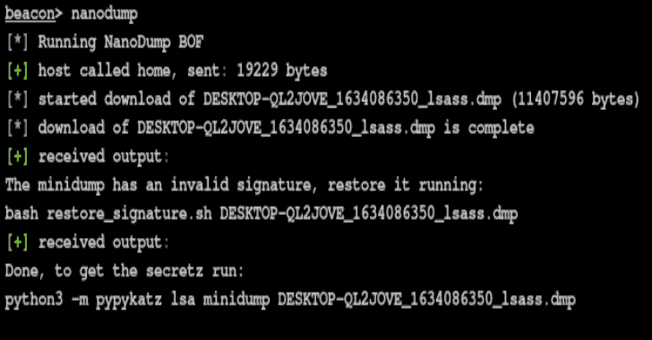

# Nanodump:一个蹩脚的 LSASS 转储程序，没有 ASCII 艺术

> 原文：<https://kalilinuxtutorials.com/nanodump/>

**Nanodump** ，一个创建 LSASS 进程小型转储的灵活工具。

## 特征

*   它使用 syscalls(使用 SysWhispers2)进行大多数操作。
*   从 **ntdll** 地址调用系统调用，以绕过一些系统调用检测。
*   它将 syscall 回调挂钩设置为 NULL。
*   使用动态调用来调用 Windows APIs。
*   您可以选择不接触磁盘下载转储文件，或者将其写入文件。
*   默认情况下，小型转储具有无效签名以避免检测。
*   它通过忽略不相关的 dll 来减小转储的大小。(纳米)转储的大小往往在 10 兆字节左右。
*   不需要提供 LSASS 的 PID。
*   没有调用 **dbghelp** 或任何其他库，所有转储逻辑都在 nanodump 中实现。
*   支持流程分叉。
*   支持快照。
*   支持句柄复制。
*   支持 MalSecLogon。
*   支持 PPL 用户土地利用。
*   您可以在 LSASS 中加载 nanodump 作为安全支持提供者(SSP)。
*   您可以使用。在 Cobalt Strike 之外运行 **nanodump** 的 exe 版本😄。

## 使用

### 克隆

**git 克隆 https://github.com/helpsystems/nanodump.git**

### 编译(可选)

**在装有 MinGW 的 Linux 上**

**在装有 MSVC** 的 Windows 上(不支持 BOF)

**nmake -f Makefile.msvc**

### 导入

在钴击上导入`**NanoDump.cna**`脚本。

### 跑

在信标控制台中运行`**nanodump**`命令。

**信标>纳米堆**

### 恢复签名

下载小型转储后，恢复无效的签名

**脚本/恢复 _ 签名**

## 加工成型

为了避免用`**PROCESS_VM_READ**`打开 LSASS 的句柄，可以使用`**--fork**`参数。
这将使 nanodump 创建一个具有`**PROCESS_CREATE_PROCESS**`访问权限的 LSASS 句柄，然后创建该进程的“克隆”。然后，这个新进程将被转储。虽然这将导致进程创建和删除，但它消除了直接读取 LSASS 的需要。

## 快照

与`**--fork**`选项类似，您可以使用`**--snapshot**`来创建 LSASS 进程的快照。
这将使 nanodump 使用`**PROCESS_CREATE_PROCESS**`访问创建 LSASS 的句柄，然后使用`**PssNtCaptureSnapsho**t`创建进程的快照。然后，这个新进程将被转储。完成后，快照将自动释放。

## 处理重复

因为可以检测到打开 LSASS 的句柄，所以 nanodump 可以改为搜索 LSASS 的现有句柄。如果找到一个，它将复制它并使用它来创建小型转储。
注意，不保证能找到这样的句柄。

## 马尔塞克伦

为了避免打开 LSASS 的句柄，可以使用 MalSecLogon，这是一种(ab)使用`**CreateProcessWithLogonW**`来泄漏 LSASS 句柄的技术。
要启用该功能，使用`**--malseclogon**`参数。
考虑到需要将未签名的 nanodump 二进制文件写入磁盘才能使用该功能。

## MalSecLogon 和句柄复制

如前所述，使用 MalSecLogon 需要将 nanodump 二进制文件写入磁盘。
如果`**--malseclogon**`和`**--dup**`与`**--binary**`一起使用，可以避免这种情况。
诀窍是使用 MalSecLogon 向 LSASS 泄漏一个句柄，但不是泄漏到 nanodump.exe，而是泄漏到另一个二进制文件中，然后复制泄漏的句柄，以便 nanodump 可以使用它。

## 将 nanodump 作为 SSP 加载

您可以在 LSASS 中将 nanodump 作为 SSP 加载，以避免打开句柄。默认情况下，转储将在`**C:\Windows\Temp\report.docx**`以无效签名写入磁盘。一旦转储完成，`**DllMain**`将返回 FALSE 以使 LSASS 卸载 nanodump DLL。
要改变转储路径和签名配置，修改 entry.c 中的函数`**NanoDump**`并重新编译。

### 上传并加载纳米转储 DLL

如果不带参数使用，未签名的 nanodump DLL 将被上载到 Temp 文件夹。一旦创建了转储，使用`**delete_file**`命令手动删除 DLL。

b**eacon>load _ ssp
beacon>delete _ file C:\ Windows \ Temp[RANDOM]。dll**

## PPL 旁路

如果 LSASS 作为受保护的进程灯(PPL)运行，您可以尝试使用 Project Zero 发现的用户空间漏洞来绕过它。如果成功，转储将被写入磁盘。

要访问该功能，使用`**nanodump_ppl**`命令

**beacon>nanodump _ ppl-v-w C:\ Windows \ Temp \ lsass . DMP**

## 因素

#### getpid

拿到 LSASS 的 PID 然后离开。
这只是为了方便，nanodump 不需要 LSASS 的 PID。

#### –write-w<路径>(EXE 需要)

转储文件的写入位置。

*   **BOF** :如果不提供该参数，转储将以无文件方式下载。
*   **EXE** :该参数是必需的，因为不存在 C2 通道

#### –有效-v

小型转储将具有有效的签名。
如果不输入，签名将无效。在分析转储之前恢复转储的签名，用:
`**scripts/restore_signature <dumpfile>**`

#### –分叉

派生 LSASS 并转储这个新进程。

#### –快照

创建 LSASS 的快照并转储这个新进程。

尝试找到 LSASS 的现有句柄并复制它。

#### 不登录-m

使用 MalSecLogon 泄漏 LSASS 的句柄。
**如果用作 BOF，无符号二进制将被写入磁盘，除非同时提供–dup！**

#### –二进制-b <路径>

二进制文件的路径，如`**C:\Windows\notepad.exe**`。
该选项专用于`**--malseclogon**`和`**--dup**`。

## 例子

通过创建 fork 间接读取 LSASS，并使用无效签名将转储写入磁盘:

**beacon>nanodump–fork–write C:\ lsass . DMP**

使用 MalSecLogon 在记事本进程中泄漏 LSASS 句柄，复制该句柄以访问 LSASS，然后通过创建一个 fork 间接读取它，并下载带有有效签名的转储:

**beacon>nanodump–malseclogon–dup–fork–binary C:\ Windows \ notepad . exe–valid**

使用 MalSecLogon 获得一个句柄，使用 fork 间接读取 LSASS，并使用有效签名将转储写到磁盘(将上传一个 nanodump 二进制文件！):

**beacon>nanodump–malseclogon–fork–valid–write C:\ Windows \ Temp \ lsass . DMP**

## HTTPS 导演

如果您正在使用 HTTPS 重定向器(正如您应该做的那样)，由于泄漏转储的请求的大小，您可能会在下载转储文件时遇到问题。
增加 web 服务器上请求的最大大小，以允许 nanodump 下载转储。

#### NGINX

**地点~ ^…$ {
……
client _ max _ body _ size 50m；
}**

A **pache2**

**LimitRequestBody 52428800**

[**Download**](https://github.com/helpsystems/nanodump)