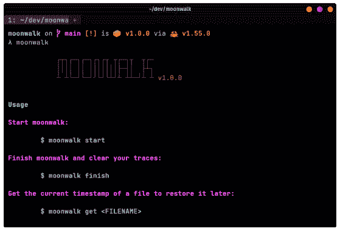

# 月球漫步:通过留下零痕迹来掩盖你在 Linux 开发过程中的踪迹

> 原文：<https://kalilinuxtutorials.com/moonwalk/>

.png)

**moonwalk** 是一个 400 KB 的单二进制可执行文件，可以在渗透测试一台 **Unix** 机器时清除你的痕迹。它保存系统日志利用前的状态，并恢复该状态，包括利用后的文件系统时间戳，在外壳中不留下任何*幽灵的痕迹。*

## 特征

*   **小的可执行文件:**通过`**curl**`获取到你的目标机器来快速开始。
*   **快速:**在不到 5 毫秒的时间内执行所有会话命令，包括日志记录、跟踪清除和文件系统操作。
*   **侦察:**为了保存系统日志的状态，`**moonwalk**`找到一个全局可写的路径，将会话保存在一个点目录下，该目录在会话结束时会被删除。
*   **Shell History:**`**moonwalk**`没有清除整个历史文件，而是将它恢复到原来的样子，包括调用 **`moonwalk`。**
*   **文件系统时间戳:**通过使用`**GET**`命令将文件的访问/修改时间戳恢复到原来的状态来隐藏蓝色团队。

## 安装

**$ curl-L https://github . com/mufeedvh/moon walk/releases/download/v 1 . 0 . 0/moon walk _ Linux-o moon walk**

(`**AMD x86-64**`)

**或**

从**版本**下载可执行文件或者用`**cargo**`安装:

## 从源代码构建

**先决条件**

*   饭桶
*   锈
*   货物(安装铁锈时自动安装)
*   C 链接器(仅适用于 Linux，通常是预装的)

**$ git 克隆 https://github.com/mufeedvh/moonwalk.git
$ CD 月球漫步/
$货物建造-发布**

第一个命令将这个存储库克隆到您的本地机器上，最后两个命令进入目录并在发布模式下构建源代码。

## 用法

一旦您在目标 Unix 机器上安装了一个 shell，就可以通过运行以下命令启动一个 moonwalk 会话:

**$月球漫步开始**

当您在侦察/利用和处理任何文件时，请事先获取文件的`**touch**`时间戳命令，以便在您访问/修改文件后恢复它:

**$月球漫步 get ~/。bash_history**

利用后，使用以下命令清除您的跟踪并关闭会话:

**$月球漫步终点**

[**Download**](https://github.com/mufeedvh/moonwalk)