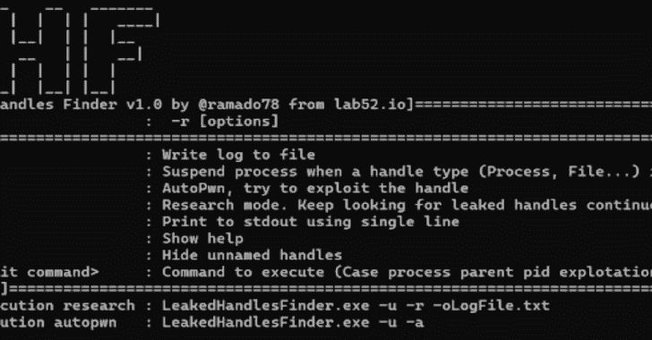
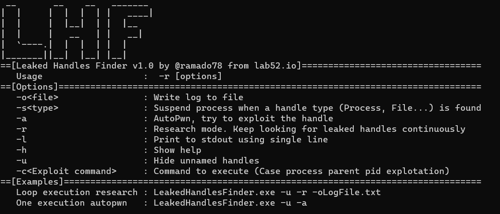

# 泄漏的 Windows 进程句柄识别工具

> 原文：<https://kalilinuxtutorials.com/leakedhandlesfinder/>

.png)

**泄露的 Windows 进程**处理识别工具。有助于在 pentest 期间识别新 LPE 漏洞，或简单地作为一个新的研究过程。目前支持利用(自动生成)进程泄漏句柄生成新的任意进程(cmd.exe 默认)。

LHF 实时识别继承的句柄，并给研究人员提供解释提示

在 https://www.rootedcon.com/ponentes-rooted2022/. 2022 年根际会议上发表

演示->演示/为 LPE.pdf 利用泄露的句柄

[**Download**](https://github.com/lab52io/LeakedHandlesFinder)