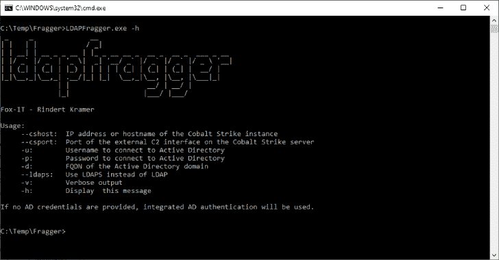

# LDAPFragger:命令和控制工具，使攻击者能够路由 Cobalt Strike 信标数据

> 原文：<https://kalilinuxtutorials.com/ldapfragger/>

.png)

**LDAPFragger** 是一个命令和控制工具，使攻击者能够使用用户属性通过 LDAP 路由 Cobalt Strike 信标数据。

有关背景信息，请阅读发布博客:http://blog . fox-it . com/2020/03/19/ldapfragger-command-and-control-over-LDAP-attributes

## 依赖性和安装

*   使用`**.NET 4.0**`编译，但可能适用于旧版本和新版本。NET 框架也一样

## 用法

**_ _*_ | | |/*|
| | | | _ _*_ |*_*_ _*_*_**_*_
| |/*`|/ _`| '*|*| '/*/`|/ _`|/*` |/*\\ |
| |(*| |(*| | |*)| | |(*| | |(*|/| |*| _*， *|_* ， *|。 /|* | | *| _* ， *|_* ，|__， | |*| | |/|/|*| |*/|*/
Fox-IT–Rindert Kramer
用法:
–cs host:Cobalt Strike 实例的 IP 地址或主机名
–cs Port:Cobalt Strike 服务器上外部 C2 接口的端口
-u:连接到 Active Directory 的用户名
-p:连接到 Active Directory 的密码
-d:Active Directory 域的 FQDN
–ldaps:使用 ldaps 而不是 LDAP
-v:详细输出
-h:显示此消息【显示***

## 用法示例

从网段 A 运行

**LDAPFragger–cs host–cs port
LDAPFragger–cs host–cs port-u-p-d**

从网段 B 运行

LDAPFragger
LDAPFragger-u-p-d

LDAPS 可以与`**--LDAPS**`标志一起使用，但是，常规的 LDAP 流量也是加密的。请注意默认的钴击有效载荷会被大多数 AVs 捕获。

[**Download**](https://github.com/fox-it/LDAPFragger)