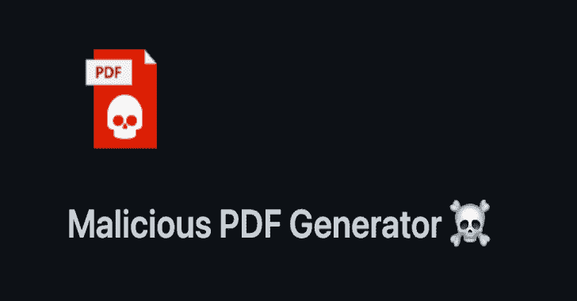

# 恶意 Pdf:生成一堆带有呼叫总部功能的恶意 Pdf 文件

> 原文：<https://kalilinuxtutorials.com/malicious-pdf/>

.png)

**恶意 Pdf** 生成十种不同的具有呼叫总部功能的恶意 Pdf 文件。可与 Burp Collaborator 或 Interact.sh 一起使用

用于渗透测试和/或红队等。我创建这个工具是因为我需要一个第三方工具来生成一堆带有各种链接的 PDF 文件。

## 用法

`**python3 malicious-pdf.py burp-collaborator-url**`

输出将被写成:test1.pdf，test2.pdf，test3.pdf 等在当前目录中。

不要在 url 参数中使用 https:// etc 前缀。

## 目的

*   测试接受 PDF 文件的网页/服务
*   测试安全产品
*   测试 PDF 阅读器
*   测试 PDF 转换器

[**Download**](https://github.com/jonaslejon/malicious-pdf)