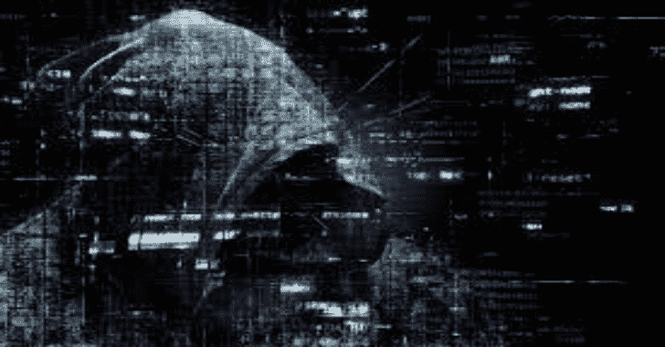

# PEzor-Docker:在这个 Docker 映像的帮助下，你可以很容易地在你的系统上访问 PEzor！

> 原文:# t0]https://kallinulixtauthorities . com/pezor dock/

在这个不可思议的工具的帮助下，你可以创建能够绕过大多数知名 AVs 的 FUD 恶意软件。例如，您可以在 PEzor 的帮助下打包“mimikatz”可执行文件，然后在受害者的系统上运行它，进行完整的 mem 转储，而不会出现任何问题！

## 如何使用

**坞站拉 https://hub . docker . com/r/4d 0 niis/pezor _ included _ kali:1.0**

**docker run-it 4d 0 niis/pezor _ included _ kali:1.0/bin/bash**

佩佐

[**Download**](https://github.com/4D0niiS/PEzor-Docker)