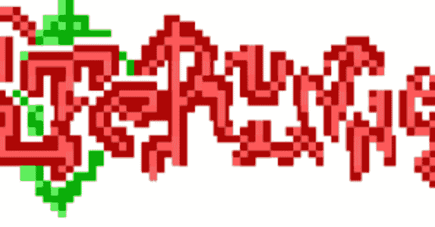
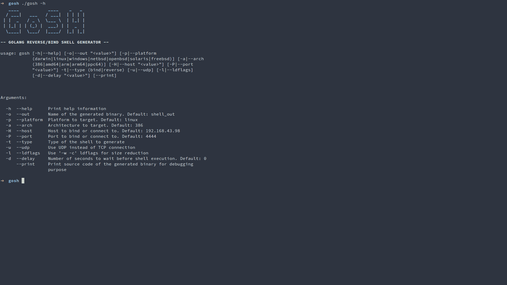

# Golang 反向/绑定外壳生成器

> 原文：<https://kalilinuxtutorials.com/gosh/>

.png)

**GoSH** 是一个生成 Go 二进制文件的工具，它在目标主机上启动所需类型的 shell。

shell 二进制文件可以为多种平台编译，支持部分多态性(唯一的函数名),并且可以使用 UDP 协议而不是默认的 TCP。如果您通过已建立的连接发送一个`**DELETE**`命令，shell 二进制文件会从执行它的主机上删除自己。

[**Download**](https://github.com/redcode-labs/GoSH)