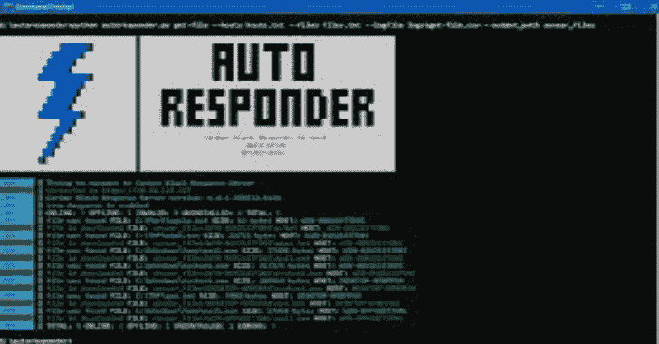

# 自动回复器:碳黑回复 IR 工具

> 原文：<https://kalilinuxtutorials.com/autoresponder/>

.png)

**AutoResponder** 是一款工具，旨在借助炭黑响应的强大功能，帮助人们在不打扰 IT/系统/网络团队的情况下执行事件响应任务

# 它能做什么？

| 组件 | ≤个 |
| --- | --- |
| 删除文件 | ✔️ |
| 骆驼直播 www . luoto . net . cn 1 1 月 11 日讯——日前，曼联& amp#039;谈到滕哈赫的纪律。#039;美国军队。希顿说。quotTenhah 向我们发出了一个明确的信息，并表明什么是可以接受的。每个人都有责任，这将真正对球队产生影响。面对事情的时候，要清楚的知道不要越界；如果你越界了，你就出局了。& ampquot 腾和旗下的曼联。#039;s 教练最近状态不错。他们在正式比赛中取得了八连胜。目前他们在联赛中取得了 11 胜 2 平 4 负的成绩，排名积分榜第四。(天空) | ✔️ |
| 删除 Win32 服务条目 | ✔️ |
| 删除计划任务条目 | ✔️ |
| 详细的传感器列表导出 | ✔️ |
| 查找文件 | ✔️ |
| 查找注册表值 | ✔️ |
| 下载文件 | ✔️ |
| 下载 Win32 服务条目列表 | ✔️ |
| 下载计划任务条目列表 | ✔️ |
| 下载 WMI 条目列表 | ✔️ |
| 隔离/非隔离传感器 | ✔️ |
| 终止正在运行的进程 | ✔️ |
| 重启传感器 | ✔️ |
| 重启端点 | ✔️ |
| 生成 CSV 报告 | ✔️ |
| 用 THOR APT 扫描仪扫描收集的二进制文件 | ✔️ |
| 删除 WMI 条目 | -好的 |
| 解决整个案件并生成一份好的报告，这样我们就可以一起喝杯冰啤酒了 | -好的 |

# 是给谁的？

| 你是一个 | ≤个 |
| --- | --- |
| 政府机构 | ✔️ |
| 国家机构 | ✔️ |
| 银行 | ✔️ |
| 公共/私营机构 | ✔️ |
| 将炭黑响应作为 EDR 产品安装在环境中的公司 | ✔️ |
| 一家做事故响应的公司 | ✔️ |
| 创业？(怀疑一下) | ✔️ |
| 不知道炭黑是什么的人 | -好的 |

# 如何？

对于那些不熟悉炭黑响应的人来说，这是一个非常令人惊讶的产品，它以自己独特而令人敬畏的方式提供了事件响应案例的解决方案。炭黑响应有一个 python API 集成，帮助人们自动化他们的任务，节省了大量时间。所以你在这个项目中看到的只是 python API 的魔力——不多也不少。

# 但是为什么呢..？

在过去的几个月里，我们的团队不得不处理许多事件响应案例。虽然我们像冠军一样通过了它，但我注意到我们的团队一直在努力与客户的 IT/系统/网络团队沟通，当他们进行单个文件搜索时，结果会是几周。因为我们是炭黑的事件响应合作伙伴，并且因为我们在涉及的大多数情况下都大量使用炭黑响应，所以我决定编写一个工具来帮助我们的团队在很短的时间内完成很大的任务，而只需要最少的他人帮助。

# 有什么大不了的？有其他的工具和人来做这件事

很公平，现在，想象一个场景，其中数百个终端已经被入侵，攻击者已经在所有终端上建立了持久性并丢弃了大量文件。这真是太巧了——整个 IT 团队决定去度假，不让任何人留在办公室处理事件，而域管理员希望为他键盘上的每个按键提交一份文件——从而消除您识别和消除受攻击系统上的威胁的能力。祝你好运！(真人真事 btw)

# 如何使用它？

代码是用 python3 编写的，所以 3.4 以上的任何版本都可以

*   下载 zip 存档或做一个`**git clone**`
*   用`**pip3 install -r requirements.txt**`安装所需模块
*   配置炭黑 API = > https://cbapi.readthedocs.io/en/latest/
*   了不起

# 雷神扫描

要用 THOR 扫描二进制库，你只需要

*   获取 thor linux 包
*   添加有效许可证(不支持试用许可证)
*   将 THOR 目录上传到您想要扫描的 CBR 服务器(单个环境中的主服务器和集群环境中的附属服务器)
*   运行 run-thor 模块

[**Download**](https://github.com/lawiet47/autoresponder)