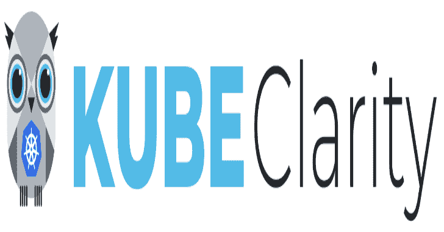
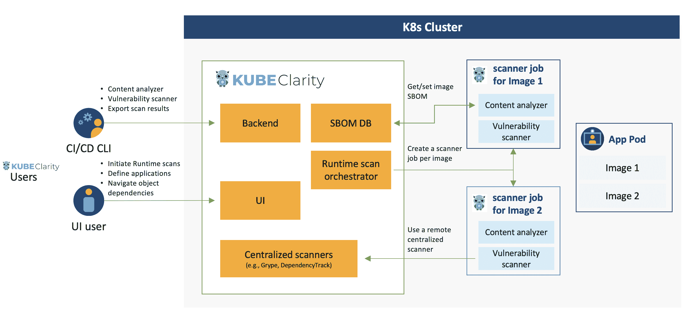

# Kubeclarity:检测和管理软件材料清单的工具

> 原文：<https://kalilinuxtutorials.com/kubeclarity/>

.png)

KubeClarity 是一款用于检测和管理软件材料清单(SBOM)以及容器映像和文件系统漏洞的工具。它扫描运行时 K8s 集群和 CI/CD 管道，以增强软件供应链安全性。

## SBOM &漏洞检测挑战

*   有效的漏洞扫描需要准确的软件材料清单(SBOM)检测:
    *   各种编程语言和包管理器
    *   各种操作系统发行版
    *   包依赖信息通常在构建时被剥离
*   哪个是最好的扫描仪/SBOM 分析仪？
*   我们应该扫描什么:Git repos、构建、容器映像或运行时？
*   每个扫描仪/分析仪都有自己的格式，如何比较结果？
*   如何管理发现的 SBOM 和漏洞？
*   新发现的漏洞对我的应用程序有何影响？

## 解决方案

*   将漏洞扫描分为两个阶段:
    *   生成 SBOM 的内容分析
    *   扫描 SBOM 的漏洞
*   创建可插拔基础设施，以:
    *   并行运行几个内容分析器
    *   并行运行几个漏洞扫描器
*   使用 KubeClarity CLI 在不同 CI 阶段之间扫描和合并结果
*   运行时 K8s 扫描，检测部署后发现的漏洞
*   将扫描的资源(映像/目录)分组到定义的应用程序下，以浏览对象树依赖项(应用程序、资源、软件包、漏洞)

## 特征

*   仪表盘
    *   每个严重性可修复的漏洞
    *   前 5 个易受攻击的元素(应用程序、资源、包)
    *   新的漏洞趋势
    *   每种许可证类型的包数
    *   每种编程语言的包数
    *   通用计数器
*   应用程序
    *   K8s 运行时的自动应用程序检测
    *   创建/编辑/删除应用程序
    *   根据应用，导航至相关:
        *   资源(图像/目录)
        *   包装
        *   脆弱点
        *   资源正在使用的许可证
*   应用程序资源(图像/目录)
    *   根据资源，导航到相关:
        *   应用程序
        *   包装
        *   脆弱点
*   包装
    *   每个包，导航到相关:
        *   应用程序
        *   可链接的资源列表和检测 SBOM 分析器
        *   脆弱点
*   脆弱点
    *   根据漏洞，导航到相关:
        *   应用程序
        *   资源
        *   检测扫描仪列表
*   K8s 运行时扫描
    *   按需扫描或预设扫描
    *   目标名称空间的自动检测
    *   每个受影响元素(应用程序、资源、软件包、漏洞)的扫描进度和结果导航
    *   CIS 坞站基准
*   CLI (CI/CD)
    *   使用多个集成内容分析器(Syft、cyclonedx-gomod)生成 SBOM
    *   使用多个集成扫描器(Grype、Dependency-track)进行 SBOM/映像/目录漏洞扫描
    *   跨不同 CI/CD 阶段合并 SBOM 和漏洞
    *   将结果导出到 KubeClarity 后端
*   应用程序接口
    *   KubeClarity 的 API 可以在这里找到

## 高层建筑

## 入门指南

### 与 SBOM 生成器和漏洞扫描器的集成

KubeClarity 内容分析器与以下 SBOM 生成器集成:

*   瞄准目标
*   Cyclonedx-gomod

KubeClarity 漏洞扫描程序与以下扫描程序集成:

*   Grype
*   依赖性跟踪

与 SBOM 生成器的集成可以在这里找到，与漏洞扫描器的集成可以在这里找到。要启用和配置支持的 SBOM 生成器和漏洞扫描程序，请检查 Helm values 中“漏洞扫描程序”部分下的“分析器”和“扫描程序”配置。

与其他工具集成的贡献是非常受欢迎的！

### 使用 Helm 在 K8s 集群中安装 KubeClarity:

*   添加舵 repo

**赫尔姆·回购加库贝拉里蒂·https://openclarity.github.io/kubeclarity**

*   保存 KubeClarity 默认图表值

**掌舵显示数值 kubeclarity/kubeclarity >数值. yaml**

*   检查`**values.yaml**`中的配置，并根据需要更新所需的值
*   使用头盔展开 KubeClarity

**helm install–values values . YAML–create-namespace kube clarity kube clarity/kube clarity-n kube clarity**

或者对于 OpenShift 受限 SCC 兼容安装:

**helm install–values values . YAML–create-namespace kube clarity kube clarity/kube clarity-n kube clarity–set global . openshift restricted = true \
–set kube clarity-PostgreSQL . security context . enabled = false–set kube clarity-PostgreSQL . containersecuritycontext . enabled = false \
–set kube clarity-PostgreSQL . volume permissions . enabled = true–set kube clarity-PostgreSQL . volume permissions . security context . runas**

*   端口转发到 KubeClarity UI:

**kubectl port-forward-n kube clarity SVC/kube clarity-kube clarity 9999:8080**

*   在浏览器中打开 kube clarity UI:http://localhost:9999/

### 必需的 K8s 权限

*   在群集范围内读取机密。这是获取用于扫描私有图像库的图像提取机密所必需的。
*   读取群集范围内的配置映射。这是获取扫描仪作业的配置模板所必需的。
*   列出群集范围内的窗格。这是计算需要扫描的目标单元所必需的。
*   列出名称空间。这是在 K8s 运行时扫描 UI 中获取要扫描的目标名称空间所必需的。
*   在群集范围内创建和删除作业。这是管理将在其名称空间中扫描目标 pod 的作业所必需的。

### 使用演示数据在本地构建和运行

*   构建 UI 和后端，并在本地启动后端(2 个选项):
    *   使用 docker:
        *   构建 UI 和后端(使用版本设置图像标签)

**版本=测试制作 docker-后端**

*   使用演示数据运行后端:

**docker run-p 8080:8080-e FAKE _ RUNTIME _ SCANNER = true-e FAKE _ DATA = true-e ENABLE _ DB _ INFO _ LOGS = true-e DATABASE _ DRIVER = LOCAL ghcr.io/openclarity/kubeclarity:test 运行**

本地版本:

*   构建 UI 和后端

**制作 ui&制作后端**

在浏览器中打开 kube clarity UI:http://localhost:8080/

## 硬币指示器 （coin-levelindicator 的缩写）命令行界面（Command Line Interface for batch scripting）

KubeClarity 包含一个可以在本地运行的 CLI，对于 CI/CD 管道特别有用。它允许分析图像和目录，以生成 SBOM，并扫描它的漏洞。结果可以导出到 KubeClarity 后端。

### 二元分布

从发布页面下载适用于您的操作系统的发布版本

解压`**kubeclarity-cli**`二进制文件，将其添加到您的路径中，您就可以开始了！

### 码头工人图像

在`**ghcr.io/openclarity/kubeclarity-cli**`有一个 Docker 图像，此处有可用标签列表。

### 本地编译

制作 cli

将`**./cli/bin/cli**`复制到`**kubeclarity-cli**`下你的路径。

### 使用多个集成内容分析器生成 SBOM

**可以使用由空格分隔的 ANALYZER_LIST env 变量(例如 ANALYZER _ LIST = " syft gomod ")
kube clarity-CLI analyze–input-type-o
例如:
ANALYZER _ LIST = " syft " kube clarity-CLI analyze nginx:latest-o nginx . sbom**

使用多个集成扫描器的漏洞扫描

要使用的漏洞扫描器列表可以使用由空格分隔的 SCANNERS_LIST env 变量进行配置(例如 SCANNERS _ LIST = " grype dependency-track ")
kube clarity-CLI scan–input-type-f
例如:
SCANNERS _ LIST = " grype " kube clarity-CLI scan nginx . sbom–input-type sbom

## 对 K8s 运行时扫描的私有注册支持

### 亚马逊 ECR

创建一个拥有`**AmazonEC2ContainerRegistryFullAccess**`权限的 AWS IAM 用户。

使用用户凭证( **`AWS_ACCESS_KEY_ID`、`AWS_SECRET_ACCESS_KEY`、`AWS_DEFAULT_REGION`、**)创建以下秘密:

**cat<<EOF | ku bectl apply-f-
API version:v1
kind:Secret
metadata:
name:ECR-sa
namespace:kube clarity
type:Opaque
data:$(echo-n ' XXXX ' | base64-w0)
AWS _ Secret _ ACCESS _ KEY:$(echo-n ' XXXX ' | base64-w0)** 

**注:**

*   机密名称必须是`**ecr-sa**`
*   保密数据密钥必须设置为 **`AWS_ACCESS_KEY_ID`、`AWS_SECRET_ACCESS_KEY`** 和`**AWS_DEFAULT_REGION**`

### 谷歌 GCR

创建一个拥有`**Artifact Registry Reader**`权限的 Google 服务账户。

使用服务帐户 json 文件创建以下密码

**kube CTL-n kube clarity create secret generic–from-file = sa . JSON gcr-sa**

**注:**

*   机密名称必须是`**gcr-sa**`
*   `**sa.json**`必须是生成密码时服务账户 json 文件的名称
*   KubeClarity 正在使用应用程序默认凭据。这些仅在从 GCP 运行 KubeClarity 时有效。

[**Download**](https://github.com/openclarity/kubeclarity)